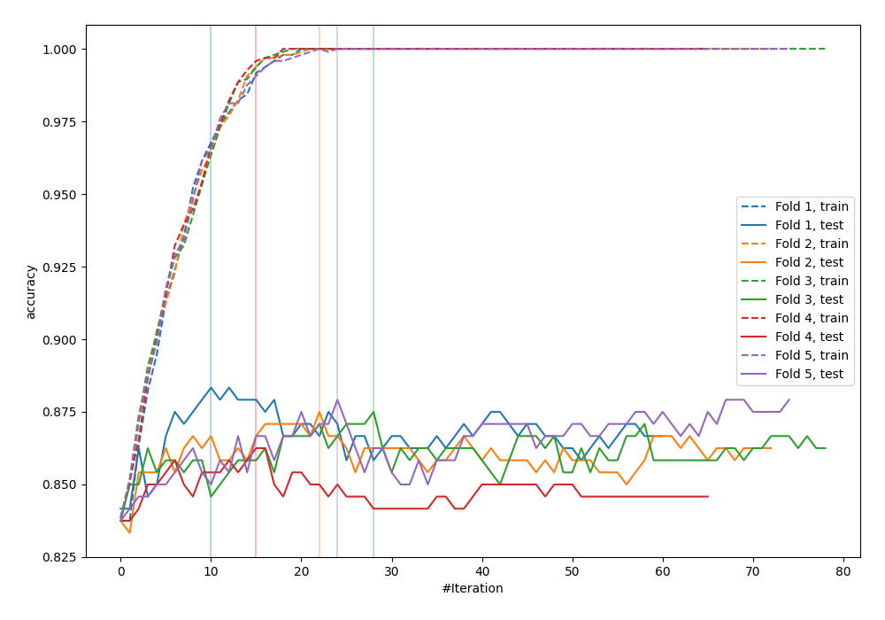
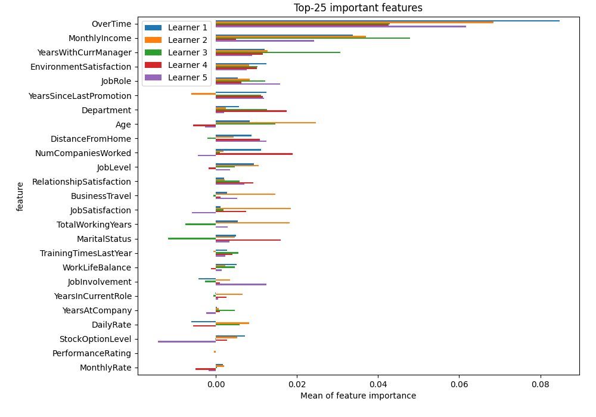
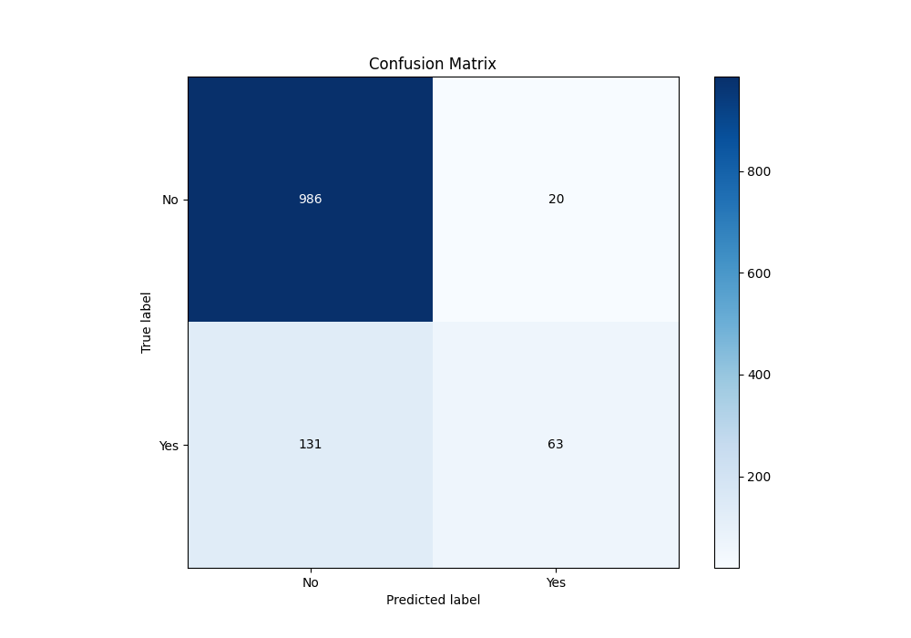
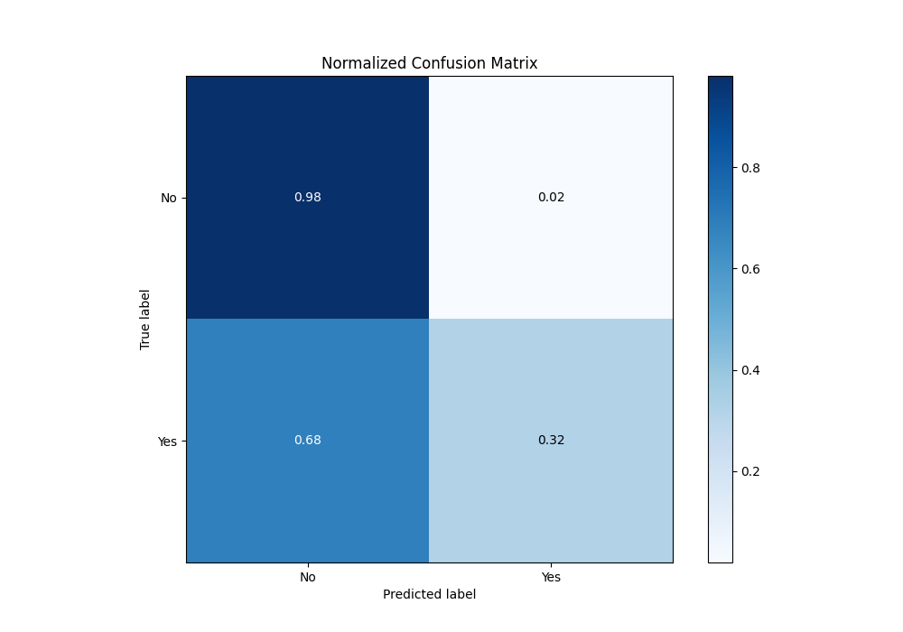
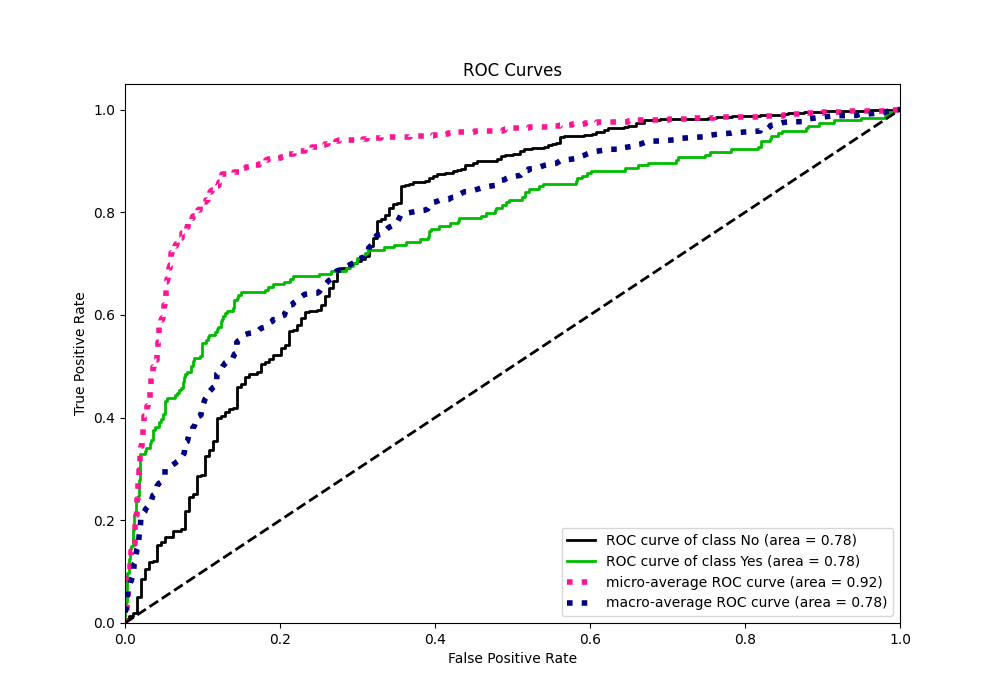
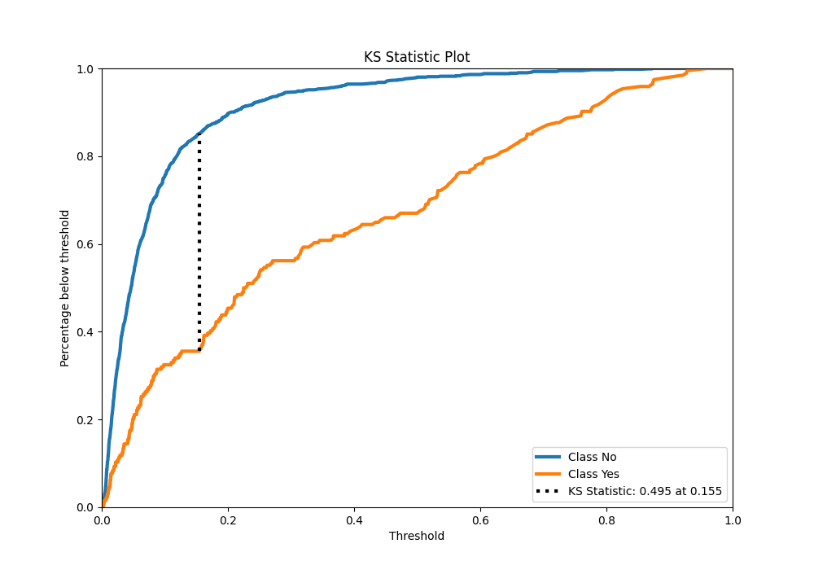
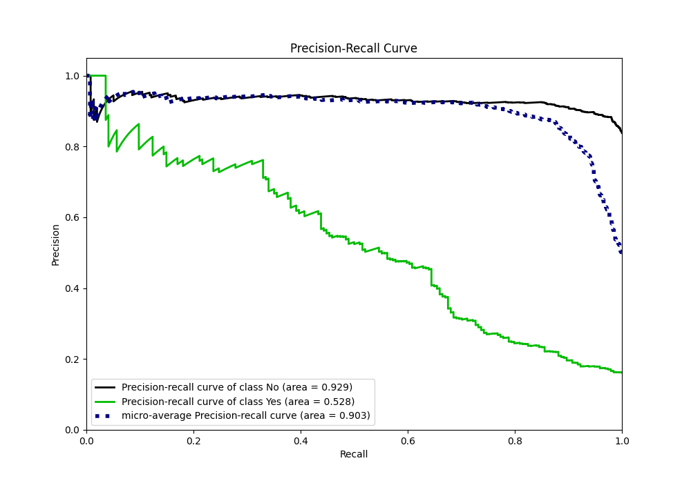
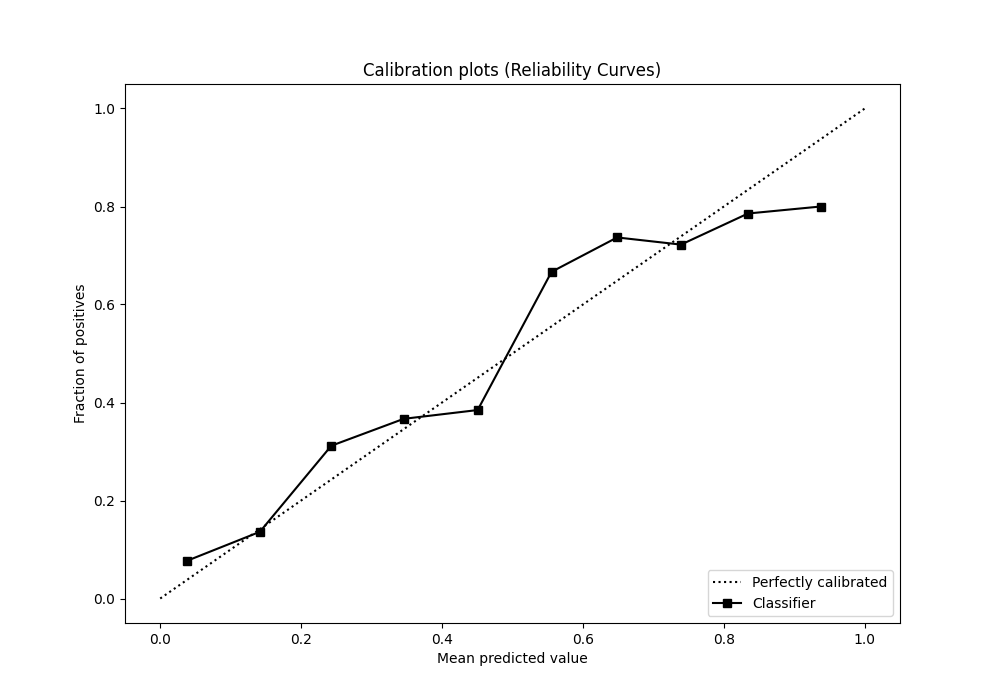
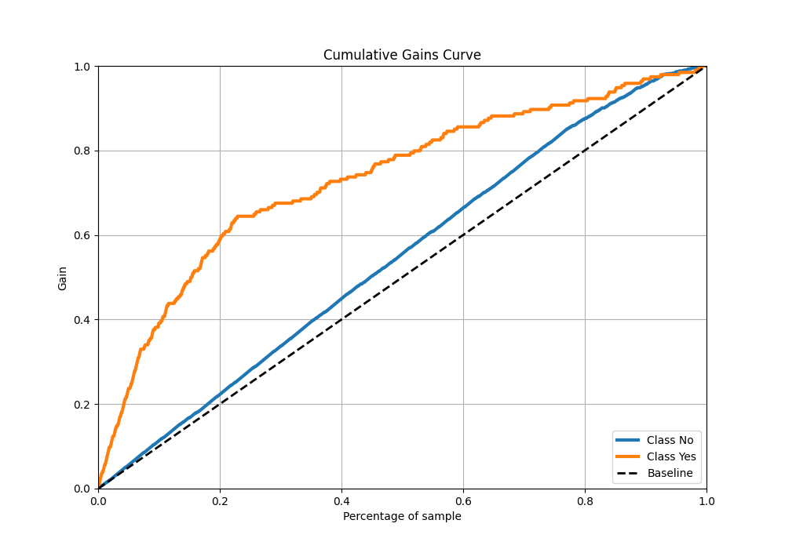

# Summary of 13_LightGBM

[<< Go back](../README.md)

## LightGBM
- **n_jobs**: -1
- **objective**: binary
- **num_leaves**: 31
- **learning_rate**: 0.2
- **feature_fraction**: 0.5
- **bagging_fraction**: 1.0
- **min_data_in_leaf**: 10
- **metric**: custom
- **custom_eval_metric_name**: accuracy
- **explain_level**: 2

## Validation
 - **validation_type**: kfold
 - **k_folds**: 5
 - **shuffle**: True
 - **stratify**: True
 - **random_seed**: 123

## Optimized metric
accuracy

## Training time

4.4 seconds

## Metric details
|           |    score |    threshold |
|:----------|---------:|-------------:|
| logloss   | 0.370884 | nan          |
| auc       | 0.778776 | nan          |
| f1        | 0.533049 |   0.15467    |
| accuracy  | 0.874167 |   0.507814   |
| precision | 0.826087 |   0.772465   |
| recall    | 1        |   0.00068314 |
| mcc       | 0.44232  |   0.507814   |

## Metric details with threshold from accuracy metric
|           |    score |   threshold |
|:----------|---------:|------------:|
| logloss   | 0.370884 |  nan        |
| auc       | 0.778776 |  nan        |
| f1        | 0.454874 |    0.507814 |
| accuracy  | 0.874167 |    0.507814 |
| precision | 0.759036 |    0.507814 |
| recall    | 0.324742 |    0.507814 |
| mcc       | 0.44232  |    0.507814 |

## Confusion matrix (at threshold=0.507814)
|                |   Predicted as No |   Predicted as Yes |
|:---------------|------------------:|-------------------:|
| Labeled as No  |               986 |                 20 |
| Labeled as Yes |               131 |                 63 |

## Learning curves

## Permutation-based Importance

## Confusion Matrix

## Normalized Confusion Matrix

## ROC Curve

## Kolmogorov-Smirnov Statistic

## Precision-Recall Curve

## Calibration Curve

## Cumulative Gains Curve

## Lift Curve

[<< Go back](../README.md)
