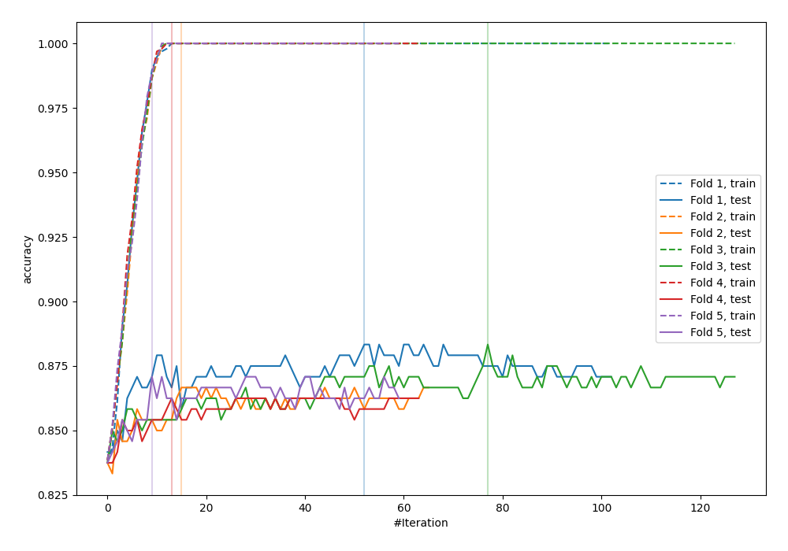
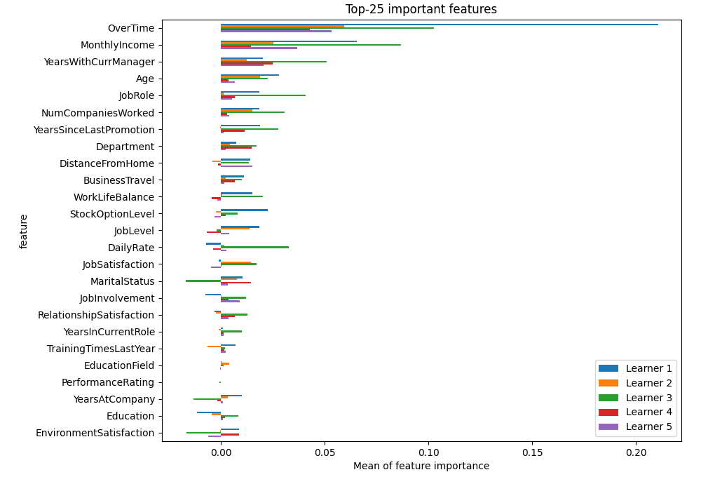
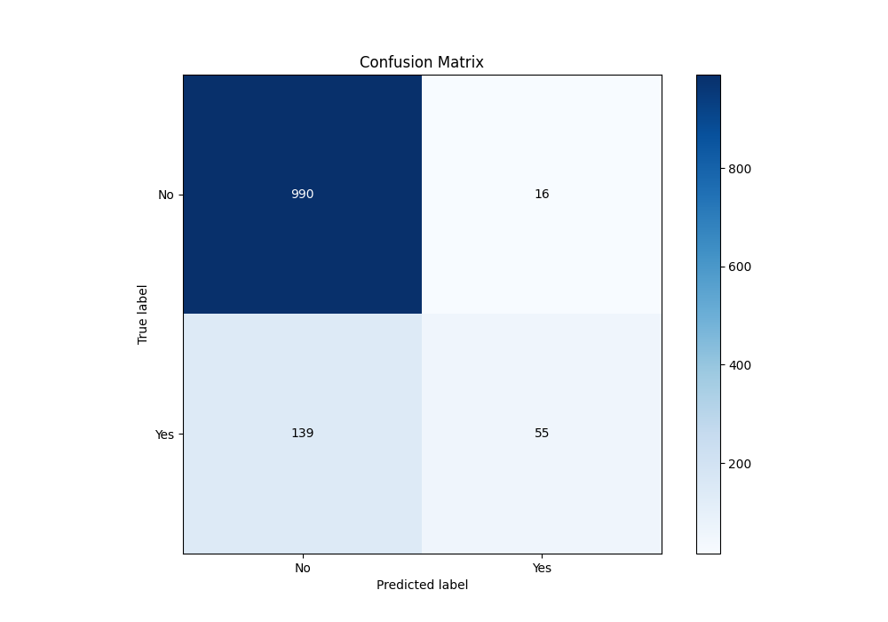
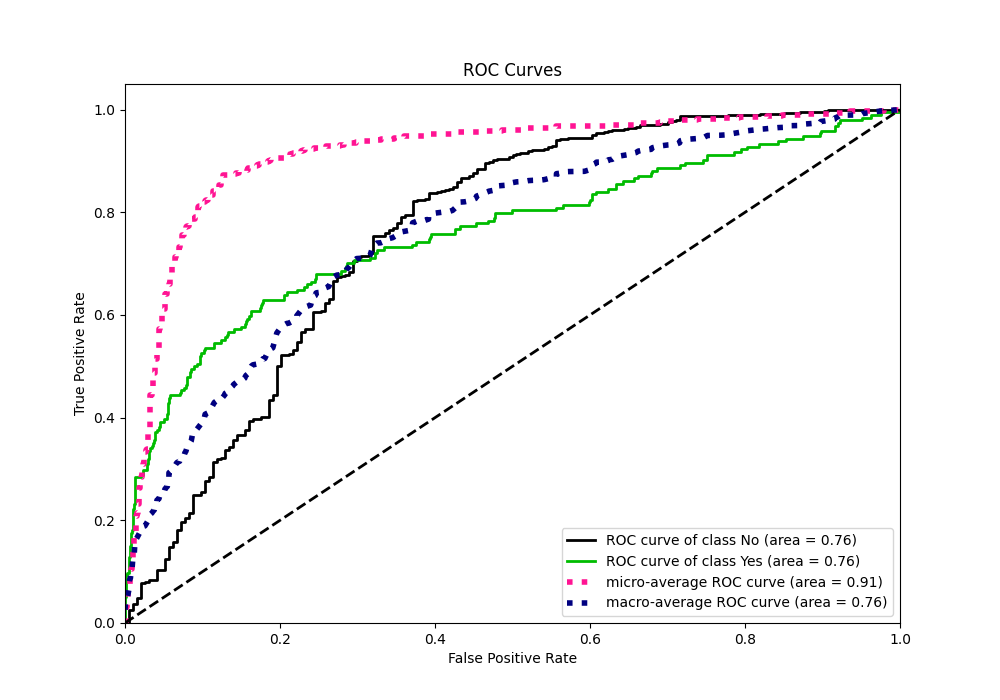
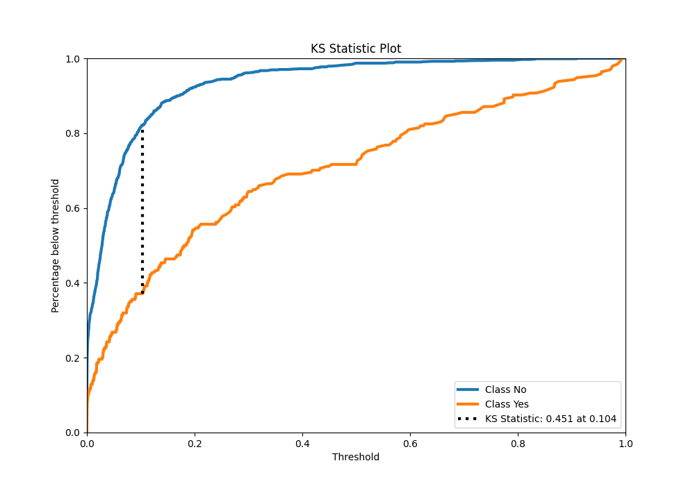
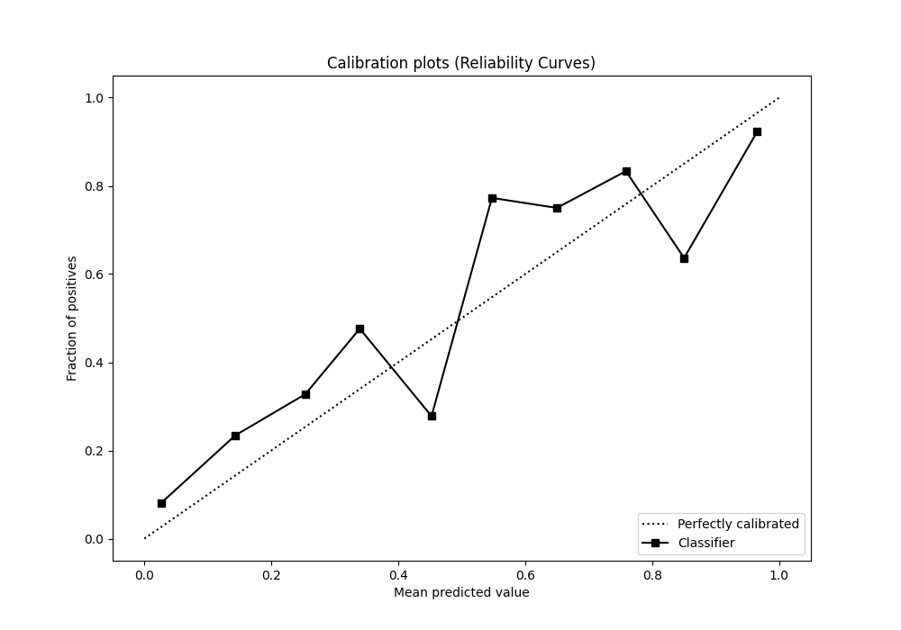
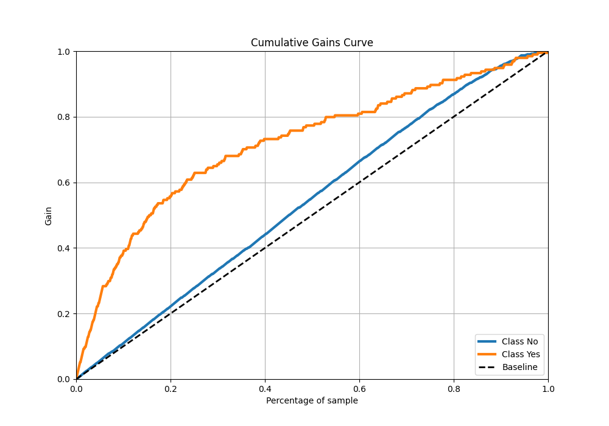
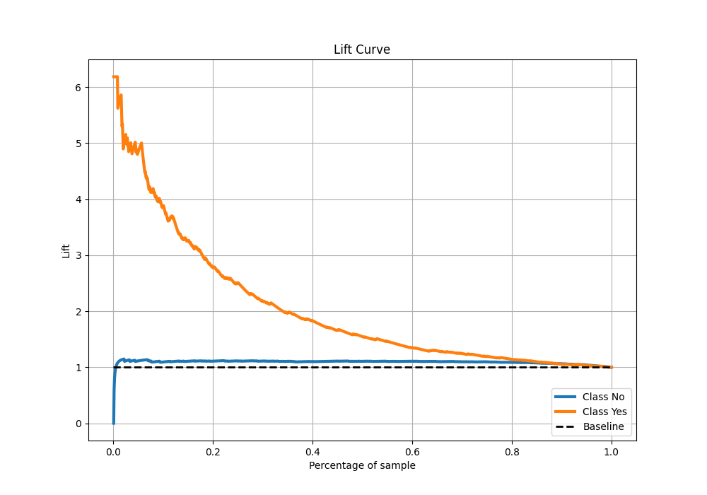

# Summary of 14_LightGBM

[<< Go back](../README.md)

## LightGBM
- **n_jobs**: -1
- **objective**: binary
- **num_leaves**: 95
- **learning_rate**: 0.2
- **feature_fraction**: 0.5
- **bagging_fraction**: 1.0
- **min_data_in_leaf**: 10
- **metric**: custom
- **custom_eval_metric_name**: accuracy
- **explain_level**: 2

## Validation
 - **validation_type**: kfold
 - **k_folds**: 5
 - **shuffle**: True
 - **stratify**: True
 - **random_seed**: 123

## Optimized metric
accuracy

## Training time

5.2 seconds

## Metric details
|           |    score |     threshold |
|:----------|---------:|--------------:|
| logloss   | 0.469332 | nan           |
| auc       | 0.762292 | nan           |
| f1        | 0.513854 |   0.170119    |
| accuracy  | 0.870833 |   0.494168    |
| precision | 0.909091 |   0.910152    |
| recall    | 1        |   3.94957e-07 |
| mcc       | 0.432352 |   0.242325    |

## Metric details with threshold from accuracy metric
|           |    score |   threshold |
|:----------|---------:|------------:|
| logloss   | 0.469332 |  nan        |
| auc       | 0.762292 |  nan        |
| f1        | 0.415094 |    0.494168 |
| accuracy  | 0.870833 |    0.494168 |
| precision | 0.774648 |    0.494168 |
| recall    | 0.283505 |    0.494168 |
| mcc       | 0.417552 |    0.494168 |

## Confusion matrix (at threshold=0.494168)
|                |   Predicted as No |   Predicted as Yes |
|:---------------|------------------:|-------------------:|
| Labeled as No  |               990 |                 16 |
| Labeled as Yes |               139 |                 55 |

## Learning curves

## Permutation-based Importance

## Confusion Matrix

## Normalized Confusion Matrix

## ROC Curve

## Kolmogorov-Smirnov Statistic

## Precision-Recall Curve

## Calibration Curve

## Cumulative Gains Curve

## Lift Curve

[<< Go back](../README.md)
