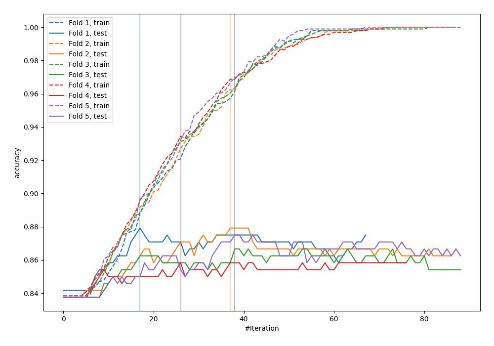
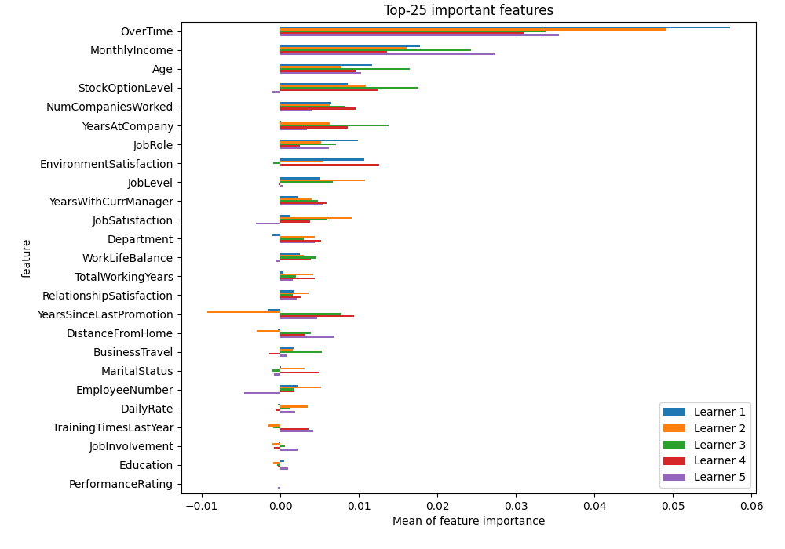
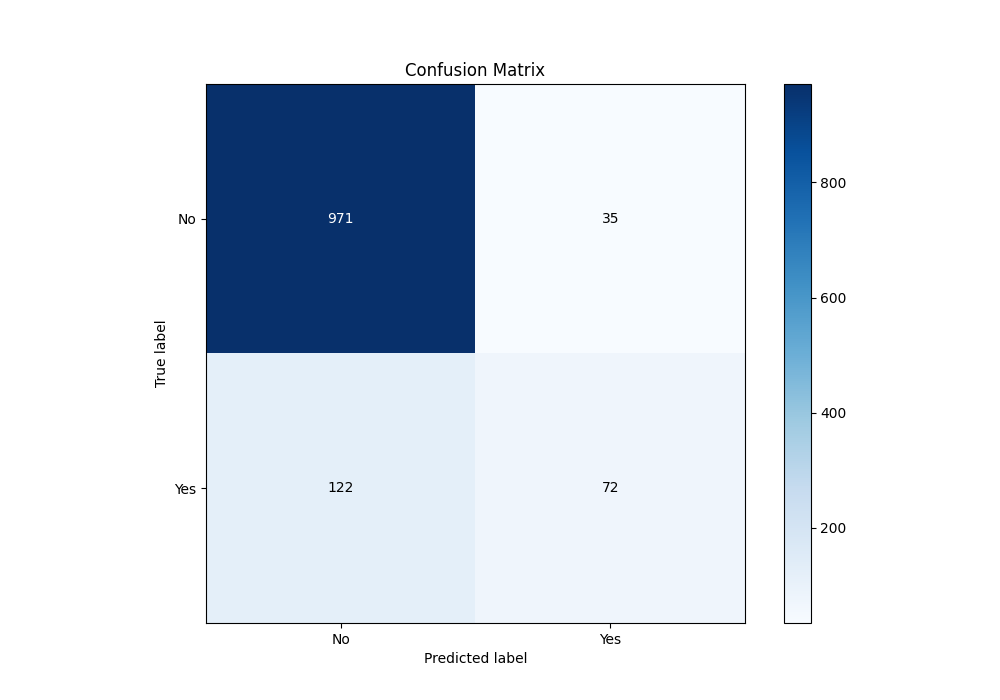
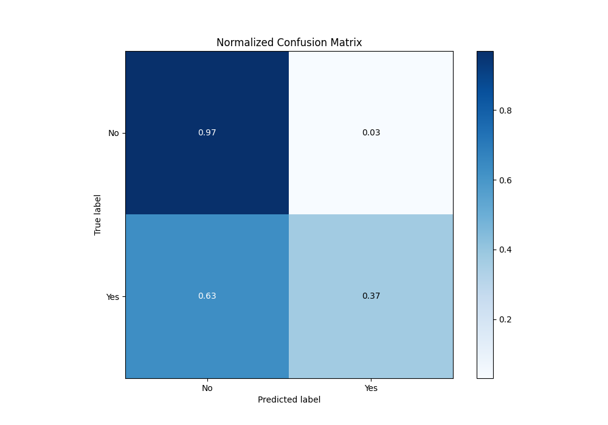
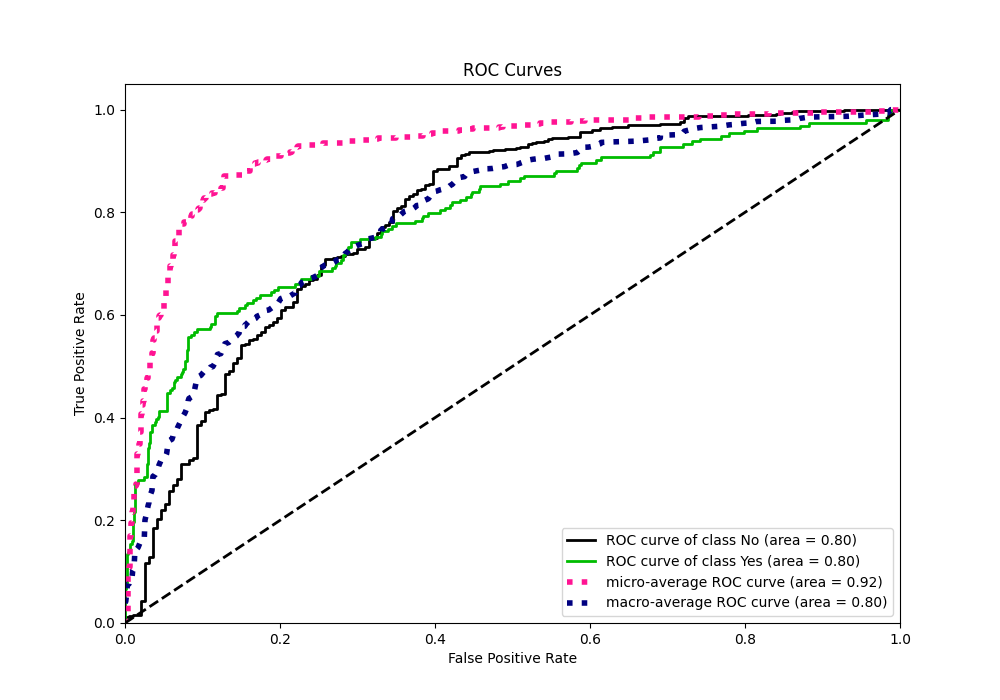
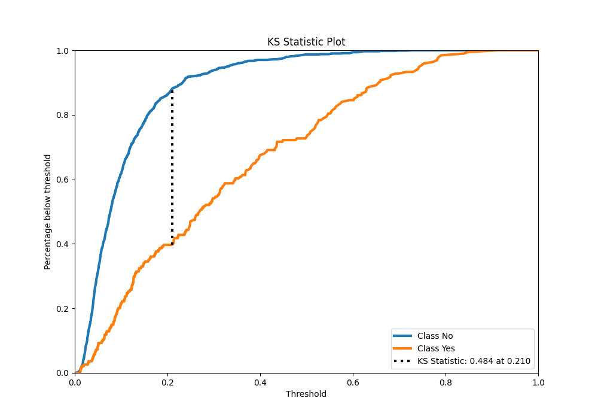
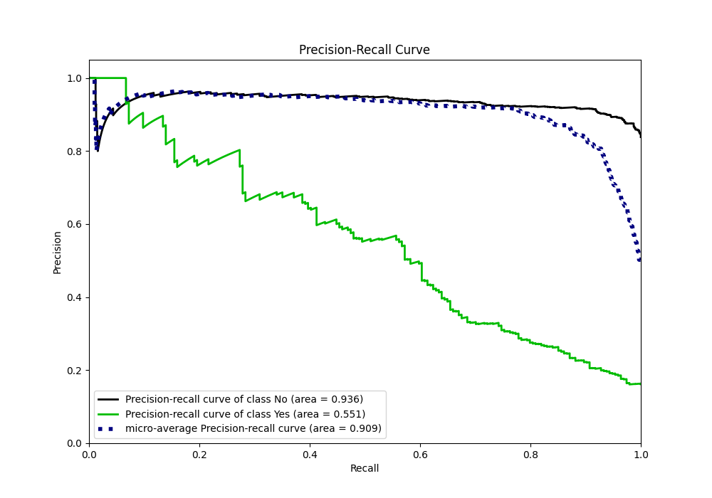
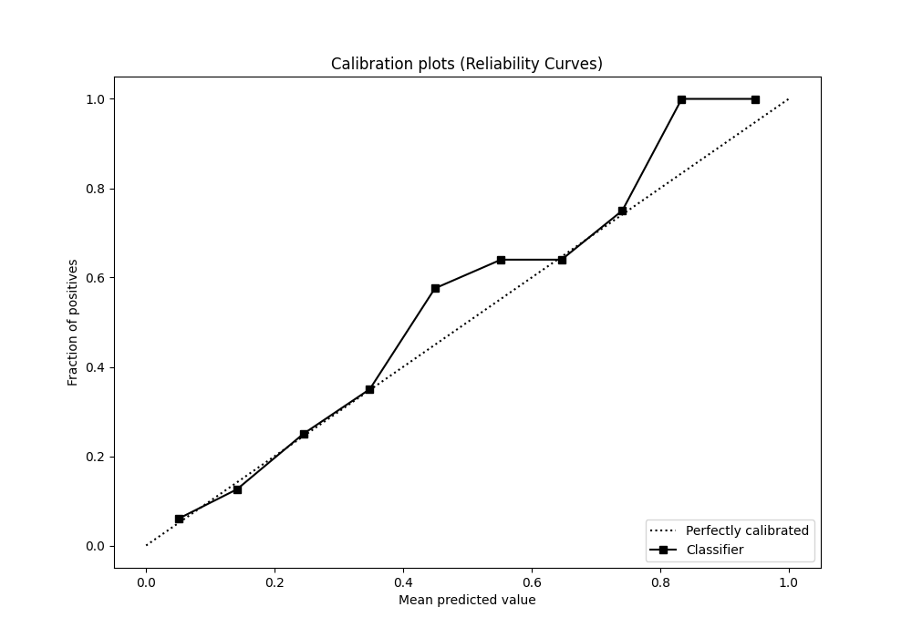
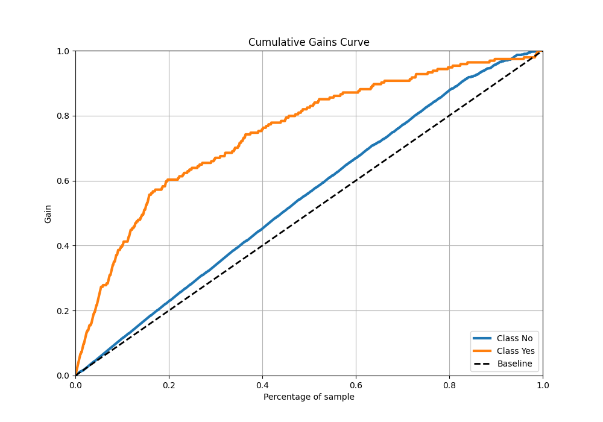
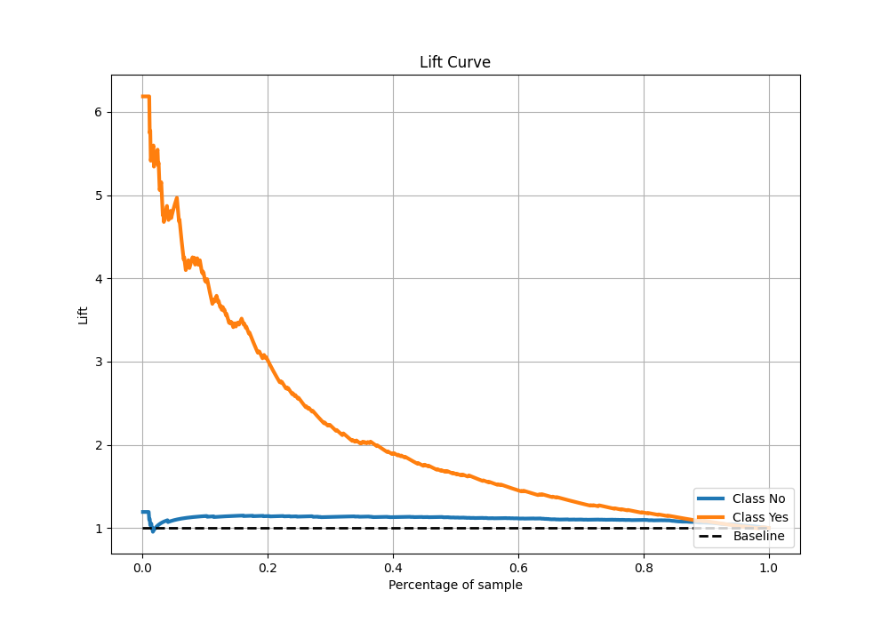

# Summary of 16_LightGBM

[<< Go back](../README.md)

## LightGBM
- **n_jobs**: -1
- **objective**: binary
- **num_leaves**: 63
- **learning_rate**: 0.1
- **feature_fraction**: 0.5
- **bagging_fraction**: 1.0
- **min_data_in_leaf**: 30
- **metric**: custom
- **custom_eval_metric_name**: accuracy
- **explain_level**: 2

## Validation
 - **validation_type**: kfold
 - **k_folds**: 5
 - **shuffle**: True
 - **stratify**: True
 - **random_seed**: 123

## Optimized metric
accuracy

## Training time

4.6 seconds

## Metric details
|           |    score |    threshold |
|:----------|---------:|-------------:|
| logloss   | 0.349127 | nan          |
| auc       | 0.797329 | nan          |
| f1        | 0.561039 |   0.244348   |
| accuracy  | 0.869167 |   0.37176    |
| precision | 1        |   0.742009   |
| recall    | 1        |   0.00454429 |
| mcc       | 0.477195 |   0.244348   |

## Metric details with threshold from accuracy metric
|           |    score |   threshold |
|:----------|---------:|------------:|
| logloss   | 0.349127 |   nan       |
| auc       | 0.797329 |   nan       |
| f1        | 0.478405 |     0.37176 |
| accuracy  | 0.869167 |     0.37176 |
| precision | 0.672897 |     0.37176 |
| recall    | 0.371134 |     0.37176 |
| mcc       | 0.43449  |     0.37176 |

## Confusion matrix (at threshold=0.37176)
|                |   Predicted as No |   Predicted as Yes |
|:---------------|------------------:|-------------------:|
| Labeled as No  |               971 |                 35 |
| Labeled as Yes |               122 |                 72 |

## Learning curves

## Permutation-based Importance

## Confusion Matrix

## Normalized Confusion Matrix

## ROC Curve

## Kolmogorov-Smirnov Statistic

## Precision-Recall Curve

## Calibration Curve

## Cumulative Gains Curve

## Lift Curve

[<< Go back](../README.md)
