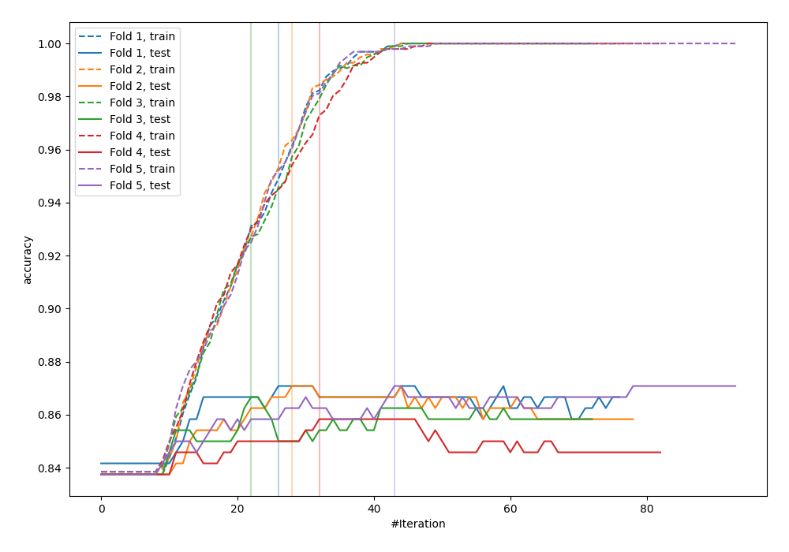
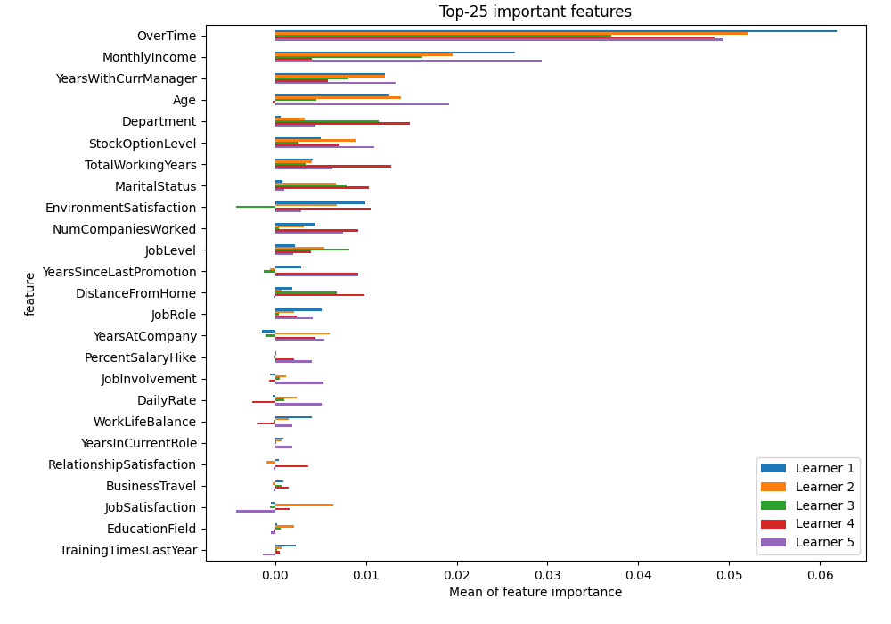
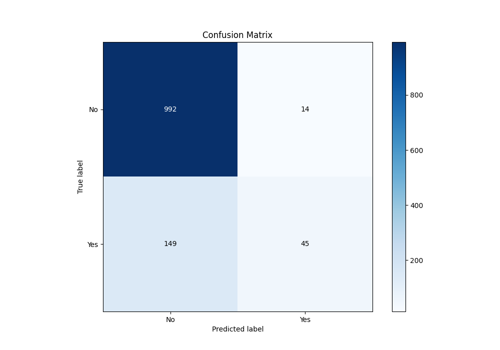
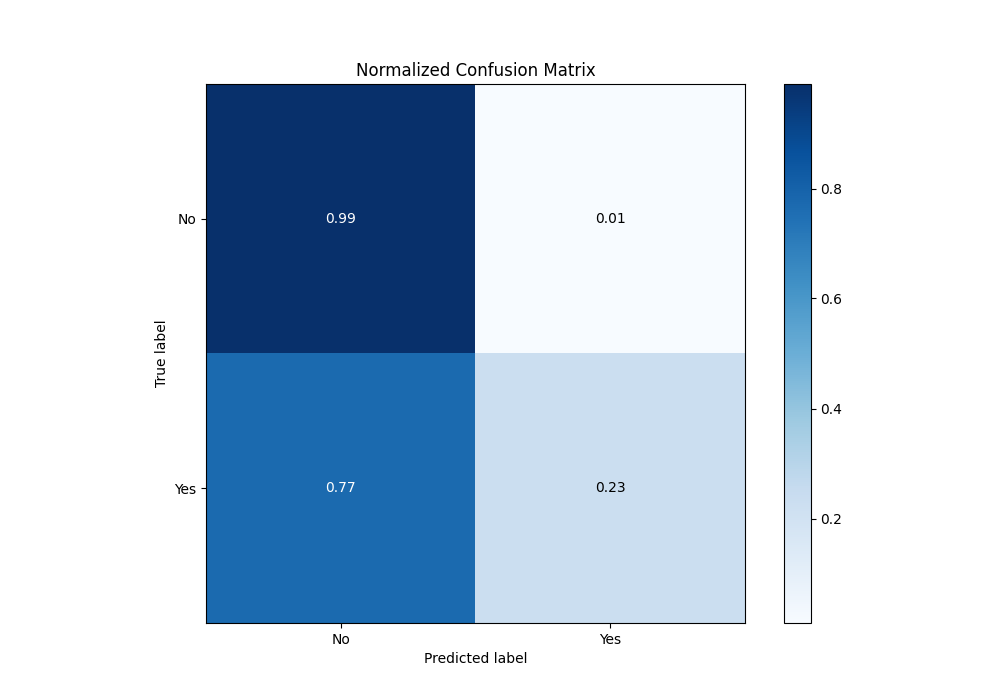
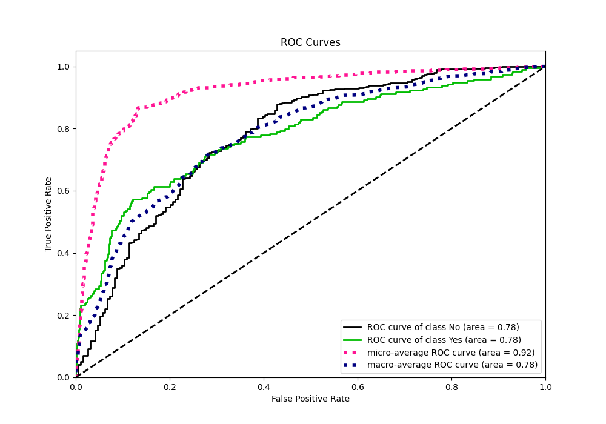
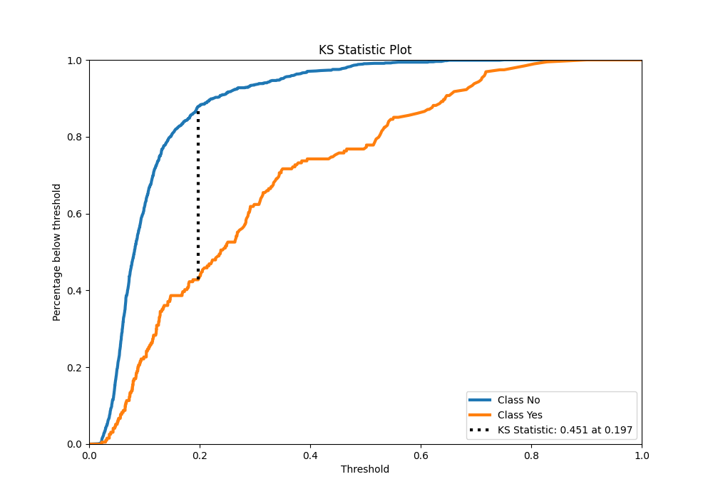
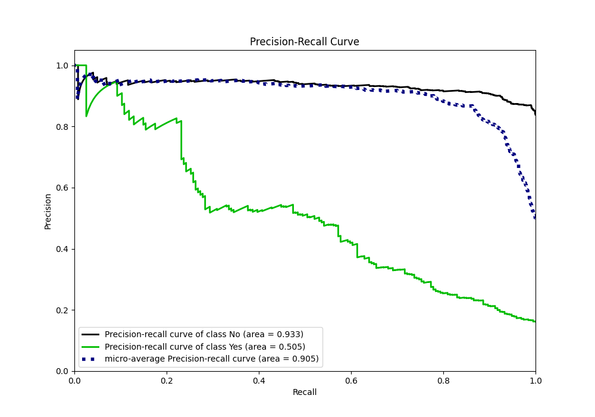
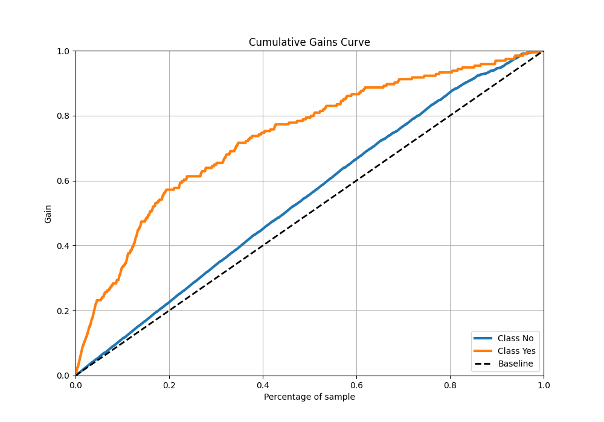
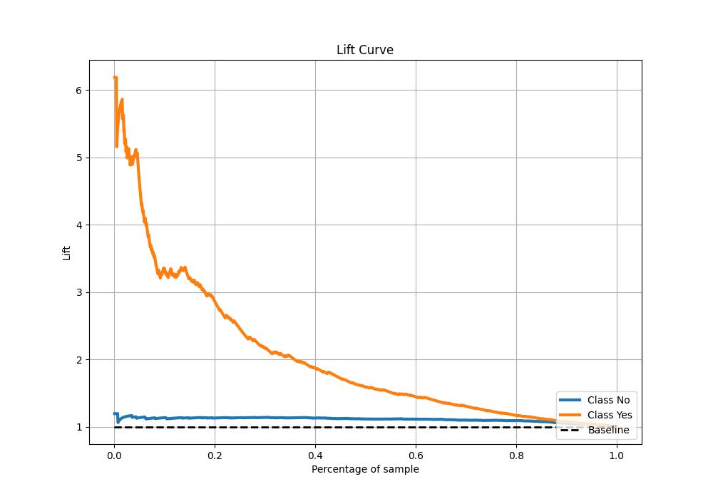

# Summary of 1_Default_LightGBM

[<< Go back](../README.md)

## LightGBM
- **n_jobs**: -1
- **objective**: binary
- **num_leaves**: 63
- **learning_rate**: 0.05
- **feature_fraction**: 0.9
- **bagging_fraction**: 0.9
- **min_data_in_leaf**: 10
- **metric**: custom
- **custom_eval_metric_name**: accuracy
- **explain_level**: 2

## Validation
 - **validation_type**: kfold
 - **k_folds**: 5
 - **shuffle**: True
 - **stratify**: True
 - **random_seed**: 123

## Optimized metric
accuracy

## Training time

5.0 seconds

## Metric details
|           |    score |   threshold |
|:----------|---------:|------------:|
| logloss   | 0.361597 | nan         |
| auc       | 0.778899 | nan         |
| f1        | 0.517815 |   0.201564  |
| accuracy  | 0.864167 |   0.482036  |
| precision | 0.909091 |   0.710367  |
| recall    | 1        |   0.0147744 |
| mcc       | 0.417888 |   0.201564  |

## Metric details with threshold from accuracy metric
|           |    score |   threshold |
|:----------|---------:|------------:|
| logloss   | 0.361597 |  nan        |
| auc       | 0.778899 |  nan        |
| f1        | 0.355731 |    0.482036 |
| accuracy  | 0.864167 |    0.482036 |
| precision | 0.762712 |    0.482036 |
| recall    | 0.231959 |    0.482036 |
| mcc       | 0.371254 |    0.482036 |

## Confusion matrix (at threshold=0.482036)
|                |   Predicted as No |   Predicted as Yes |
|:---------------|------------------:|-------------------:|
| Labeled as No  |               992 |                 14 |
| Labeled as Yes |               149 |                 45 |

## Learning curves

## Permutation-based Importance

## Confusion Matrix

## Normalized Confusion Matrix

## ROC Curve

## Kolmogorov-Smirnov Statistic

## Precision-Recall Curve

## Calibration Curve

## Cumulative Gains Curve

## Lift Curve

[<< Go back](../README.md)
