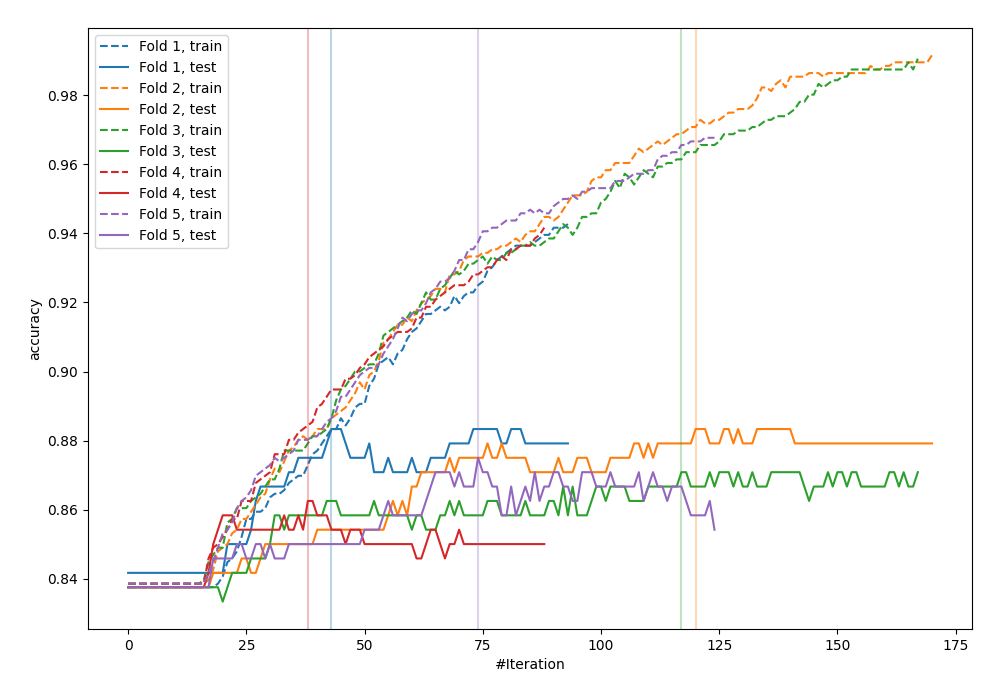
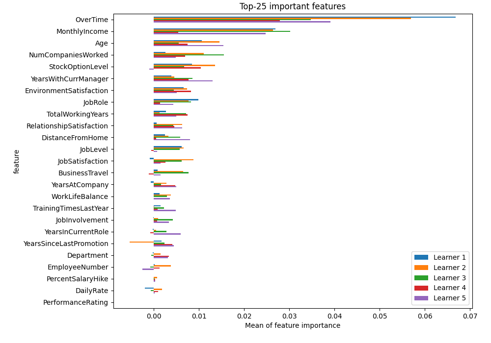
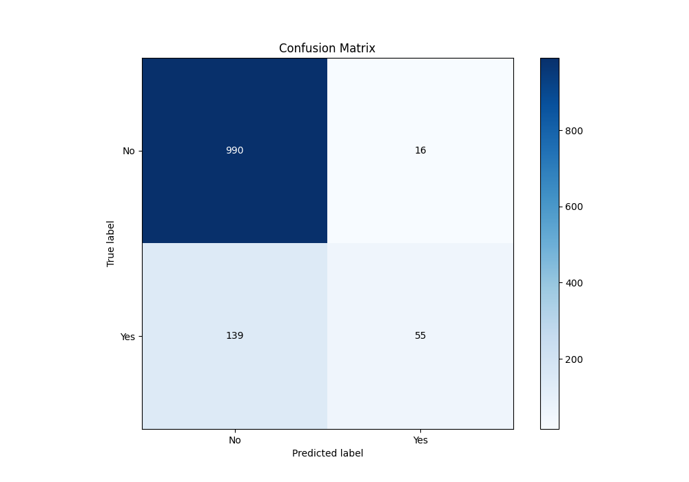
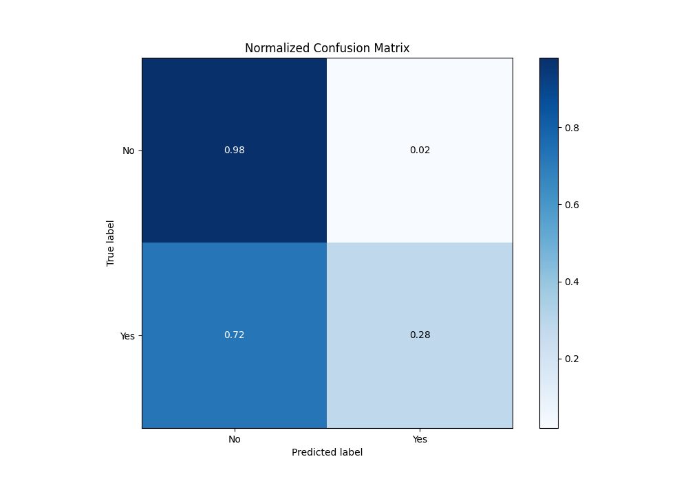
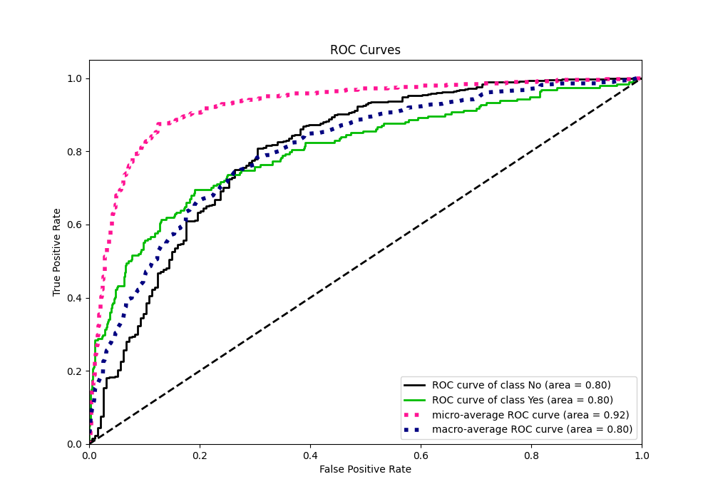
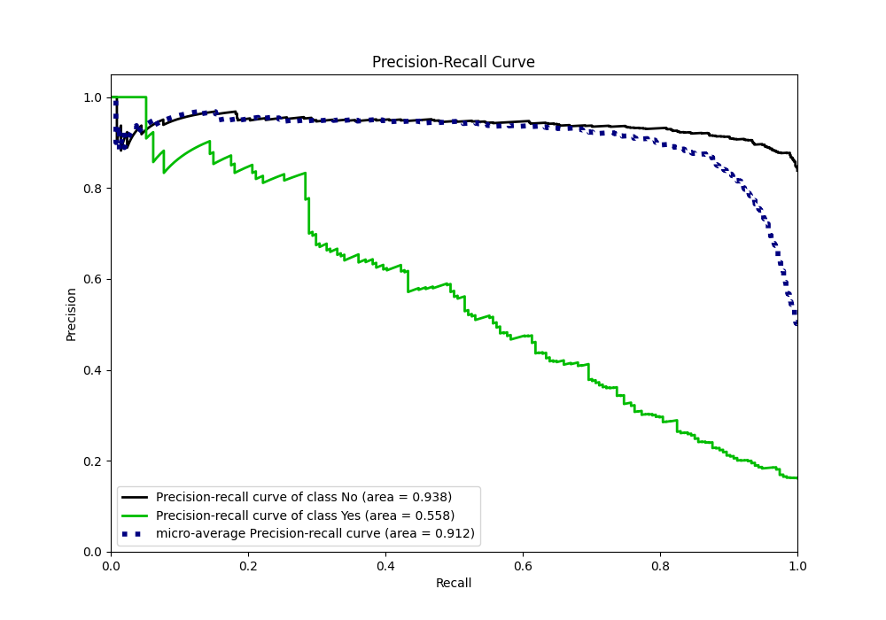
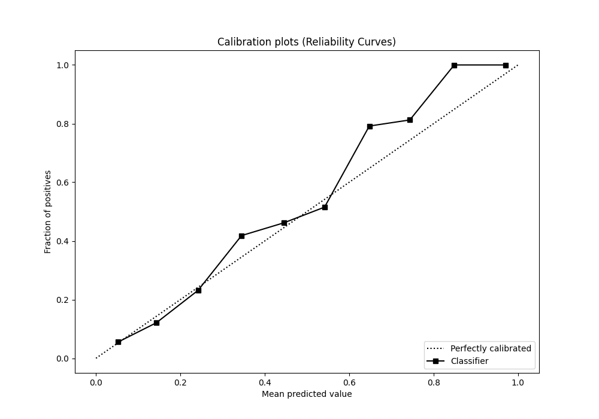
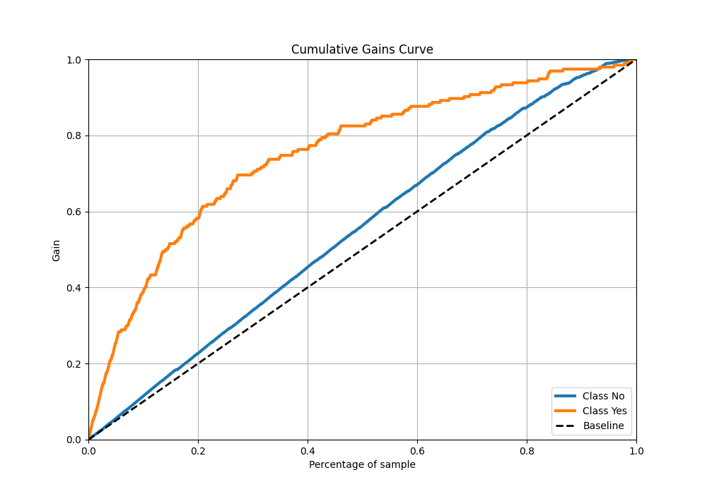
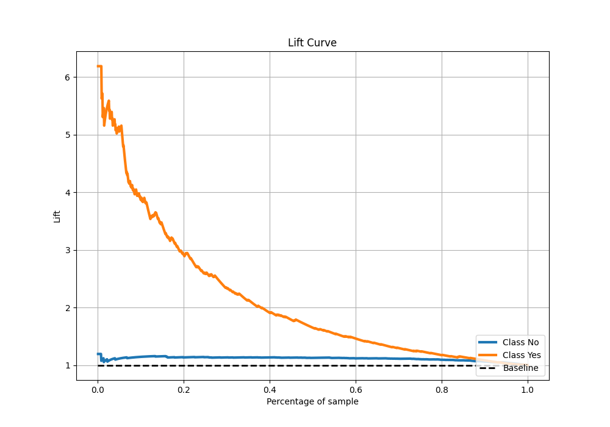

# Summary of 2_LightGBM

[<< Go back](../README.md)

## LightGBM
- **n_jobs**: -1
- **objective**: binary
- **num_leaves**: 15
- **learning_rate**: 0.05
- **feature_fraction**: 0.8
- **bagging_fraction**: 0.5
- **min_data_in_leaf**: 50
- **metric**: custom
- **custom_eval_metric_name**: accuracy
- **explain_level**: 2

## Validation
 - **validation_type**: kfold
 - **k_folds**: 5
 - **shuffle**: True
 - **stratify**: True
 - **random_seed**: 123

## Optimized metric
accuracy

## Training time

4.2 seconds

## Metric details
|           |    score |    threshold |
|:----------|---------:|-------------:|
| logloss   | 0.347131 | nan          |
| auc       | 0.802341 | nan          |
| f1        | 0.536193 |   0.273479   |
| accuracy  | 0.870833 |   0.486676   |
| precision | 0.909091 |   0.719993   |
| recall    | 1        |   0.00129706 |
| mcc       | 0.45152  |   0.273479   |

## Metric details with threshold from accuracy metric
|           |    score |   threshold |
|:----------|---------:|------------:|
| logloss   | 0.347131 |  nan        |
| auc       | 0.802341 |  nan        |
| f1        | 0.415094 |    0.486676 |
| accuracy  | 0.870833 |    0.486676 |
| precision | 0.774648 |    0.486676 |
| recall    | 0.283505 |    0.486676 |
| mcc       | 0.417552 |    0.486676 |

## Confusion matrix (at threshold=0.486676)
|                |   Predicted as No |   Predicted as Yes |
|:---------------|------------------:|-------------------:|
| Labeled as No  |               990 |                 16 |
| Labeled as Yes |               139 |                 55 |

## Learning curves

## Permutation-based Importance

## Confusion Matrix

## Normalized Confusion Matrix

## ROC Curve

## Kolmogorov-Smirnov Statistic

## Precision-Recall Curve

## Calibration Curve

## Cumulative Gains Curve

## Lift Curve

[<< Go back](../README.md)
