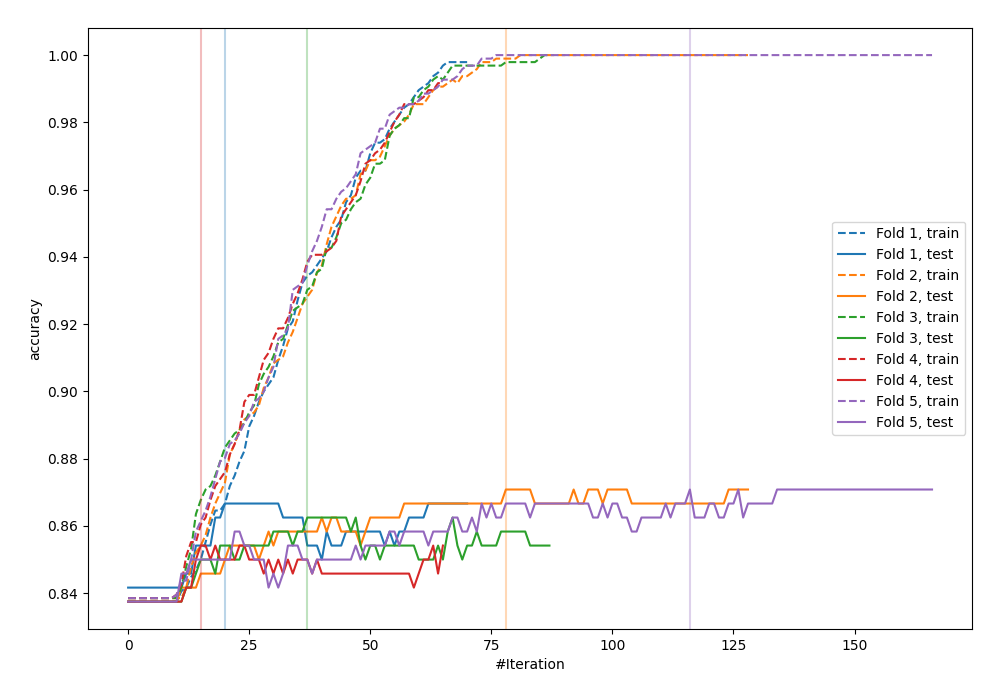
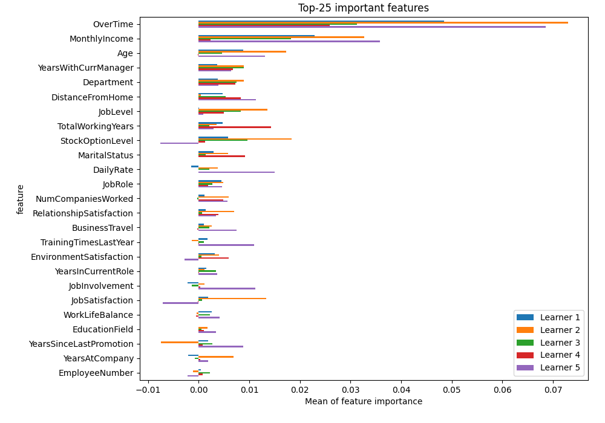
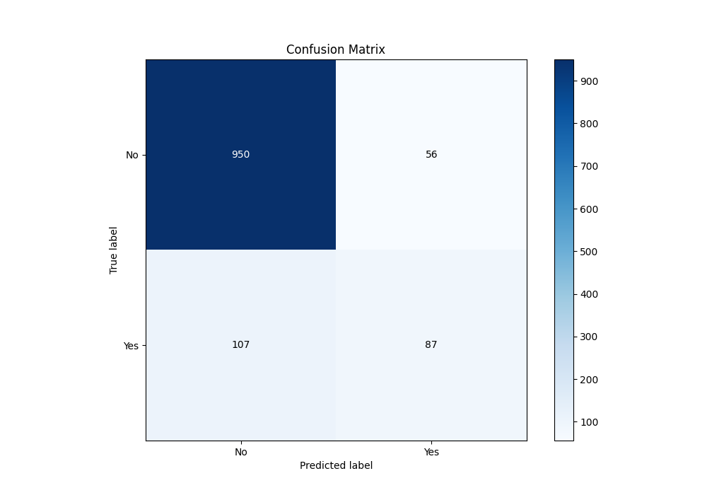
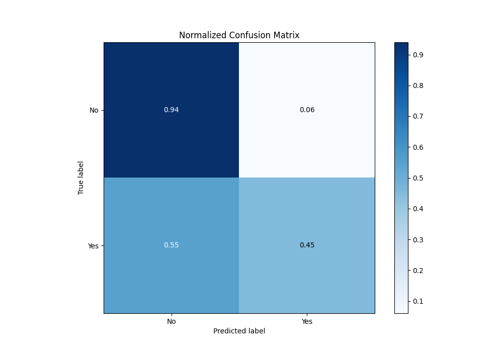
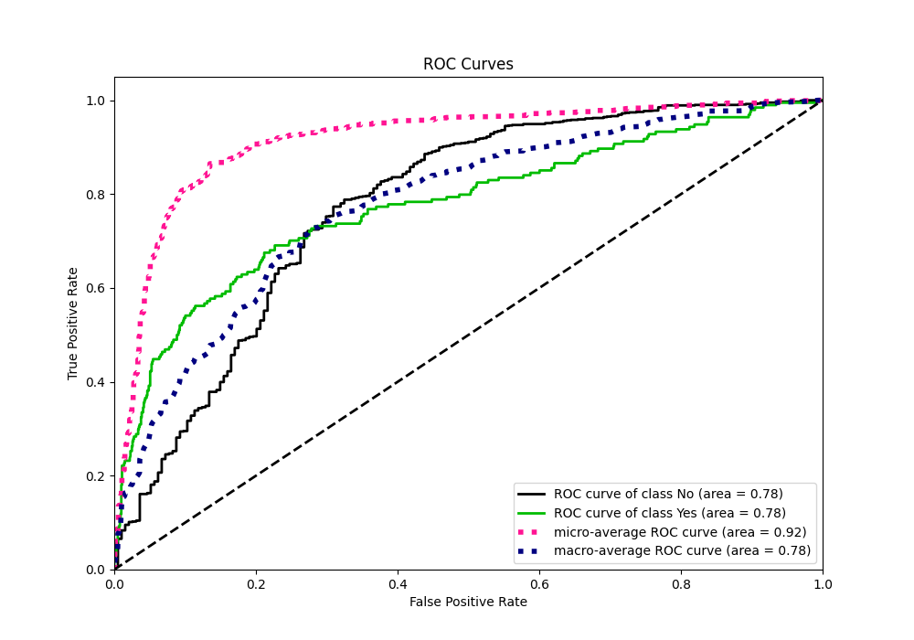
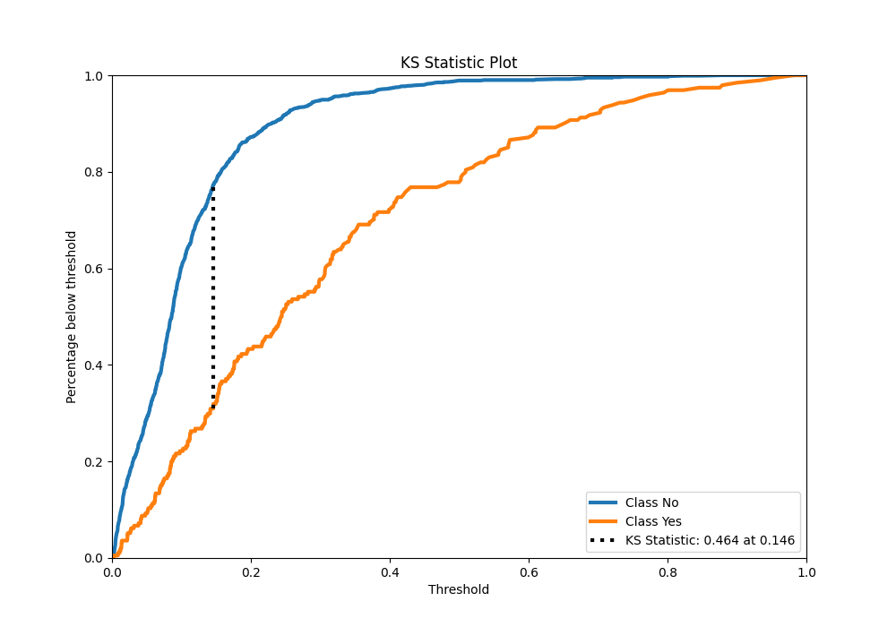
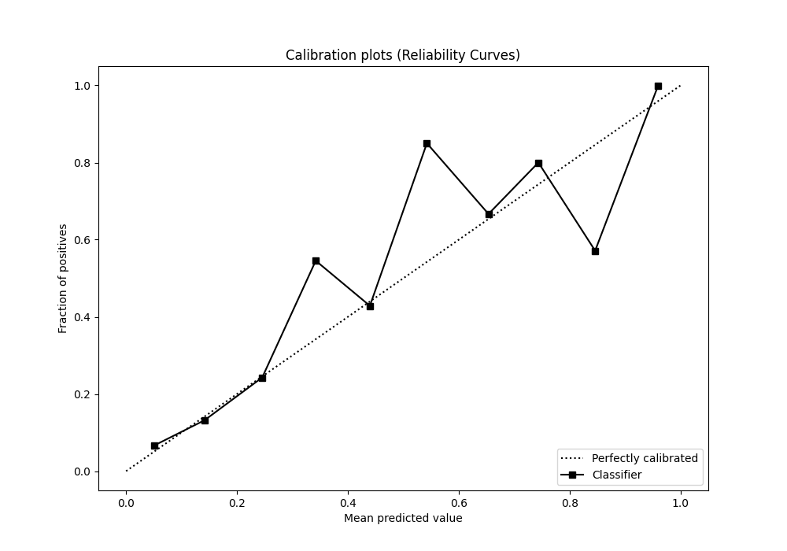
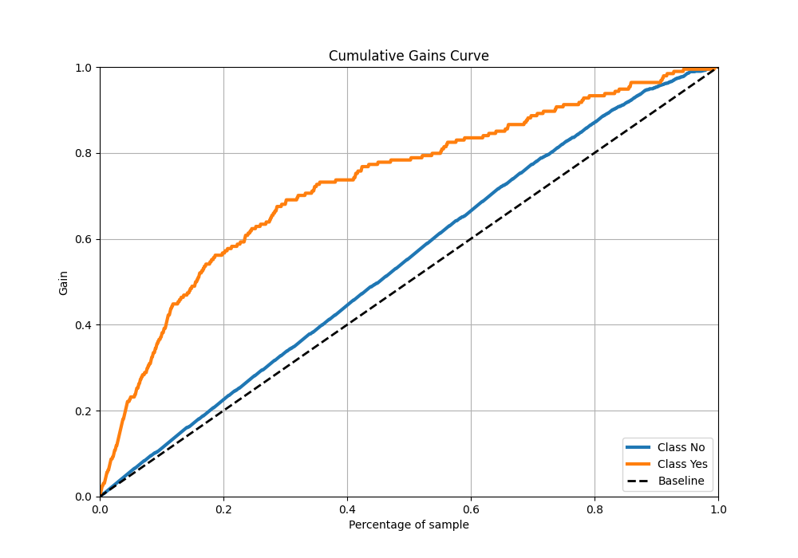
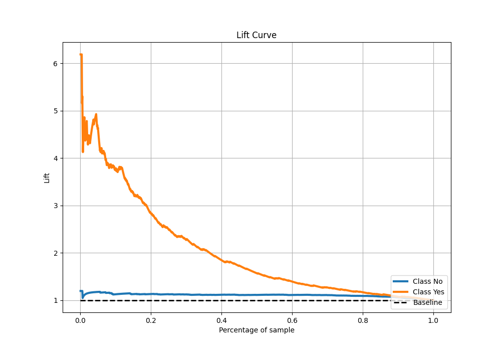

# Summary of 4_LightGBM

[<< Go back](../README.md)

## LightGBM
- **n_jobs**: -1
- **objective**: binary
- **num_leaves**: 63
- **learning_rate**: 0.05
- **feature_fraction**: 0.9
- **bagging_fraction**: 1.0
- **min_data_in_leaf**: 20
- **metric**: custom
- **custom_eval_metric_name**: accuracy
- **explain_level**: 2

## Validation
 - **validation_type**: kfold
 - **k_folds**: 5
 - **shuffle**: True
 - **stratify**: True
 - **random_seed**: 123

## Optimized metric
accuracy

## Training time

4.5 seconds

## Metric details
|           |    score |     threshold |
|:----------|---------:|--------------:|
| logloss   | 0.367604 | nan           |
| auc       | 0.776391 | nan           |
| f1        | 0.523929 |   0.231437    |
| accuracy  | 0.864167 |   0.290201    |
| precision | 0.765957 |   0.527072    |
| recall    | 1        |   0.000833323 |
| mcc       | 0.446326 |   0.290201    |

## Metric details with threshold from accuracy metric
|           |    score |   threshold |
|:----------|---------:|------------:|
| logloss   | 0.367604 |  nan        |
| auc       | 0.776391 |  nan        |
| f1        | 0.51632  |    0.290201 |
| accuracy  | 0.864167 |    0.290201 |
| precision | 0.608392 |    0.290201 |
| recall    | 0.448454 |    0.290201 |
| mcc       | 0.446326 |    0.290201 |

## Confusion matrix (at threshold=0.290201)
|                |   Predicted as No |   Predicted as Yes |
|:---------------|------------------:|-------------------:|
| Labeled as No  |               950 |                 56 |
| Labeled as Yes |               107 |                 87 |

## Learning curves

## Permutation-based Importance

## Confusion Matrix

## Normalized Confusion Matrix

## ROC Curve

## Kolmogorov-Smirnov Statistic

## Precision-Recall Curve

## Calibration Curve

## Cumulative Gains Curve

## Lift Curve

[<< Go back](../README.md)
