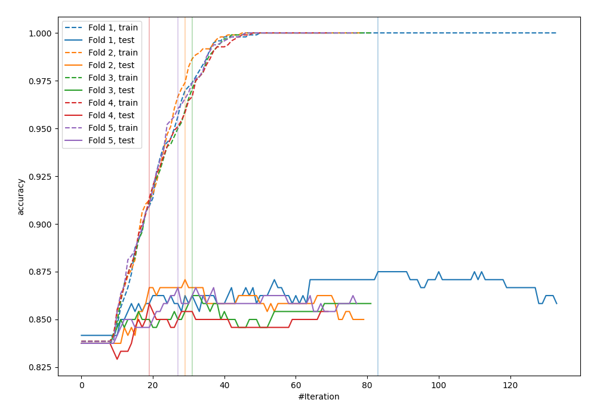
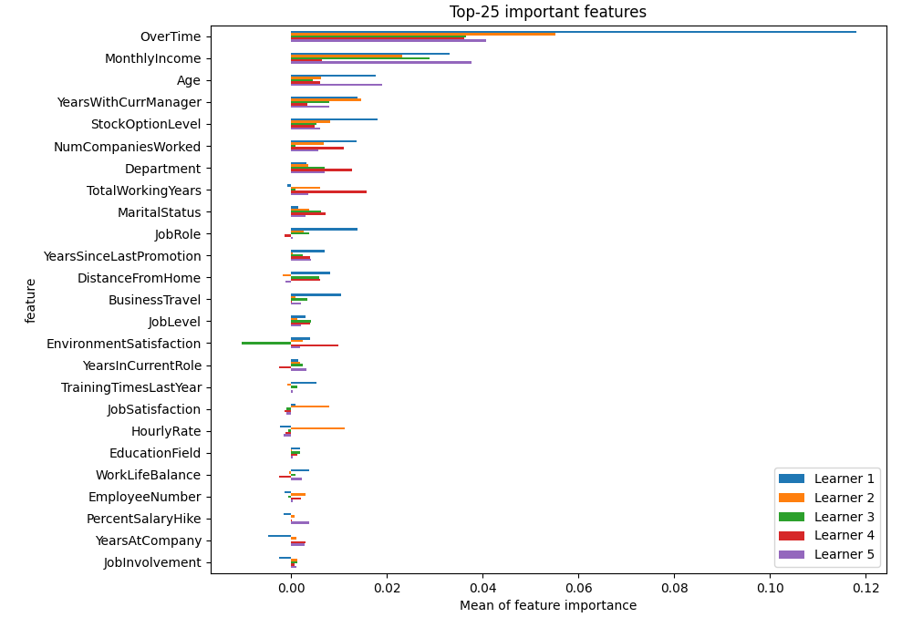
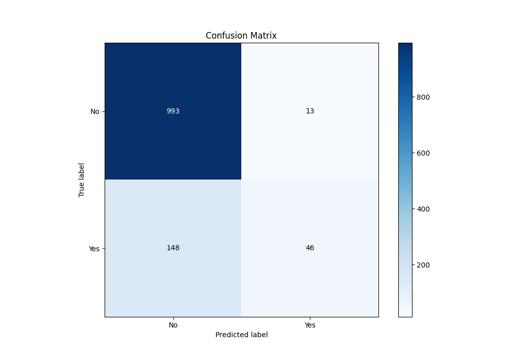
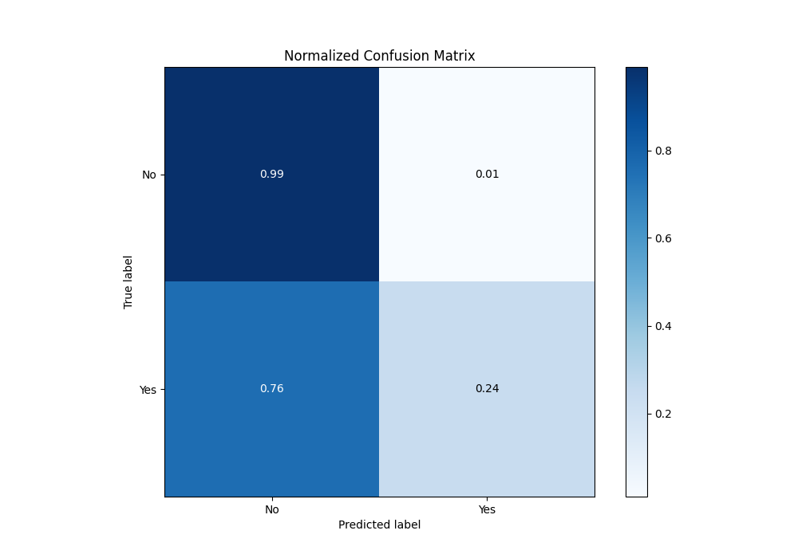
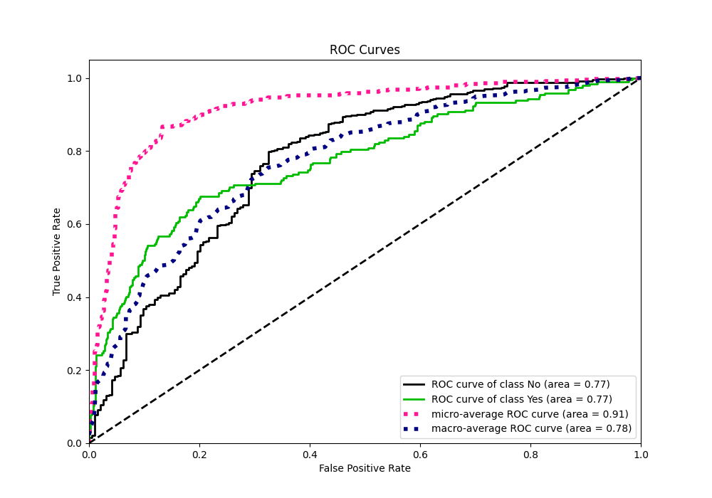
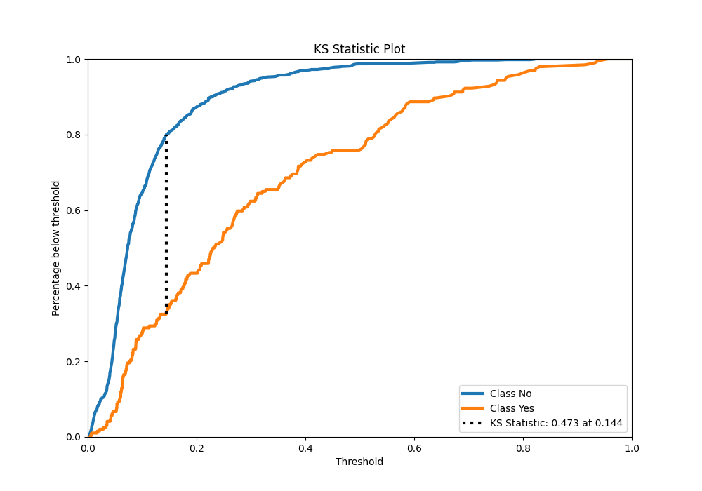
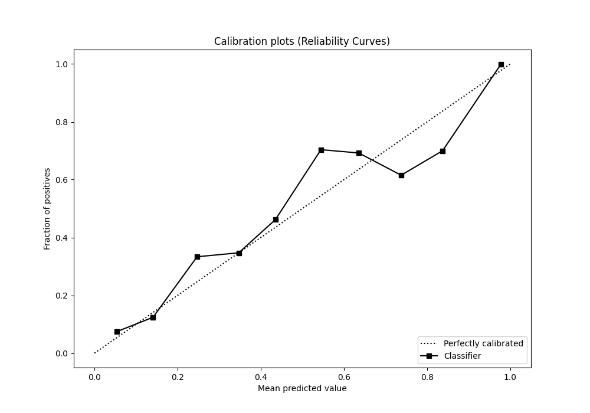
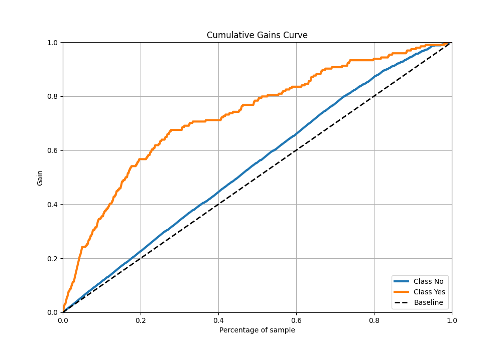
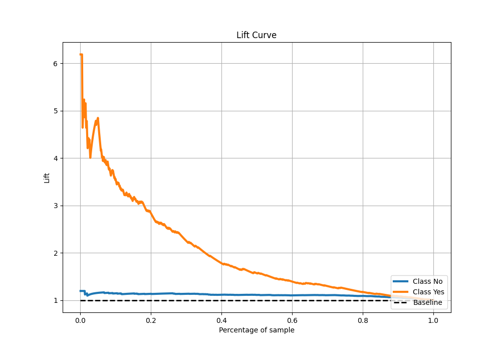

# Summary of 5_LightGBM

[<< Go back](../README.md)

## LightGBM
- **n_jobs**: -1
- **objective**: binary
- **num_leaves**: 95
- **learning_rate**: 0.05
- **feature_fraction**: 1.0
- **bagging_fraction**: 1.0
- **min_data_in_leaf**: 10
- **metric**: custom
- **custom_eval_metric_name**: accuracy
- **explain_level**: 2

## Validation
 - **validation_type**: kfold
 - **k_folds**: 5
 - **shuffle**: True
 - **stratify**: True
 - **random_seed**: 123

## Optimized metric
accuracy

## Training time

4.8 seconds

## Metric details
|           |    score |    threshold |
|:----------|---------:|-------------:|
| logloss   | 0.365839 | nan          |
| auc       | 0.774118 | nan          |
| f1        | 0.513447 |   0.221745   |
| accuracy  | 0.865833 |   0.505426   |
| precision | 0.818182 |   0.782297   |
| recall    | 1        |   0.00248028 |
| mcc       | 0.414609 |   0.221745   |

## Metric details with threshold from accuracy metric
|           |    score |   threshold |
|:----------|---------:|------------:|
| logloss   | 0.365839 |  nan        |
| auc       | 0.774118 |  nan        |
| f1        | 0.363636 |    0.505426 |
| accuracy  | 0.865833 |    0.505426 |
| precision | 0.779661 |    0.505426 |
| recall    | 0.237113 |    0.505426 |
| mcc       | 0.381724 |    0.505426 |

## Confusion matrix (at threshold=0.505426)
|                |   Predicted as No |   Predicted as Yes |
|:---------------|------------------:|-------------------:|
| Labeled as No  |               993 |                 13 |
| Labeled as Yes |               148 |                 46 |

## Learning curves

## Permutation-based Importance

## Confusion Matrix

## Normalized Confusion Matrix

## ROC Curve

## Kolmogorov-Smirnov Statistic

## Precision-Recall Curve

## Calibration Curve

## Cumulative Gains Curve

## Lift Curve

[<< Go back](../README.md)
