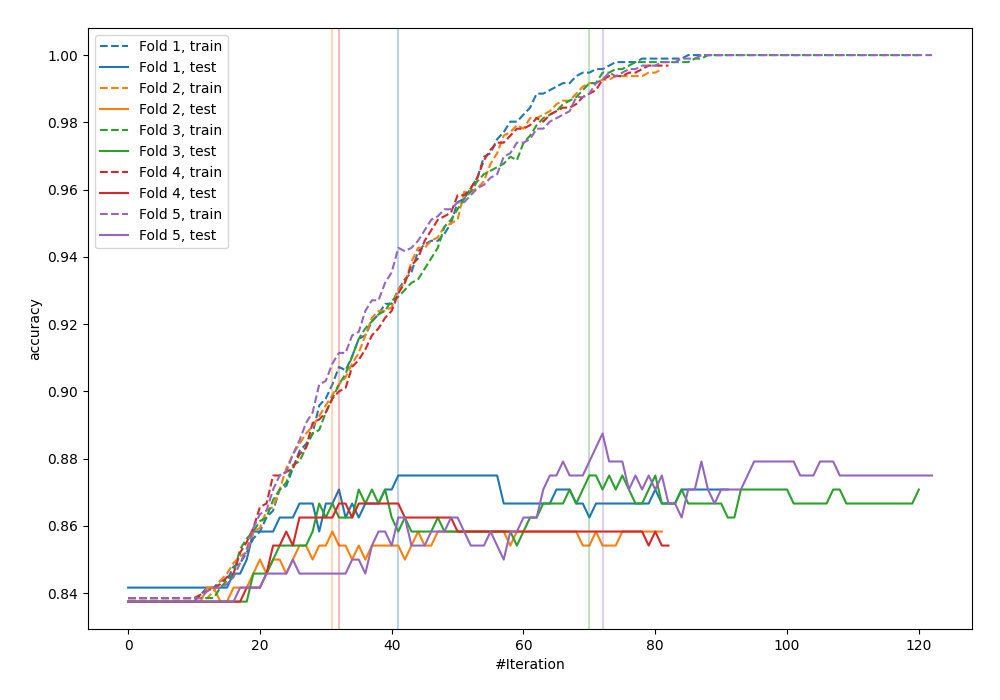
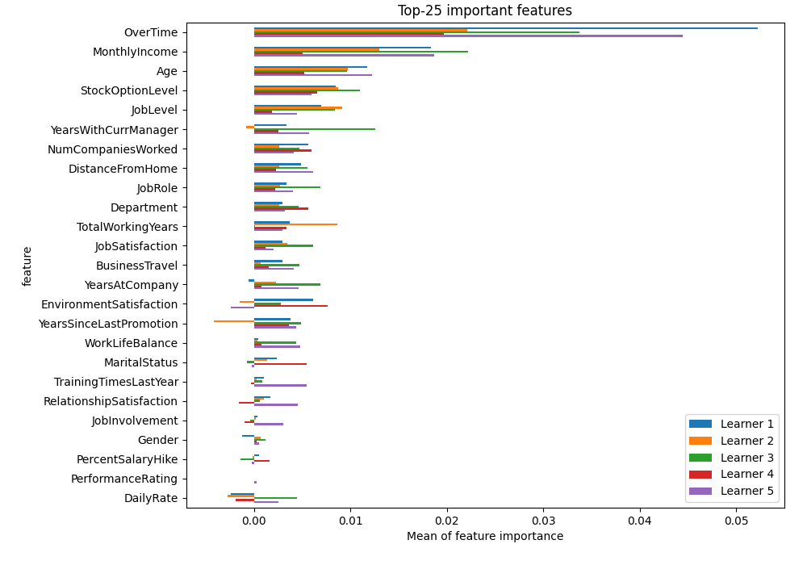
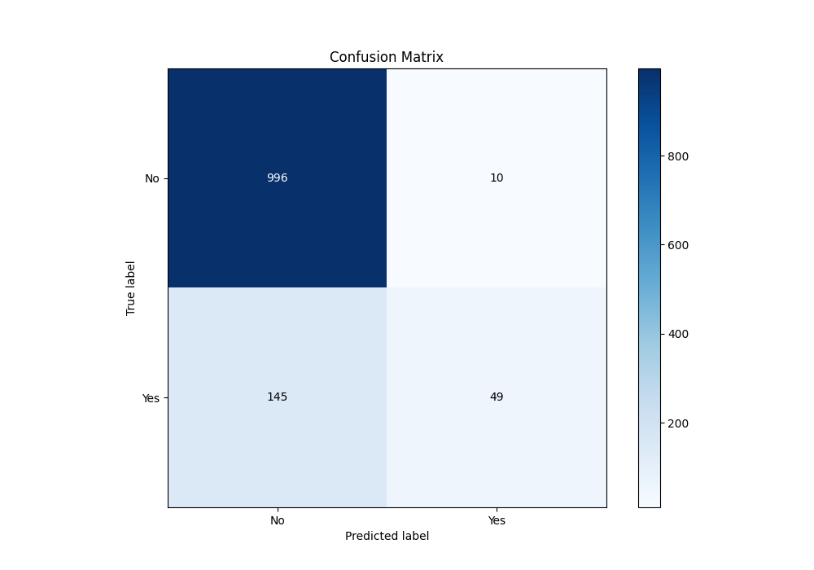
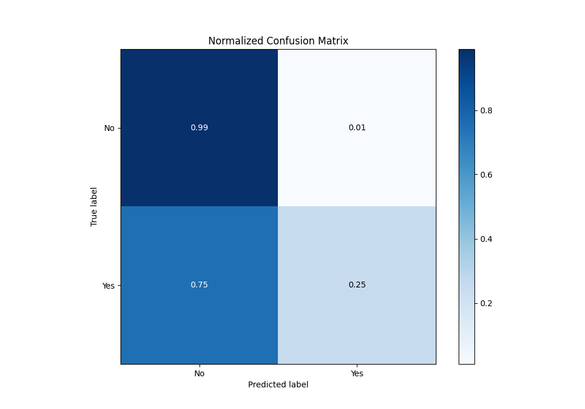
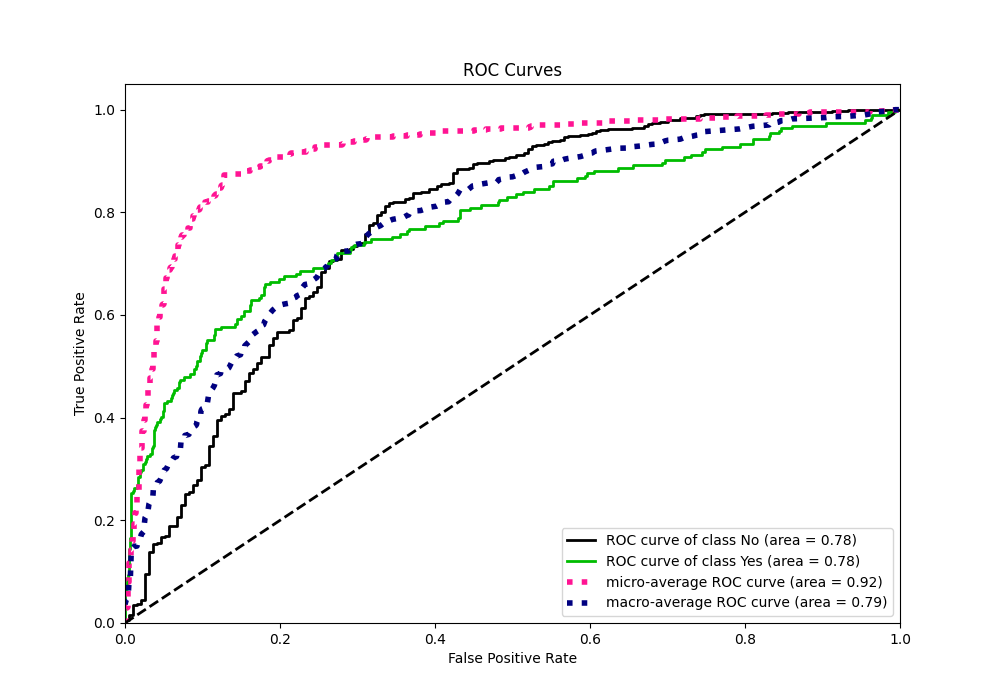
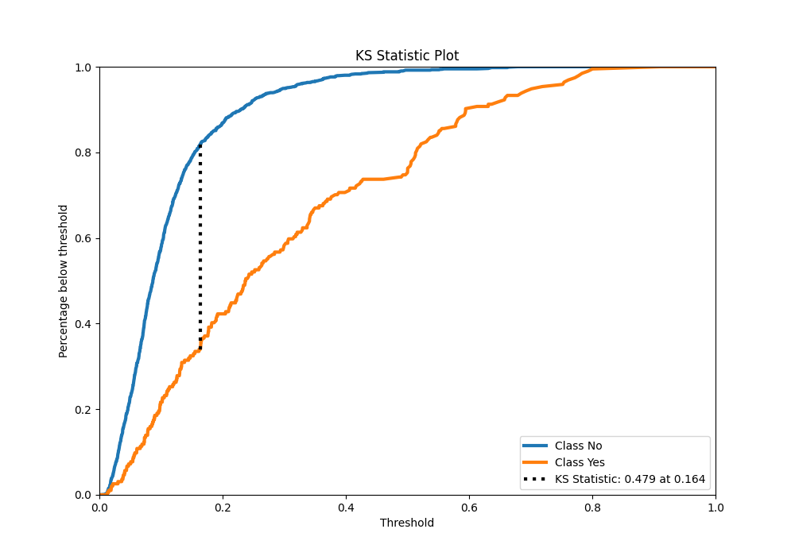
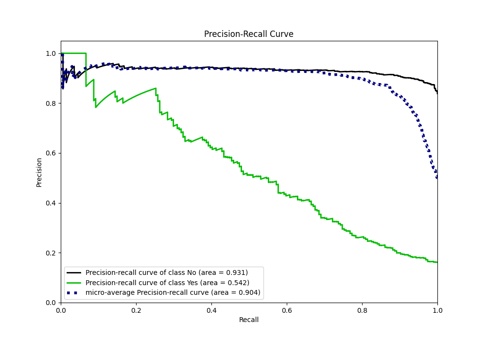
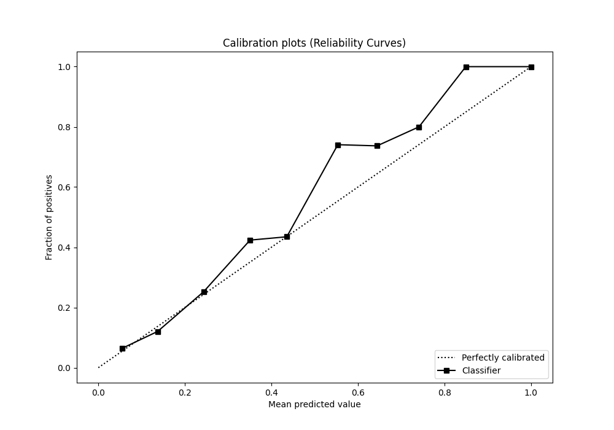
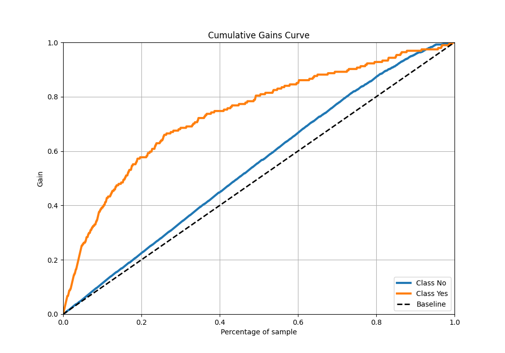
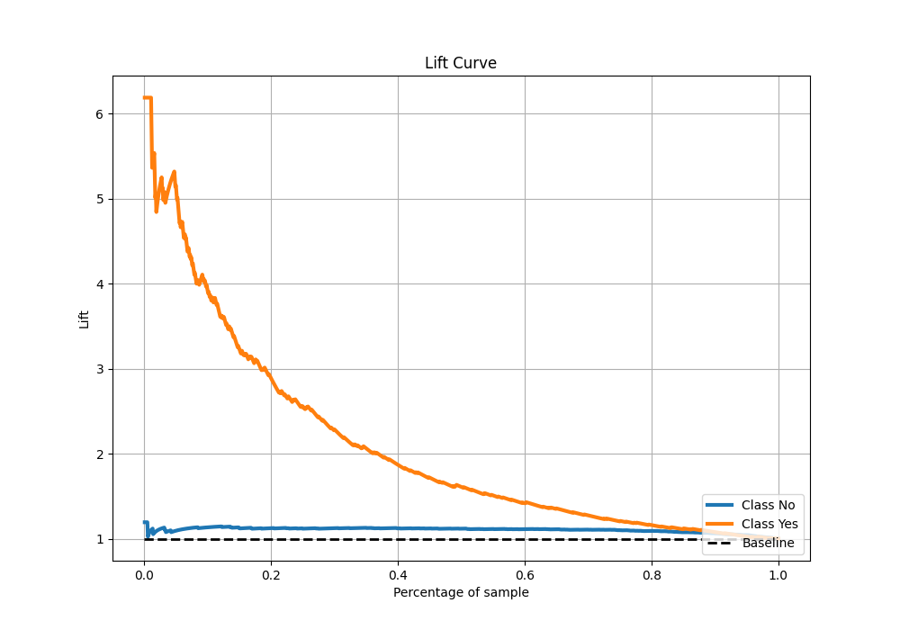

# Summary of 7_LightGBM

[<< Go back](../README.md)

## LightGBM
- **n_jobs**: -1
- **objective**: binary
- **num_leaves**: 127
- **learning_rate**: 0.05
- **feature_fraction**: 0.5
- **bagging_fraction**: 0.5
- **min_data_in_leaf**: 20
- **metric**: custom
- **custom_eval_metric_name**: accuracy
- **explain_level**: 2

## Validation
 - **validation_type**: kfold
 - **k_folds**: 5
 - **shuffle**: True
 - **stratify**: True
 - **random_seed**: 123

## Optimized metric
accuracy

## Training time

4.6 seconds

## Metric details
|           |    score |   threshold |
|:----------|---------:|------------:|
| logloss   | 0.356275 | nan         |
| auc       | 0.783572 | nan         |
| f1        | 0.523227 |   0.220854  |
| accuracy  | 0.870833 |   0.493818  |
| precision | 1        |   0.696939  |
| recall    | 1        |   0.0070274 |
| mcc       | 0.429883 |   0.32049   |

## Metric details with threshold from accuracy metric
|           |    score |   threshold |
|:----------|---------:|------------:|
| logloss   | 0.356275 |  nan        |
| auc       | 0.783572 |  nan        |
| f1        | 0.387352 |    0.493818 |
| accuracy  | 0.870833 |    0.493818 |
| precision | 0.830508 |    0.493818 |
| recall    | 0.252577 |    0.493818 |
| mcc       | 0.413131 |    0.493818 |

## Confusion matrix (at threshold=0.493818)
|                |   Predicted as No |   Predicted as Yes |
|:---------------|------------------:|-------------------:|
| Labeled as No  |               996 |                 10 |
| Labeled as Yes |               145 |                 49 |

## Learning curves

## Permutation-based Importance

## Confusion Matrix

## Normalized Confusion Matrix

## ROC Curve

## Kolmogorov-Smirnov Statistic

## Precision-Recall Curve

## Calibration Curve

## Cumulative Gains Curve

## Lift Curve

[<< Go back](../README.md)
