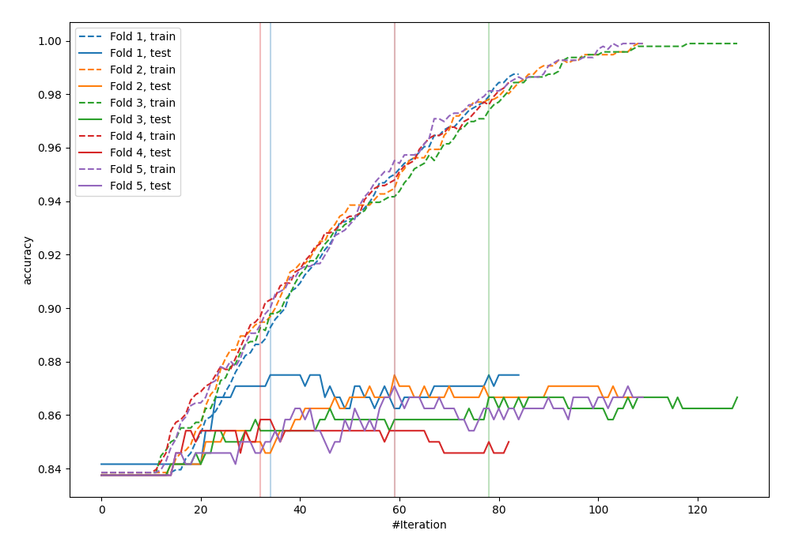
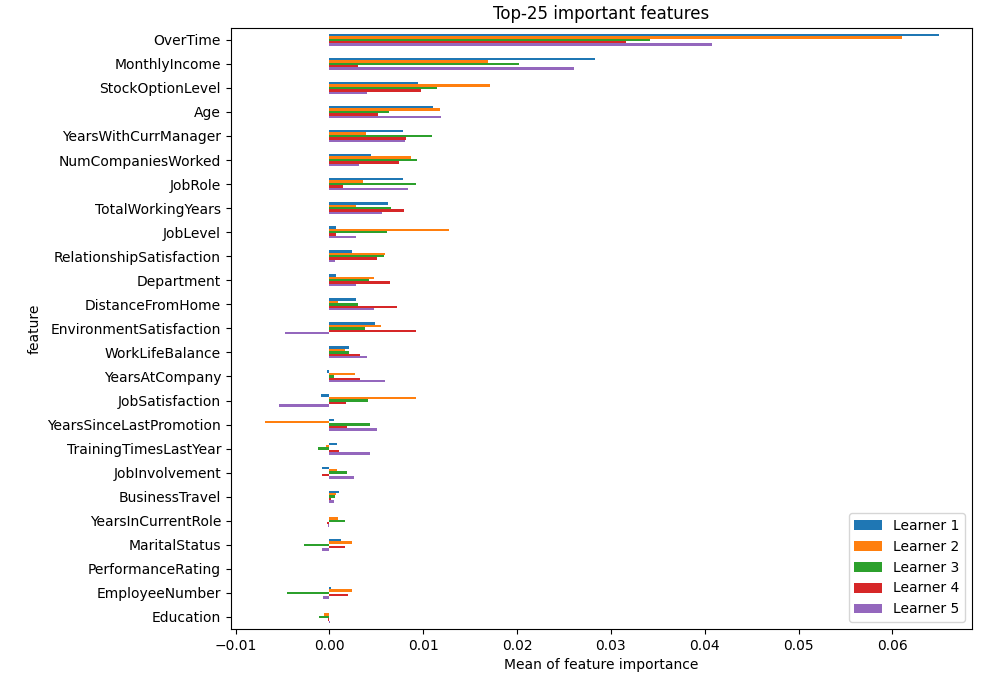
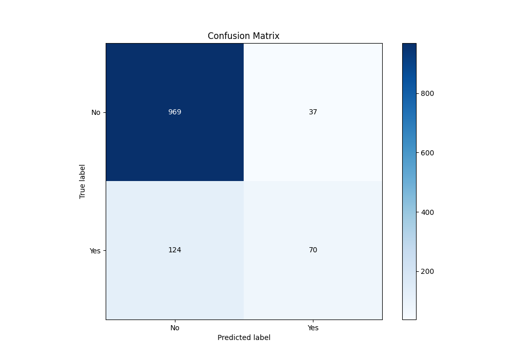
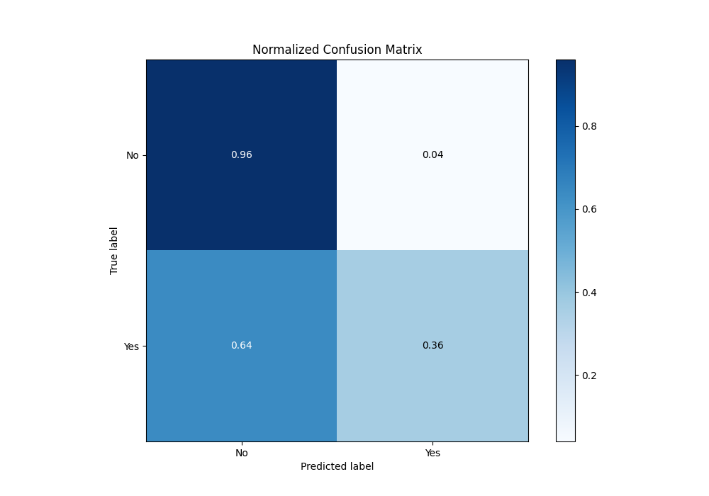
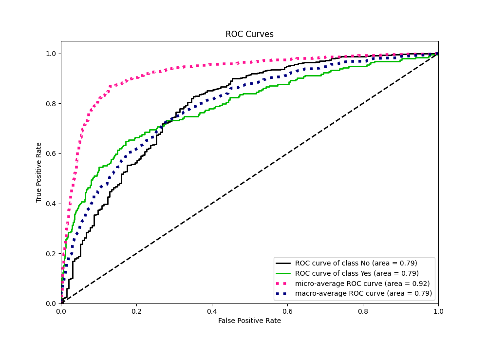
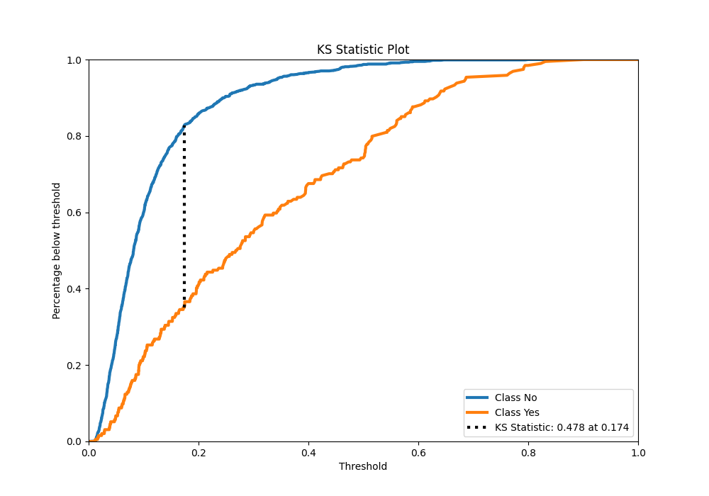
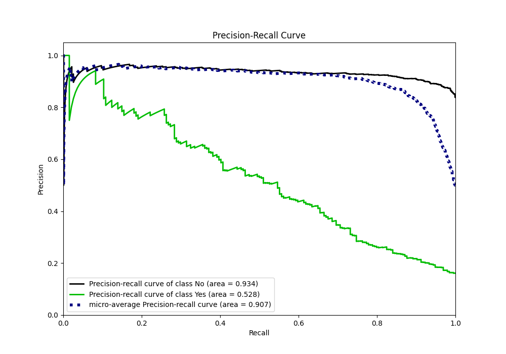
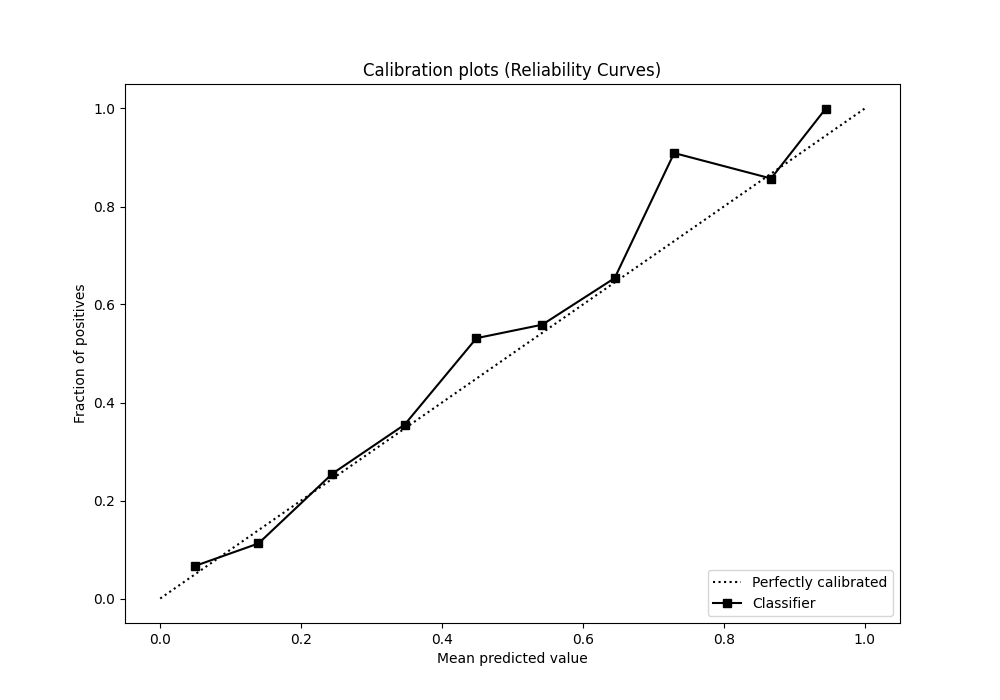

# Summary of 8_LightGBM

[<< Go back](../README.md)

## LightGBM
- **n_jobs**: -1
- **objective**: binary
- **num_leaves**: 63
- **learning_rate**: 0.05
- **feature_fraction**: 0.9
- **bagging_fraction**: 0.8
- **min_data_in_leaf**: 30
- **metric**: custom
- **custom_eval_metric_name**: accuracy
- **explain_level**: 2

## Validation
 - **validation_type**: kfold
 - **k_folds**: 5
 - **shuffle**: True
 - **stratify**: True
 - **random_seed**: 123

## Optimized metric
accuracy

## Training time

4.4 seconds

## Metric details
|           |    score |   threshold |
|:----------|---------:|------------:|
| logloss   | 0.354178 | nan         |
| auc       | 0.789469 | nan         |
| f1        | 0.518892 |   0.247246  |
| accuracy  | 0.865833 |   0.388428  |
| precision | 0.909091 |   0.686558  |
| recall    | 1        |   0.0103322 |
| mcc       | 0.426105 |   0.273799  |

## Metric details with threshold from accuracy metric
|           |    score |   threshold |
|:----------|---------:|------------:|
| logloss   | 0.354178 |  nan        |
| auc       | 0.789469 |  nan        |
| f1        | 0.465116 |    0.388428 |
| accuracy  | 0.865833 |    0.388428 |
| precision | 0.654206 |    0.388428 |
| recall    | 0.360825 |    0.388428 |
| mcc       | 0.418604 |    0.388428 |

## Confusion matrix (at threshold=0.388428)
|                |   Predicted as No |   Predicted as Yes |
|:---------------|------------------:|-------------------:|
| Labeled as No  |               969 |                 37 |
| Labeled as Yes |               124 |                 70 |

## Learning curves

## Permutation-based Importance

## Confusion Matrix

## Normalized Confusion Matrix

## ROC Curve

## Kolmogorov-Smirnov Statistic

## Precision-Recall Curve

## Calibration Curve

## Cumulative Gains Curve

## Lift Curve

[<< Go back](../README.md)
