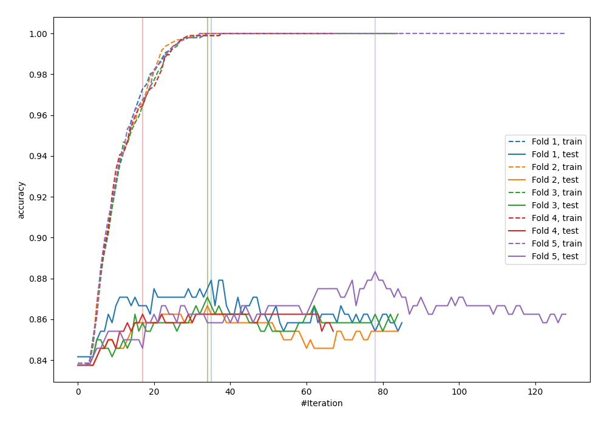
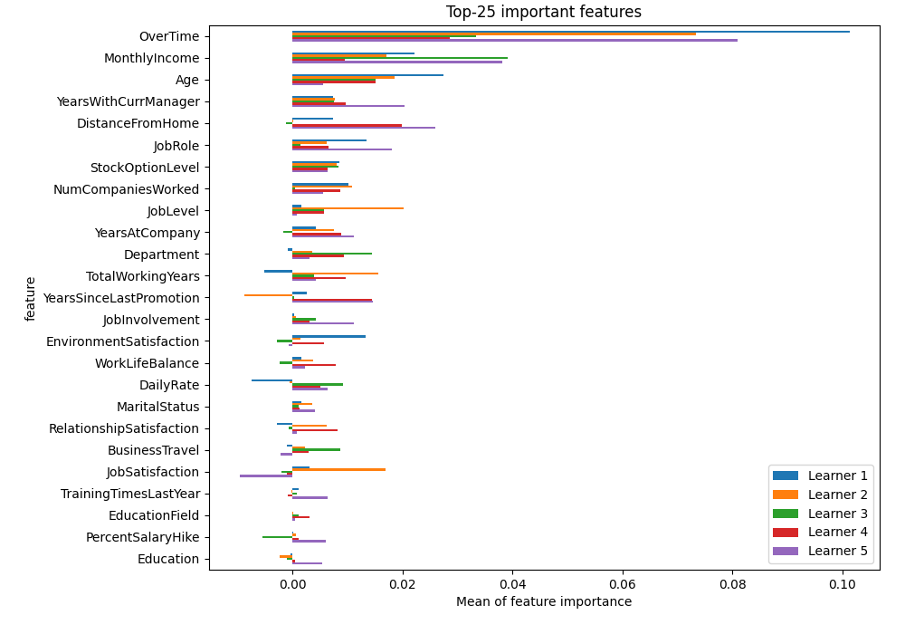
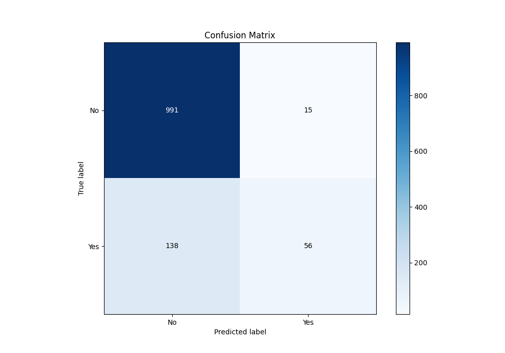
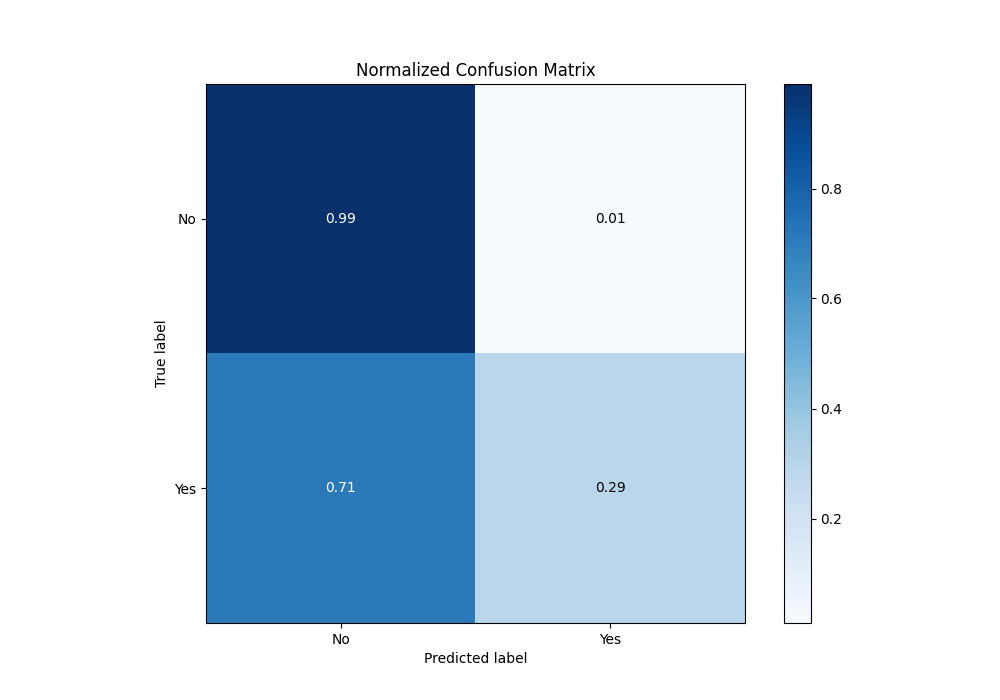
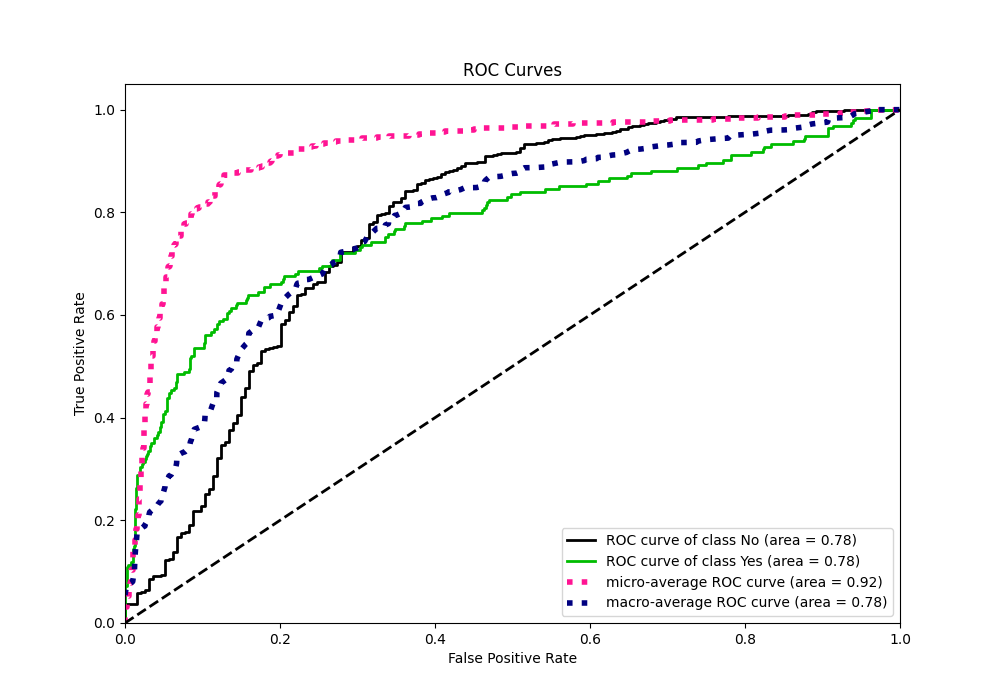
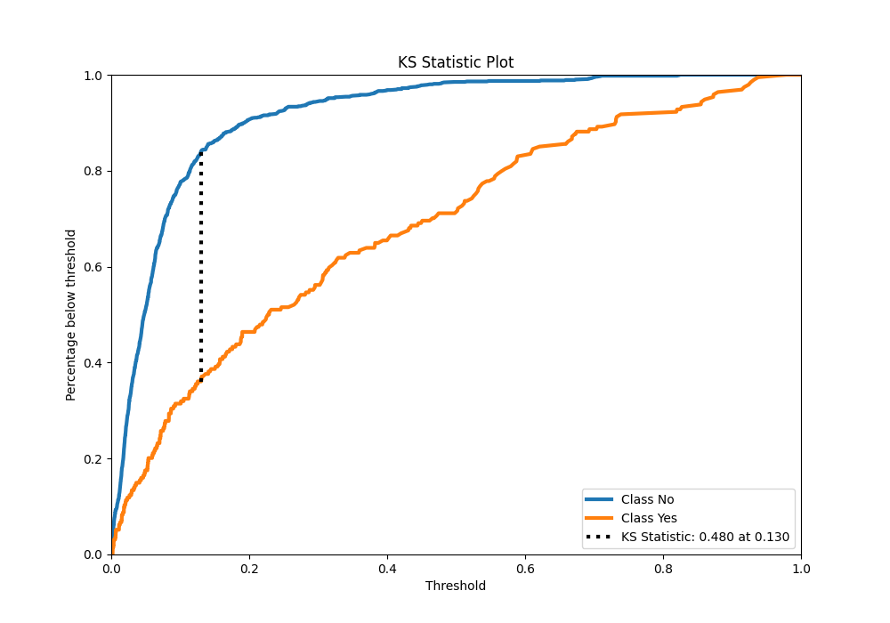
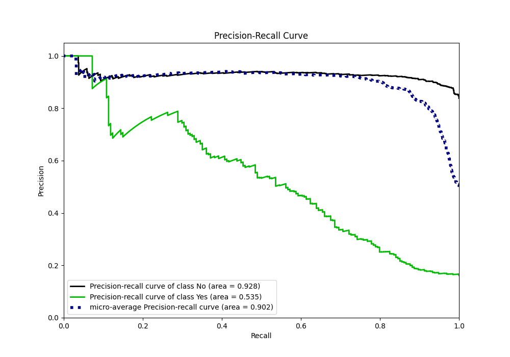
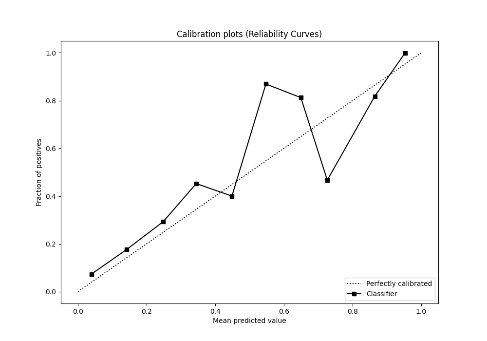
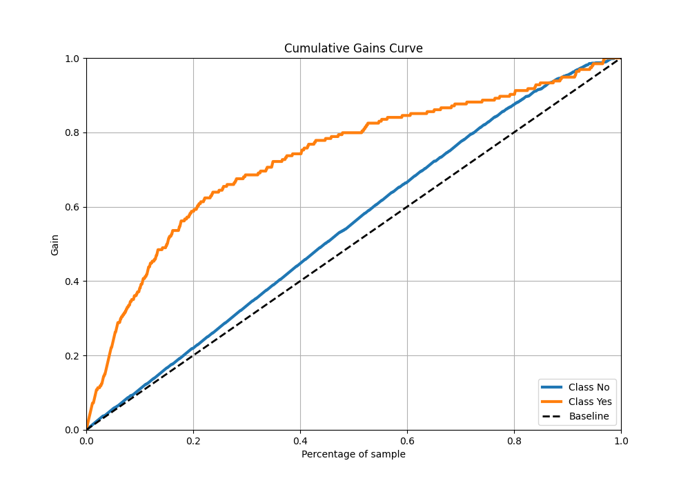
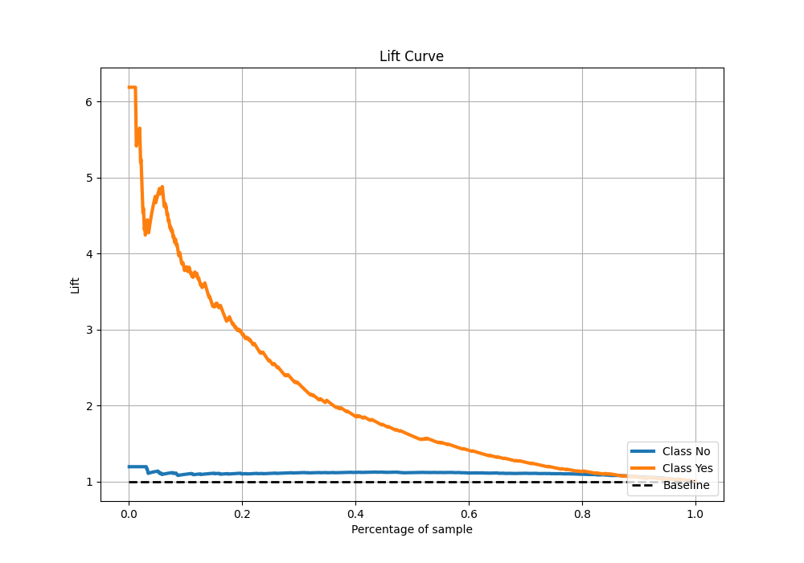

# Summary of 9_LightGBM

[<< Go back](../README.md)

## LightGBM
- **n_jobs**: -1
- **objective**: binary
- **num_leaves**: 31
- **learning_rate**: 0.1
- **feature_fraction**: 0.8
- **bagging_fraction**: 0.8
- **min_data_in_leaf**: 5
- **metric**: custom
- **custom_eval_metric_name**: accuracy
- **explain_level**: 2

## Validation
 - **validation_type**: kfold
 - **k_folds**: 5
 - **shuffle**: True
 - **stratify**: True
 - **random_seed**: 123

## Optimized metric
accuracy

## Training time

4.4 seconds

## Metric details
|           |    score |     threshold |
|:----------|---------:|--------------:|
| logloss   | 0.376184 | nan           |
| auc       | 0.778699 | nan           |
| f1        | 0.533007 |   0.184711    |
| accuracy  | 0.8725   |   0.49988     |
| precision | 1        |   0.857861    |
| recall    | 1        |   0.000209932 |
| mcc       | 0.440069 |   0.214501    |

## Metric details with threshold from accuracy metric
|           |    score |   threshold |
|:----------|---------:|------------:|
| logloss   | 0.376184 |   nan       |
| auc       | 0.778699 |   nan       |
| f1        | 0.422642 |     0.49988 |
| accuracy  | 0.8725   |     0.49988 |
| precision | 0.788732 |     0.49988 |
| recall    | 0.28866  |     0.49988 |
| mcc       | 0.427146 |     0.49988 |

## Confusion matrix (at threshold=0.49988)
|                |   Predicted as No |   Predicted as Yes |
|:---------------|------------------:|-------------------:|
| Labeled as No  |               991 |                 15 |
| Labeled as Yes |               138 |                 56 |

## Learning curves

## Permutation-based Importance

## Confusion Matrix

## Normalized Confusion Matrix

## ROC Curve

## Kolmogorov-Smirnov Statistic

## Precision-Recall Curve

## Calibration Curve

## Cumulative Gains Curve

## Lift Curve

[<< Go back](../README.md)
