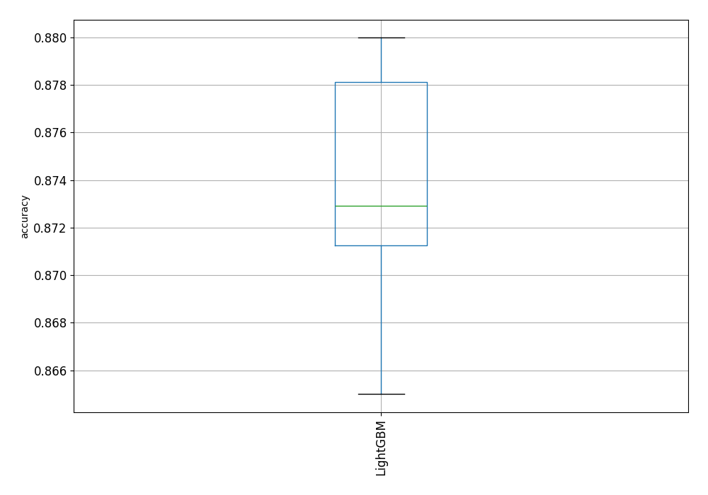

# AutoML Leaderboard

| Best model   | name                                               | model_type   | metric_type   |   metric_value |   train_time |
|:-------------|:---------------------------------------------------|:-------------|:--------------|---------------:|-------------:|
|              | [1_Default_LightGBM](1_Default_LightGBM/README.md) | LightGBM     | accuracy      |       0.8675   |         5.9  |
|              | [2_LightGBM](2_LightGBM/README.md)                 | LightGBM     | accuracy      |       0.875    |         5.1  |
|              | [3_LightGBM](3_LightGBM/README.md)                 | LightGBM     | accuracy      |       0.8775   |         5.42 |
|              | [4_LightGBM](4_LightGBM/README.md)                 | LightGBM     | accuracy      |       0.865    |         5.42 |
|              | [5_LightGBM](5_LightGBM/README.md)                 | LightGBM     | accuracy      |       0.866667 |         5.7  |
| **the best** | [6_LightGBM](6_LightGBM/README.md)                 | LightGBM     | accuracy      |       0.88     |         5.26 |
|              | [7_LightGBM](7_LightGBM/README.md)                 | LightGBM     | accuracy      |       0.8725   |         5.49 |
|              | [8_LightGBM](8_LightGBM/README.md)                 | LightGBM     | accuracy      |       0.869167 |         5.37 |
|              | [9_LightGBM](9_LightGBM/README.md)                 | LightGBM     | accuracy      |       0.8725   |         5.35 |
|              | [10_LightGBM](10_LightGBM/README.md)               | LightGBM     | accuracy      |       0.87     |         5.58 |
|              | [11_LightGBM](11_LightGBM/README.md)               | LightGBM     | accuracy      |       0.88     |         5.63 |
|              | [12_LightGBM](12_LightGBM/README.md)               | LightGBM     | accuracy      |       0.88     |         5.8  |
|              | [13_LightGBM](13_LightGBM/README.md)               | LightGBM     | accuracy      |       0.875    |         5.33 |
|              | [14_LightGBM](14_LightGBM/README.md)               | LightGBM     | accuracy      |       0.873333 |         6.09 |
|              | [15_LightGBM](15_LightGBM/README.md)               | LightGBM     | accuracy      |       0.874167 |         5.8  |
|              | [16_LightGBM](16_LightGBM/README.md)               | LightGBM     | accuracy      |       0.871667 |         5.5  |
|              | [17_LightGBM](17_LightGBM/README.md)               | LightGBM     | accuracy      |       0.871667 |         5.76 |
|              | [18_LightGBM](18_LightGBM/README.md)               | LightGBM     | accuracy      |       0.871667 |         6.06 |
|              | [19_LightGBM](19_LightGBM/README.md)               | LightGBM     | accuracy      |       0.88     |         6.19 |
|              | [20_LightGBM](20_LightGBM/README.md)               | LightGBM     | accuracy      |       0.88     |         5.82 |

### AutoML Performance

### AutoML Performance Boxplot
