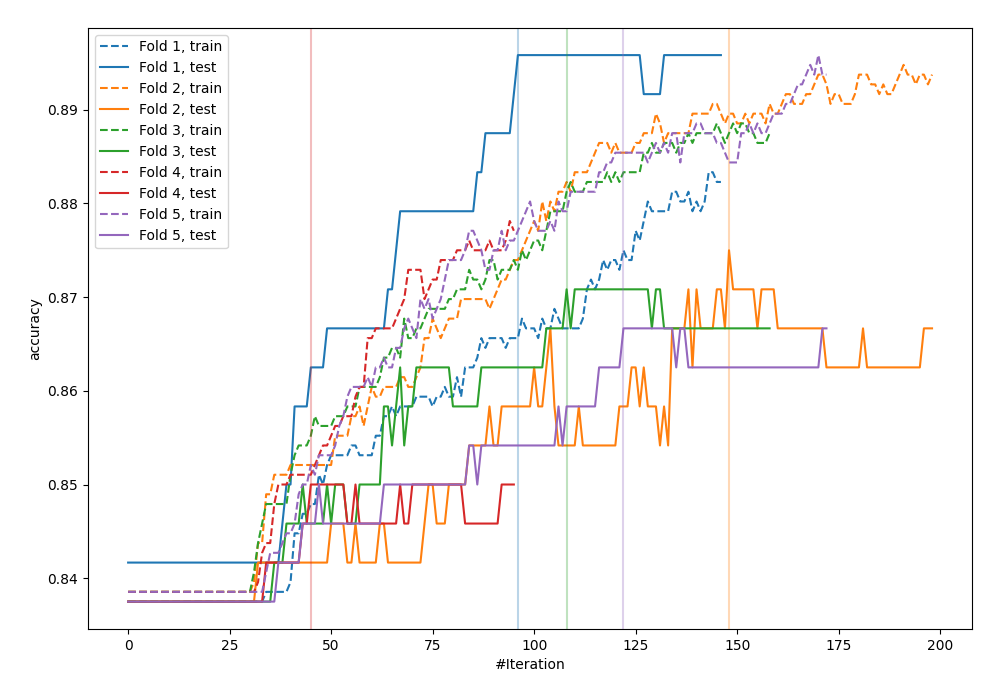
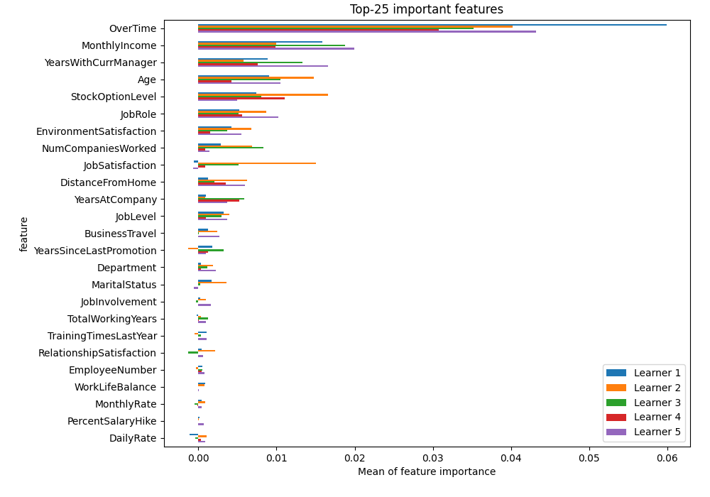
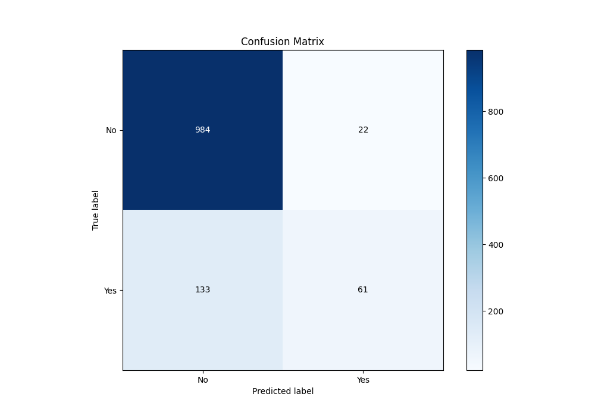
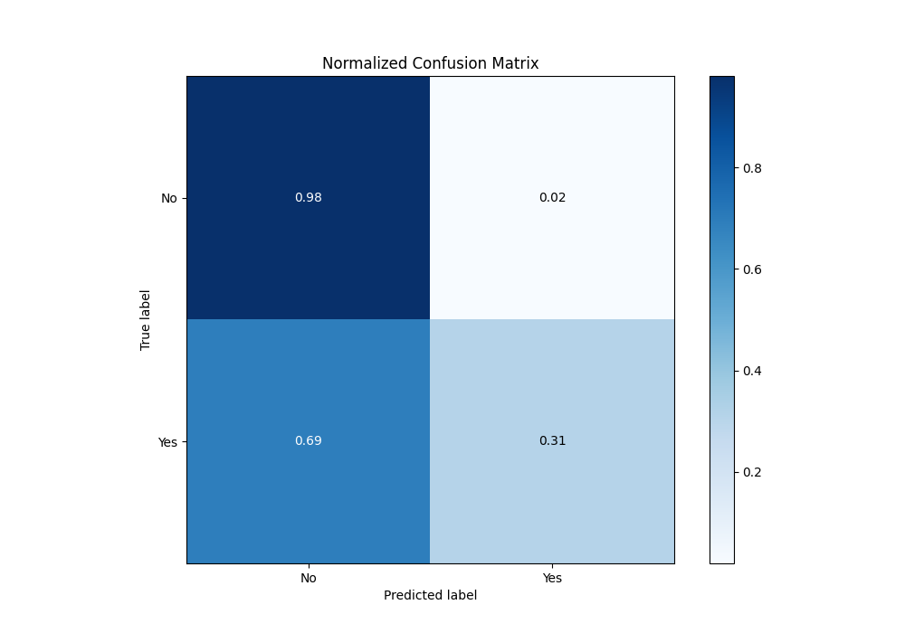
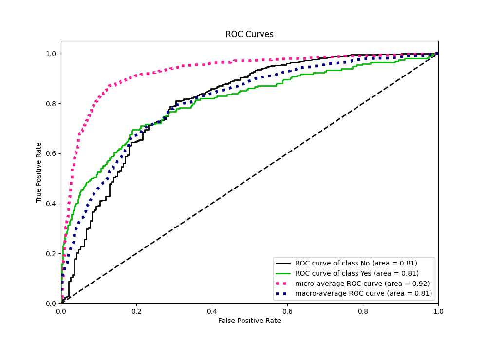
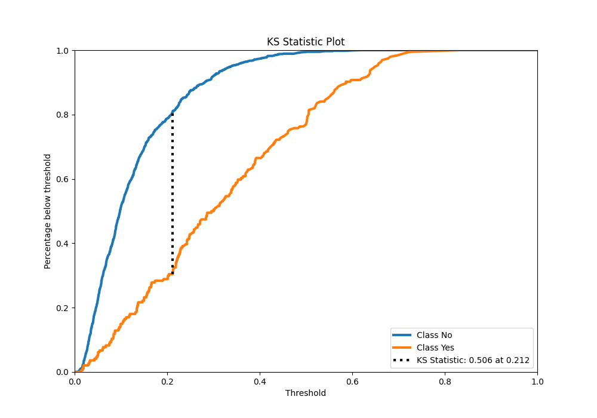
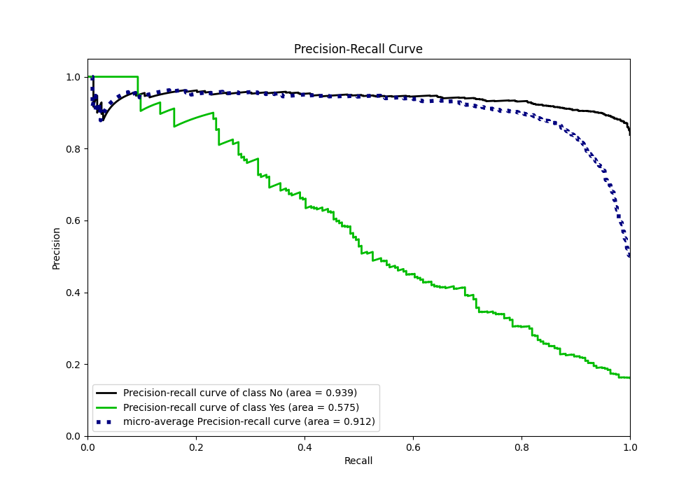
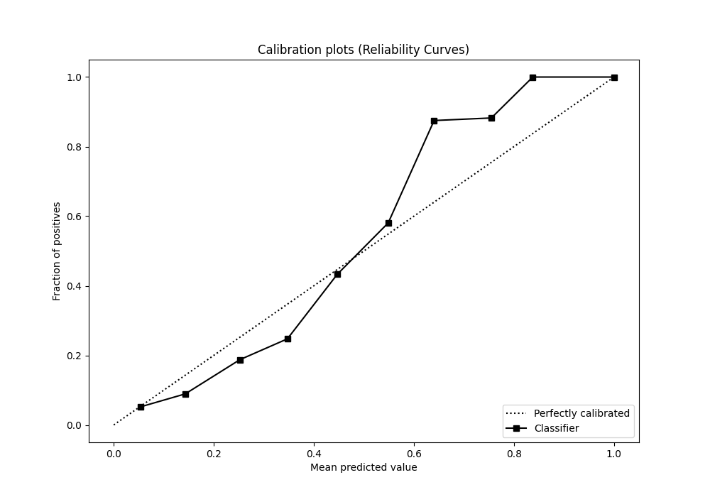
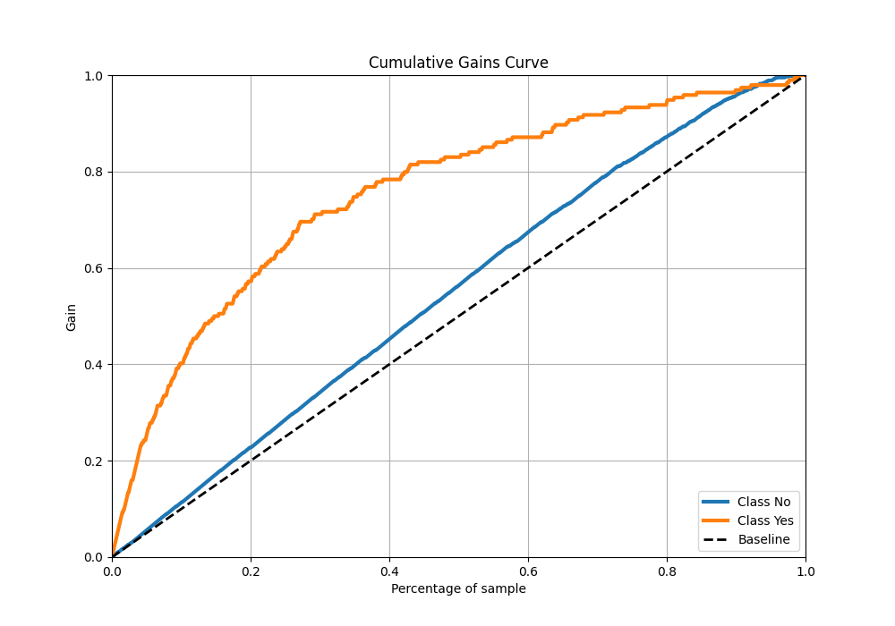
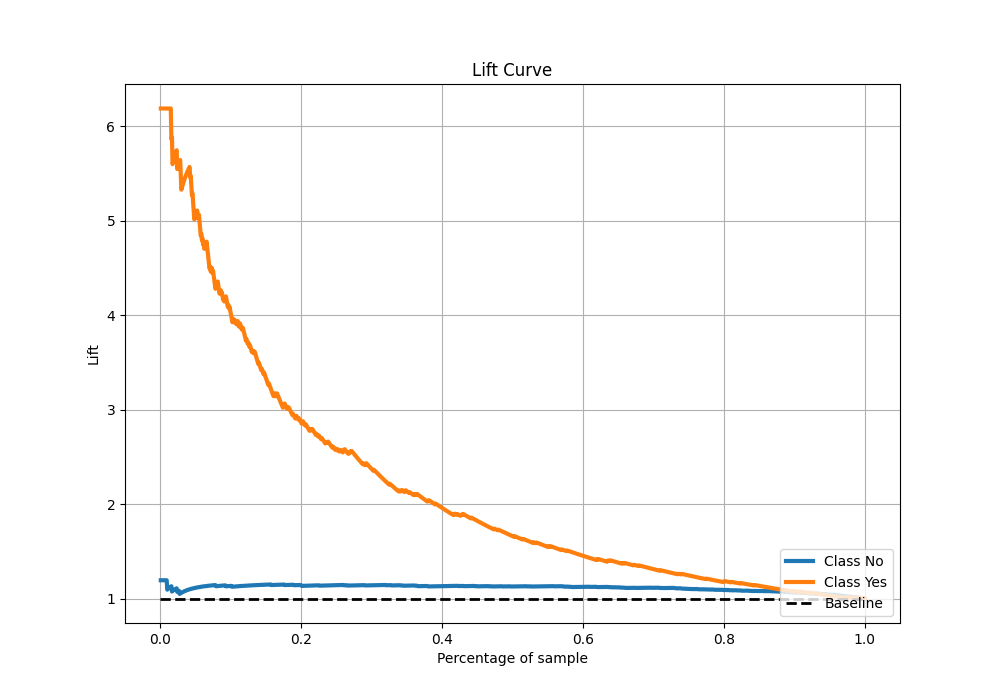

# Summary of 11_Xgboost

[<< Go back](../README.md)

## Extreme Gradient Boosting (Xgboost)
- **n_jobs**: -1
- **objective**: binary:logistic
- **eta**: 0.075
- **max_depth**: 7
- **min_child_weight**: 25
- **subsample**: 0.9
- **colsample_bytree**: 0.6
- **eval_metric**: accuracy
- **explain_level**: 2

## Validation
 - **validation_type**: kfold
 - **k_folds**: 5
 - **shuffle**: True
 - **stratify**: True
 - **random_seed**: 123

## Optimized metric
accuracy

## Training time

5.1 seconds

## Metric details
|           |    score |    threshold |
|:----------|---------:|-------------:|
| logloss   | 0.348776 | nan          |
| auc       | 0.805456 | nan          |
| f1        | 0.522255 |   0.331417   |
| accuracy  | 0.870833 |   0.41531    |
| precision | 1        |   0.646747   |
| recall    | 1        |   0.00624074 |
| mcc       | 0.453313 |   0.331417   |

## Metric details with threshold from accuracy metric
|           |    score |   threshold |
|:----------|---------:|------------:|
| logloss   | 0.348776 |   nan       |
| auc       | 0.805456 |   nan       |
| f1        | 0.440433 |     0.41531 |
| accuracy  | 0.870833 |     0.41531 |
| precision | 0.73494  |     0.41531 |
| recall    | 0.314433 |     0.41531 |
| mcc       | 0.424478 |     0.41531 |

## Confusion matrix (at threshold=0.41531)
|                |   Predicted as No |   Predicted as Yes |
|:---------------|------------------:|-------------------:|
| Labeled as No  |               984 |                 22 |
| Labeled as Yes |               133 |                 61 |

## Learning curves

## Permutation-based Importance

## Confusion Matrix

## Normalized Confusion Matrix

## ROC Curve

## Kolmogorov-Smirnov Statistic

## Precision-Recall Curve

## Calibration Curve

## Cumulative Gains Curve

## Lift Curve

[<< Go back](../README.md)
