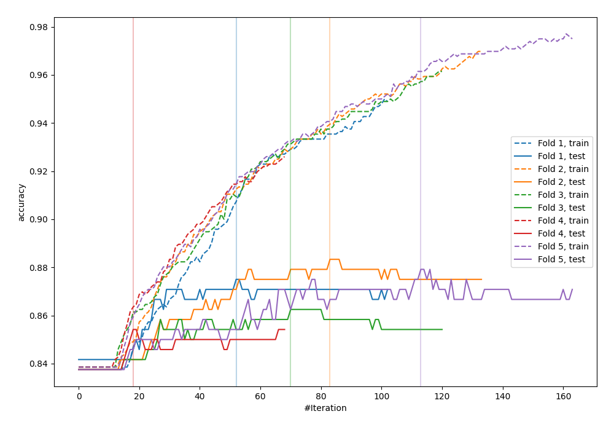
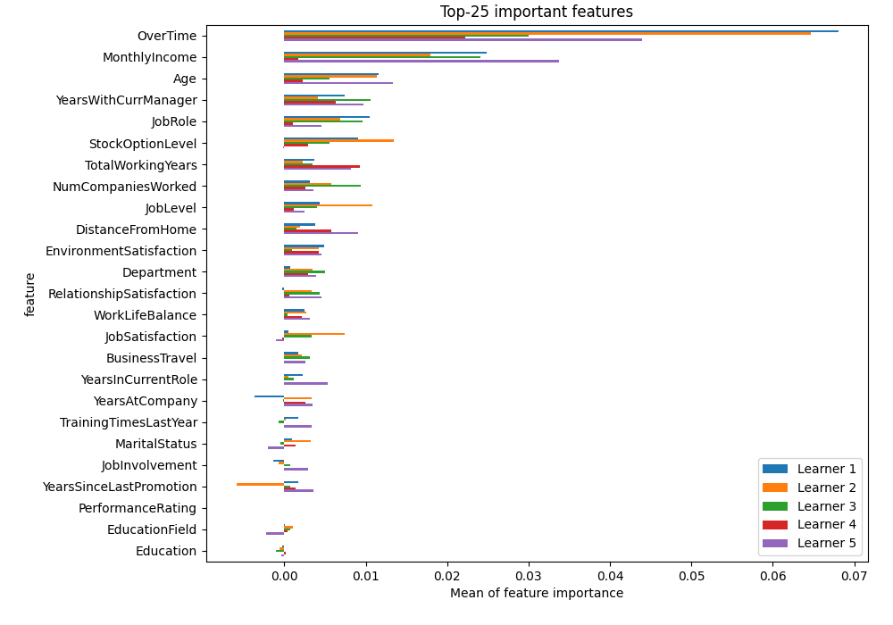
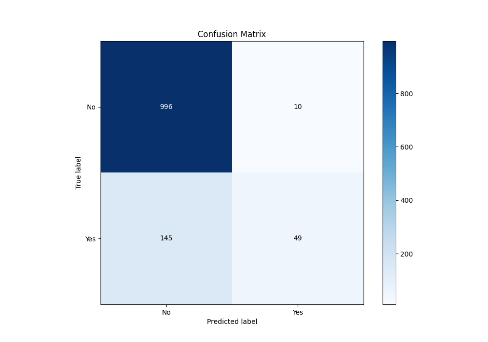
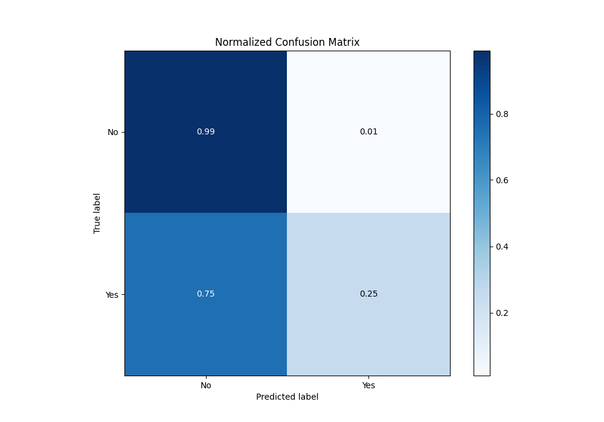
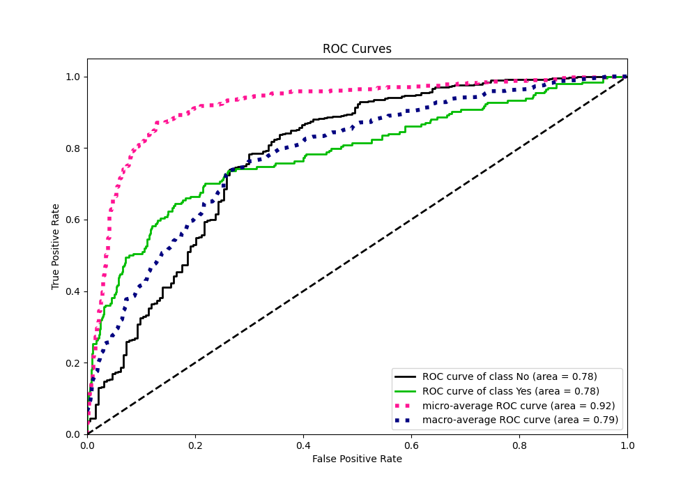
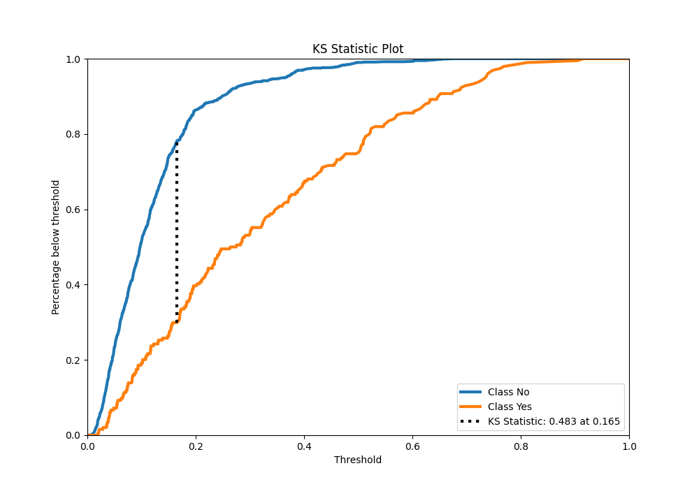
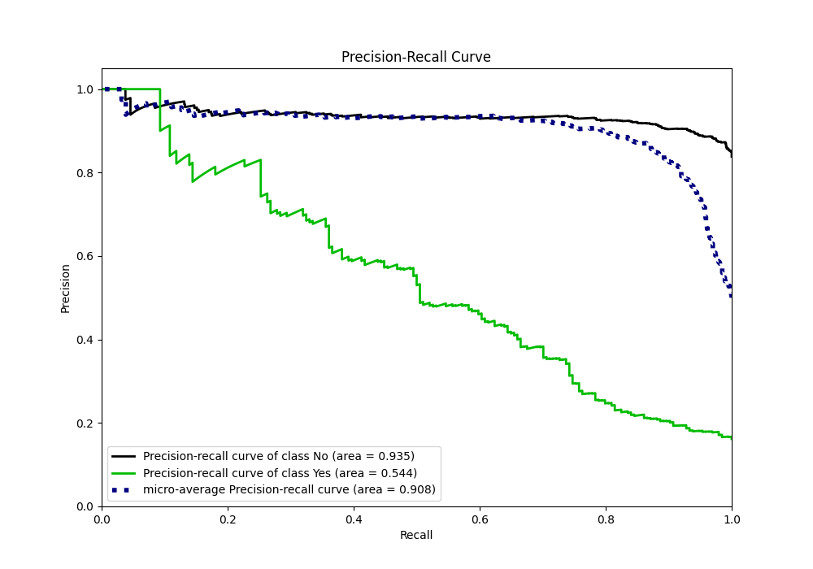
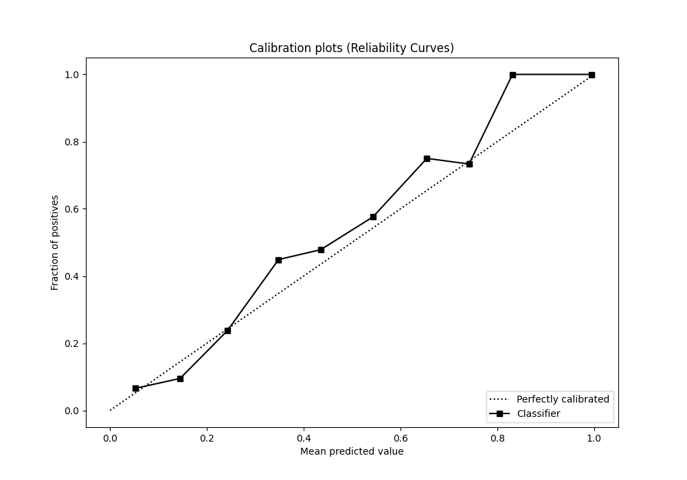
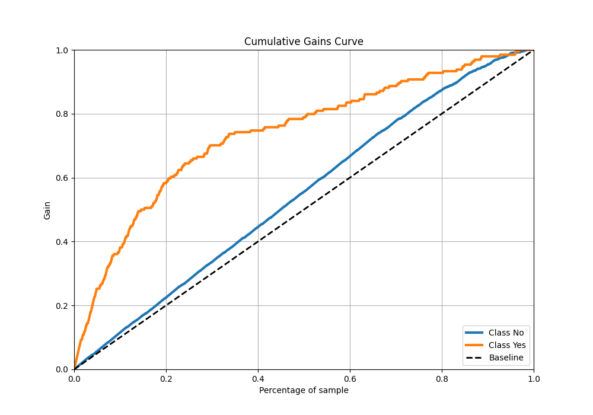
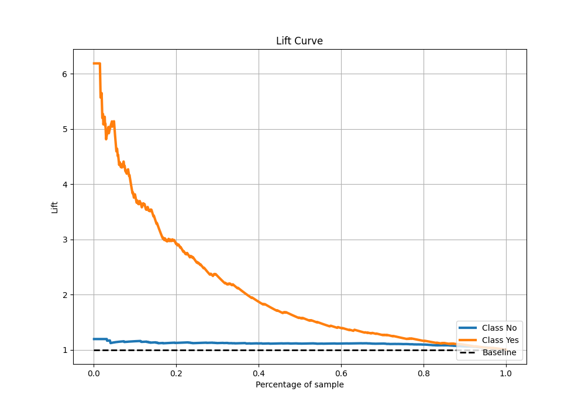

# Summary of 14_Xgboost

[<< Go back](../README.md)

## Extreme Gradient Boosting (Xgboost)
- **n_jobs**: -1
- **objective**: binary:logistic
- **eta**: 0.05
- **max_depth**: 8
- **min_child_weight**: 5
- **subsample**: 1.0
- **colsample_bytree**: 1.0
- **eval_metric**: accuracy
- **explain_level**: 2

## Validation
 - **validation_type**: kfold
 - **k_folds**: 5
 - **shuffle**: True
 - **stratify**: True
 - **random_seed**: 123

## Optimized metric
accuracy

## Training time

5.1 seconds

## Metric details
|           |    score |    threshold |
|:----------|---------:|-------------:|
| logloss   | 0.354664 | nan          |
| auc       | 0.783961 | nan          |
| f1        | 0.526316 |   0.283682   |
| accuracy  | 0.870833 |   0.498872   |
| precision | 1        |   0.731043   |
| recall    | 1        |   0.00749179 |
| mcc       | 0.444726 |   0.283682   |

## Metric details with threshold from accuracy metric
|           |    score |   threshold |
|:----------|---------:|------------:|
| logloss   | 0.354664 |  nan        |
| auc       | 0.783961 |  nan        |
| f1        | 0.387352 |    0.498872 |
| accuracy  | 0.870833 |    0.498872 |
| precision | 0.830508 |    0.498872 |
| recall    | 0.252577 |    0.498872 |
| mcc       | 0.413131 |    0.498872 |

## Confusion matrix (at threshold=0.498872)
|                |   Predicted as No |   Predicted as Yes |
|:---------------|------------------:|-------------------:|
| Labeled as No  |               996 |                 10 |
| Labeled as Yes |               145 |                 49 |

## Learning curves

## Permutation-based Importance

## Confusion Matrix

## Normalized Confusion Matrix

## ROC Curve

## Kolmogorov-Smirnov Statistic

## Precision-Recall Curve

## Calibration Curve

## Cumulative Gains Curve

## Lift Curve

[<< Go back](../README.md)
