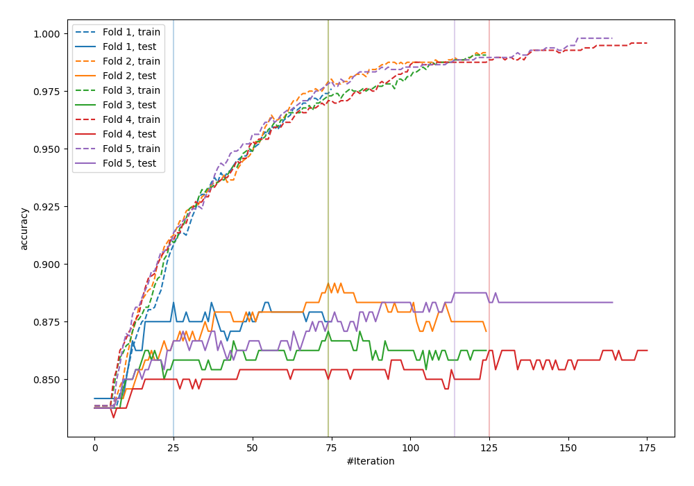
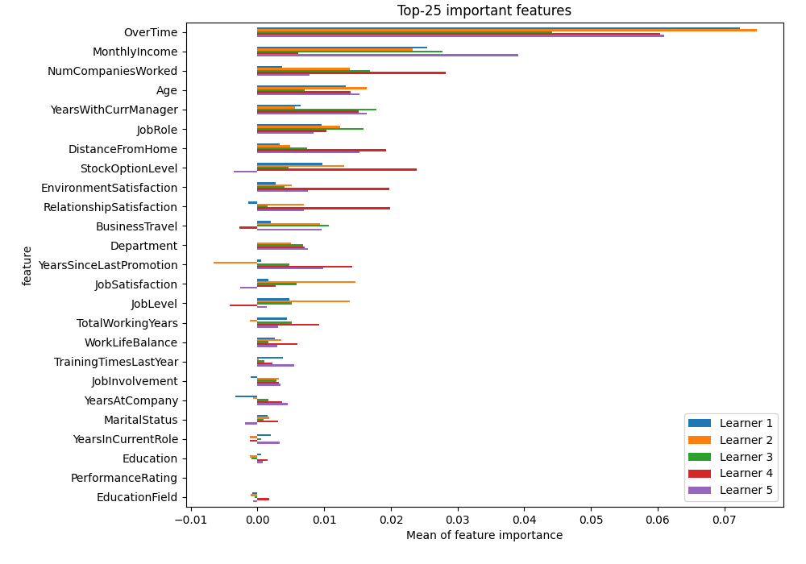
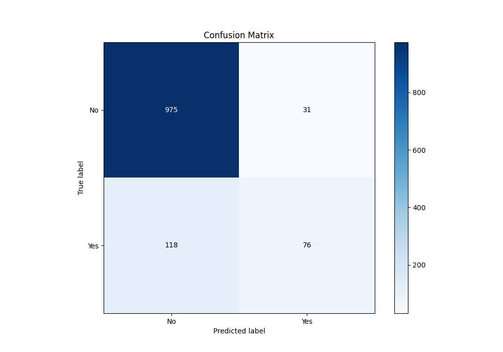
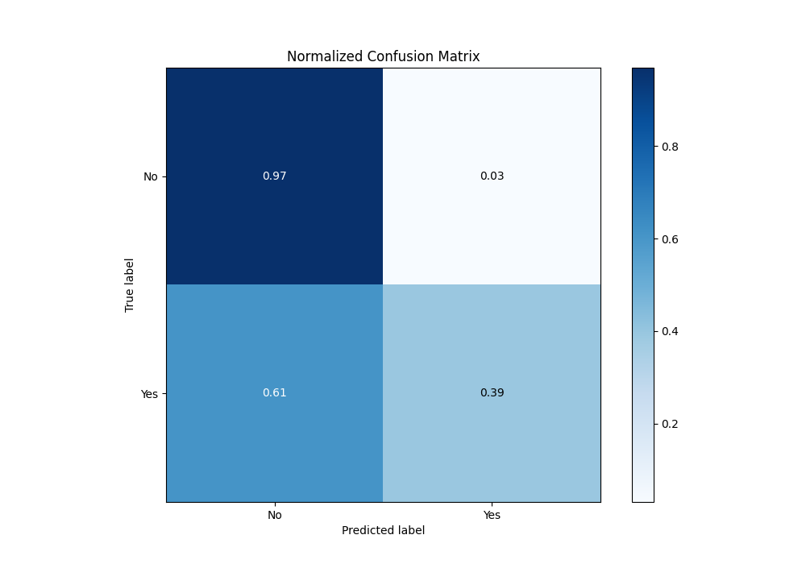
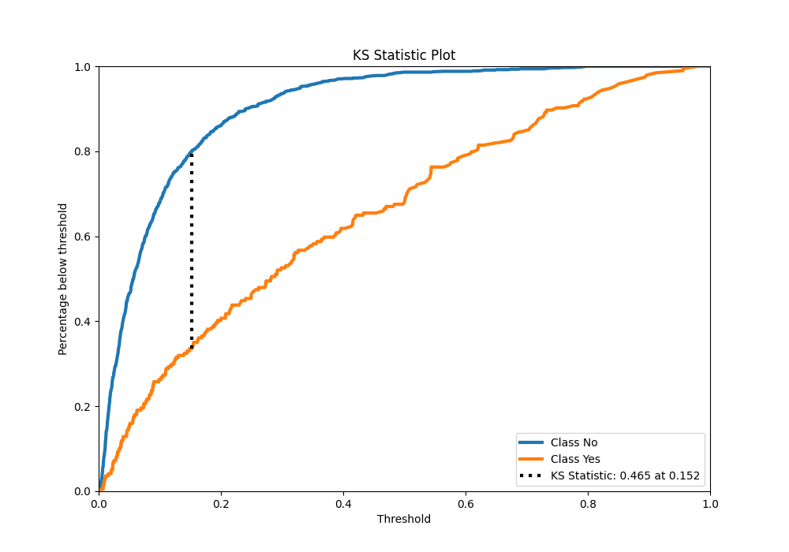
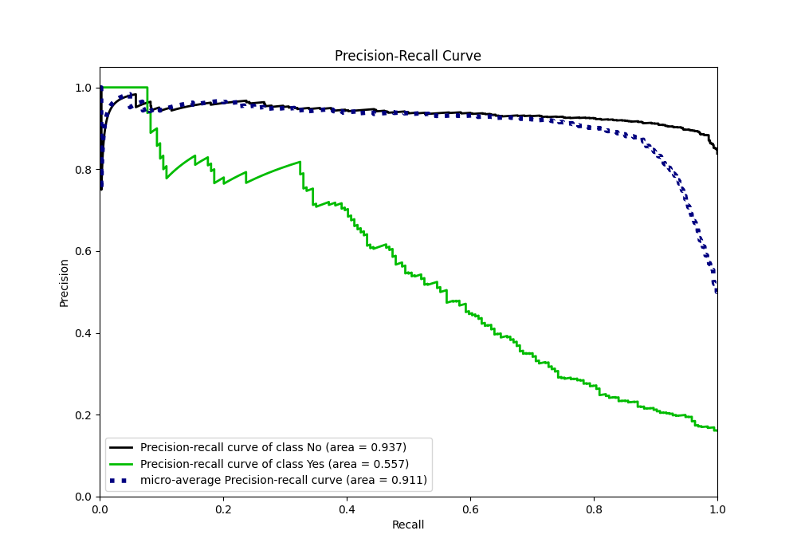
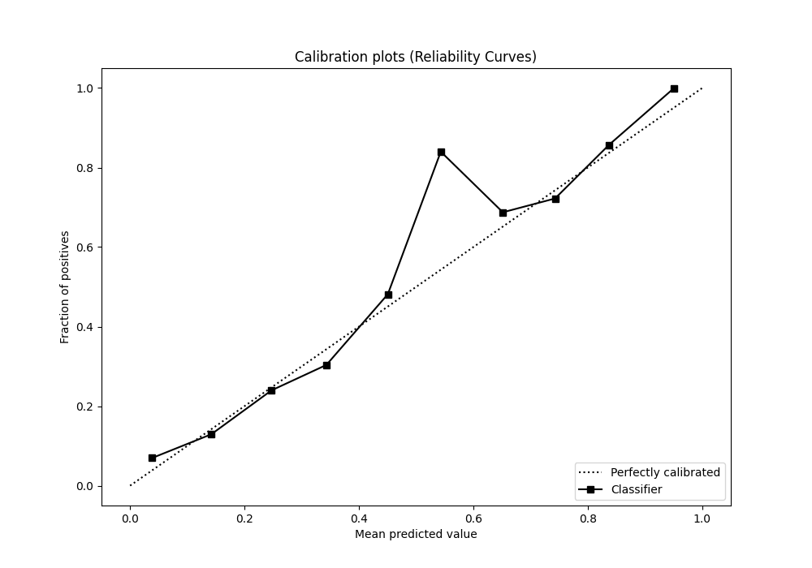
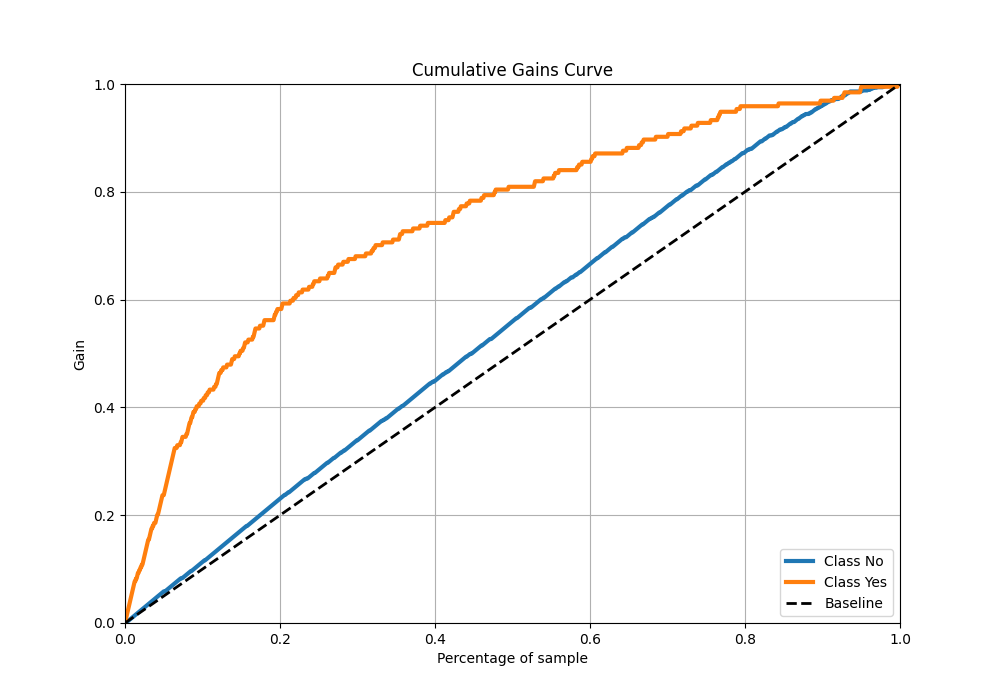
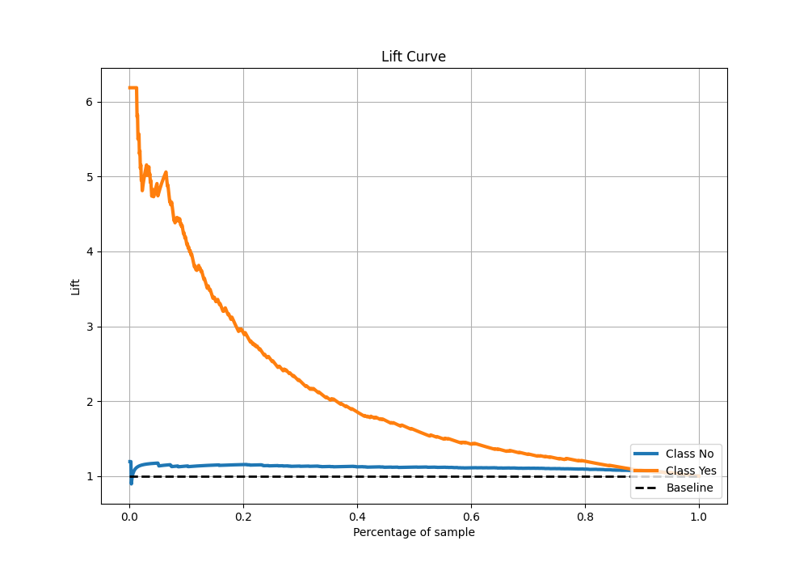

# Summary of 15_Xgboost

[<< Go back](../README.md)

## Extreme Gradient Boosting (Xgboost)
- **n_jobs**: -1
- **objective**: binary:logistic
- **eta**: 0.1
- **max_depth**: 8
- **min_child_weight**: 5
- **subsample**: 1.0
- **colsample_bytree**: 1.0
- **eval_metric**: accuracy
- **explain_level**: 2

## Validation
 - **validation_type**: kfold
 - **k_folds**: 5
 - **shuffle**: True
 - **stratify**: True
 - **random_seed**: 123

## Optimized metric
accuracy

## Training time

5.3 seconds

## Metric details
|           |    score |     threshold |
|:----------|---------:|--------------:|
| logloss   | 0.353866 | nan           |
| auc       | 0.792856 | nan           |
| f1        | 0.534005 |   0.248511    |
| accuracy  | 0.875833 |   0.390742    |
| precision | 1        |   0.829896    |
| recall    | 1        |   0.000903932 |
| mcc       | 0.466262 |   0.390742    |

## Metric details with threshold from accuracy metric
|           |    score |   threshold |
|:----------|---------:|------------:|
| logloss   | 0.353866 |  nan        |
| auc       | 0.792856 |  nan        |
| f1        | 0.504983 |    0.390742 |
| accuracy  | 0.875833 |    0.390742 |
| precision | 0.71028  |    0.390742 |
| recall    | 0.391753 |    0.390742 |
| mcc       | 0.466262 |    0.390742 |

## Confusion matrix (at threshold=0.390742)
|                |   Predicted as No |   Predicted as Yes |
|:---------------|------------------:|-------------------:|
| Labeled as No  |               975 |                 31 |
| Labeled as Yes |               118 |                 76 |

## Learning curves

## Permutation-based Importance

## Confusion Matrix

## Normalized Confusion Matrix

## ROC Curve

## Kolmogorov-Smirnov Statistic

## Precision-Recall Curve

## Calibration Curve

## Cumulative Gains Curve

## Lift Curve

[<< Go back](../README.md)
