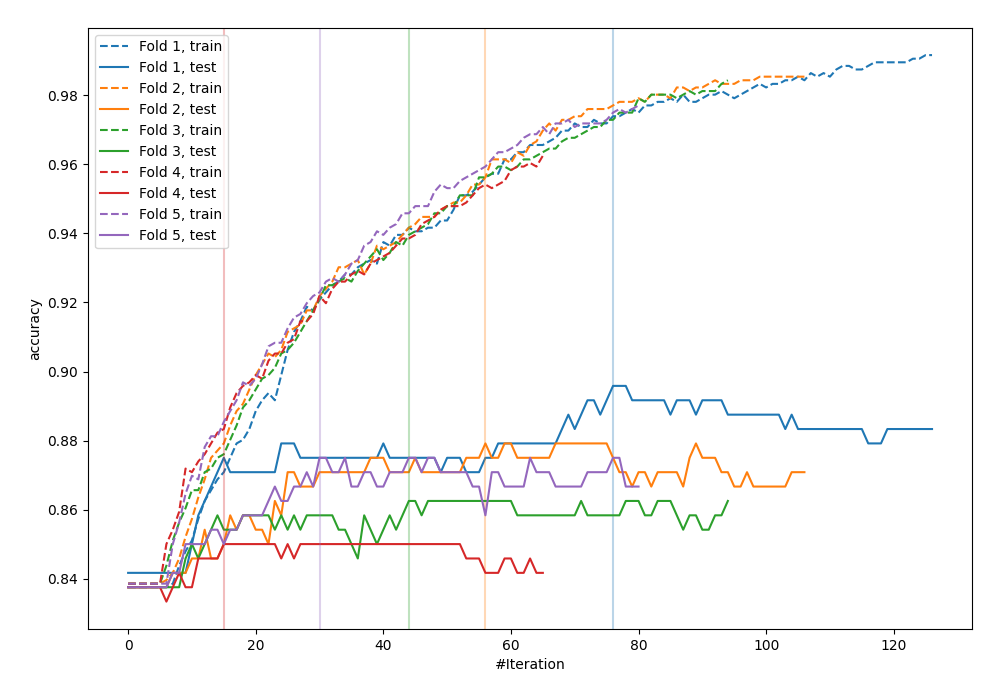
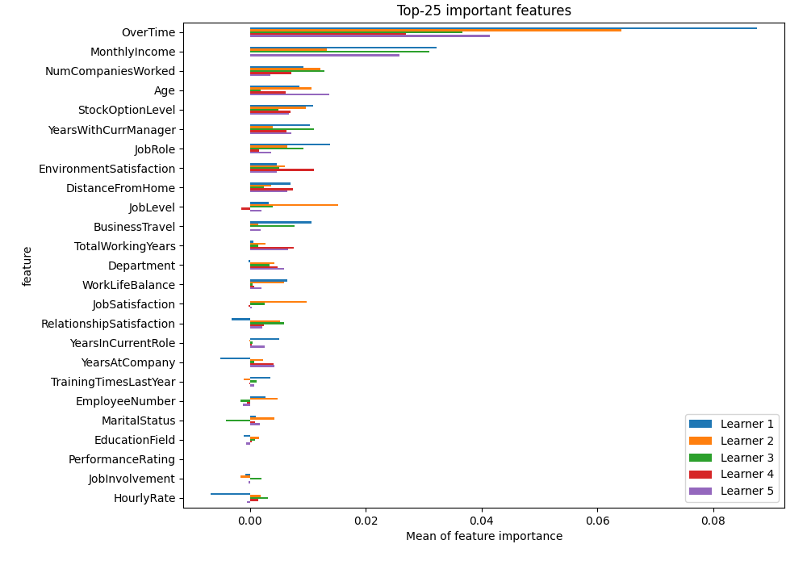
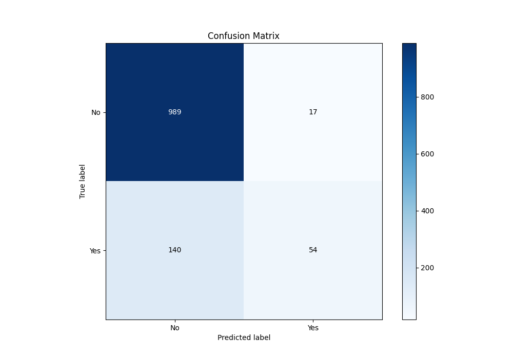
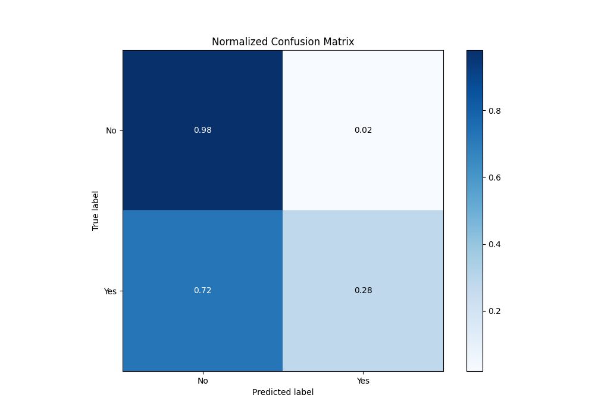
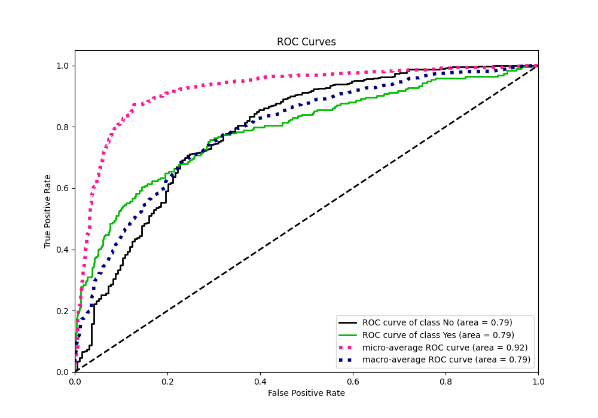
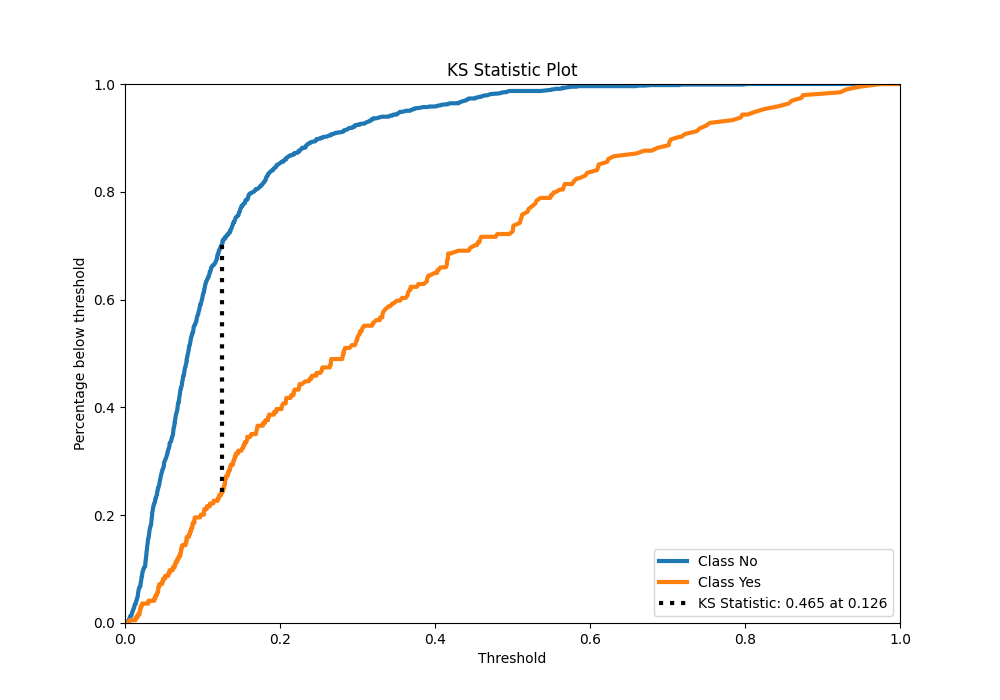
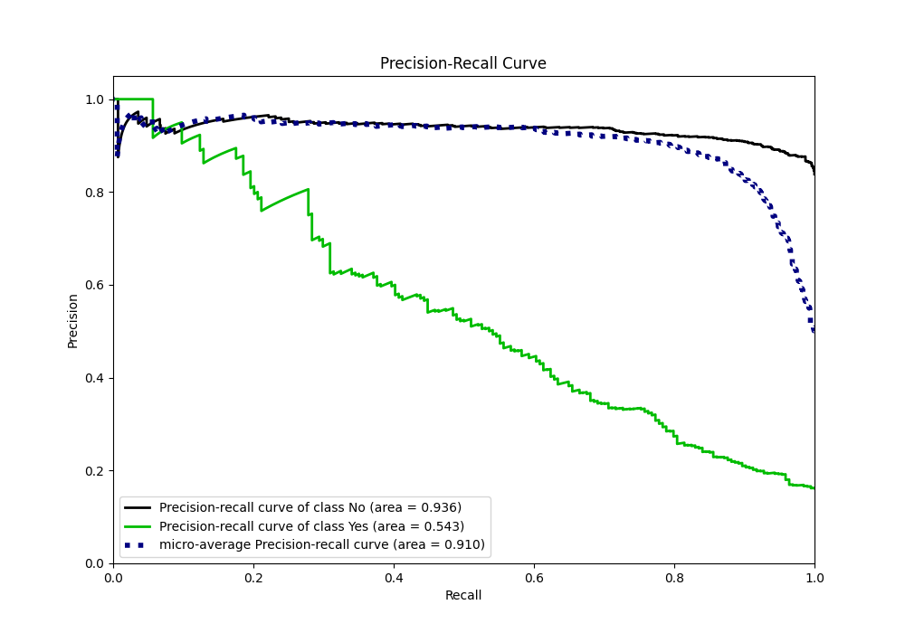
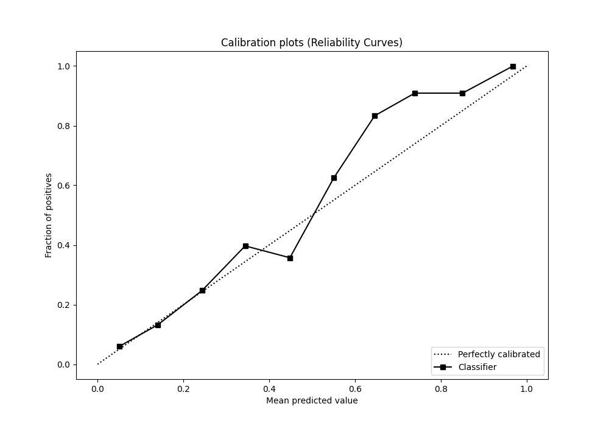
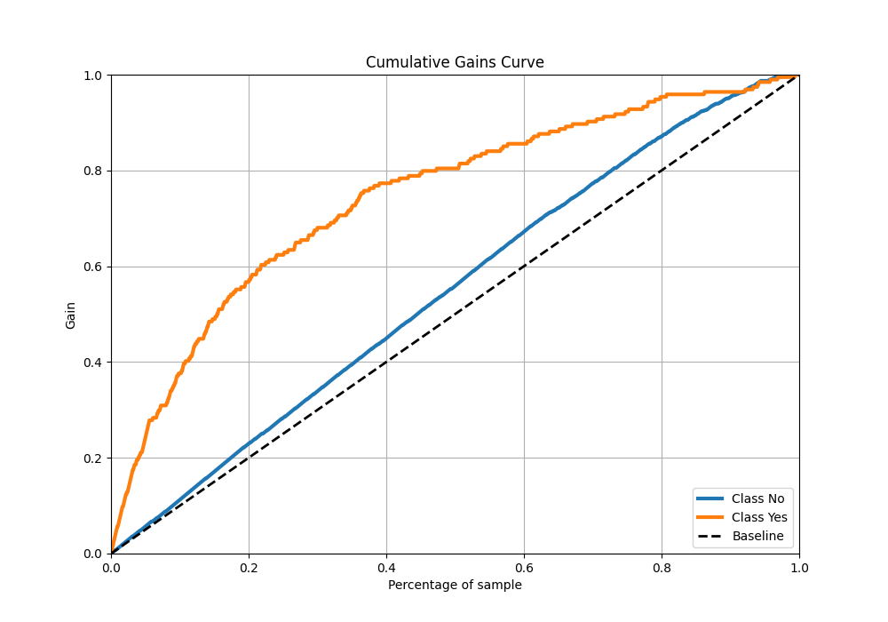
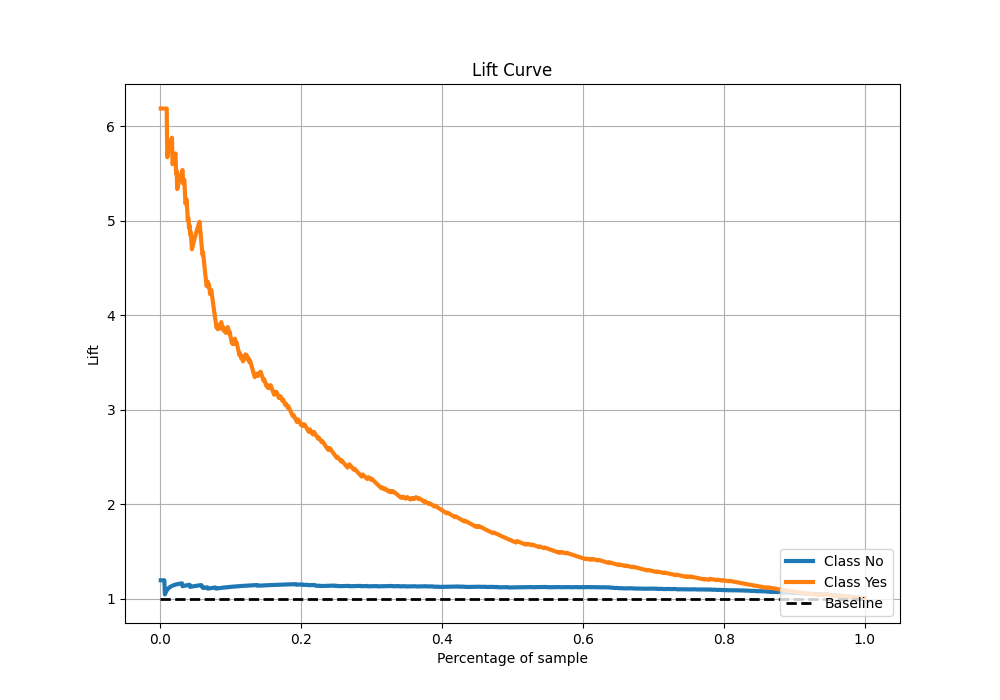

# Summary of 18_Xgboost

[<< Go back](../README.md)

## Extreme Gradient Boosting (Xgboost)
- **n_jobs**: -1
- **objective**: binary:logistic
- **eta**: 0.1
- **max_depth**: 7
- **min_child_weight**: 5
- **subsample**: 1.0
- **colsample_bytree**: 1.0
- **eval_metric**: accuracy
- **explain_level**: 2

## Validation
 - **validation_type**: kfold
 - **k_folds**: 5
 - **shuffle**: True
 - **stratify**: True
 - **random_seed**: 123

## Optimized metric
accuracy

## Training time

5.0 seconds

## Metric details
|           |    score |    threshold |
|:----------|---------:|-------------:|
| logloss   | 0.351578 | nan          |
| auc       | 0.790771 | nan          |
| f1        | 0.518892 |   0.254446   |
| accuracy  | 0.869167 |   0.485168   |
| precision | 1        |   0.808196   |
| recall    | 1        |   0.00229466 |
| mcc       | 0.42375  |   0.254446   |

## Metric details with threshold from accuracy metric
|           |    score |   threshold |
|:----------|---------:|------------:|
| logloss   | 0.351578 |  nan        |
| auc       | 0.790771 |  nan        |
| f1        | 0.407547 |    0.485168 |
| accuracy  | 0.869167 |    0.485168 |
| precision | 0.760563 |    0.485168 |
| recall    | 0.278351 |    0.485168 |
| mcc       | 0.407958 |    0.485168 |

## Confusion matrix (at threshold=0.485168)
|                |   Predicted as No |   Predicted as Yes |
|:---------------|------------------:|-------------------:|
| Labeled as No  |               989 |                 17 |
| Labeled as Yes |               140 |                 54 |

## Learning curves

## Permutation-based Importance

## Confusion Matrix

## Normalized Confusion Matrix

## ROC Curve

## Kolmogorov-Smirnov Statistic

## Precision-Recall Curve

## Calibration Curve

## Cumulative Gains Curve

## Lift Curve

[<< Go back](../README.md)
