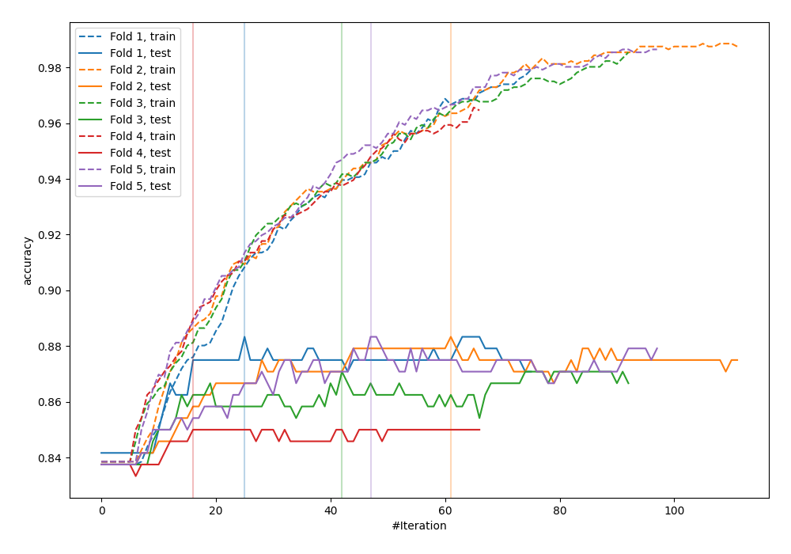
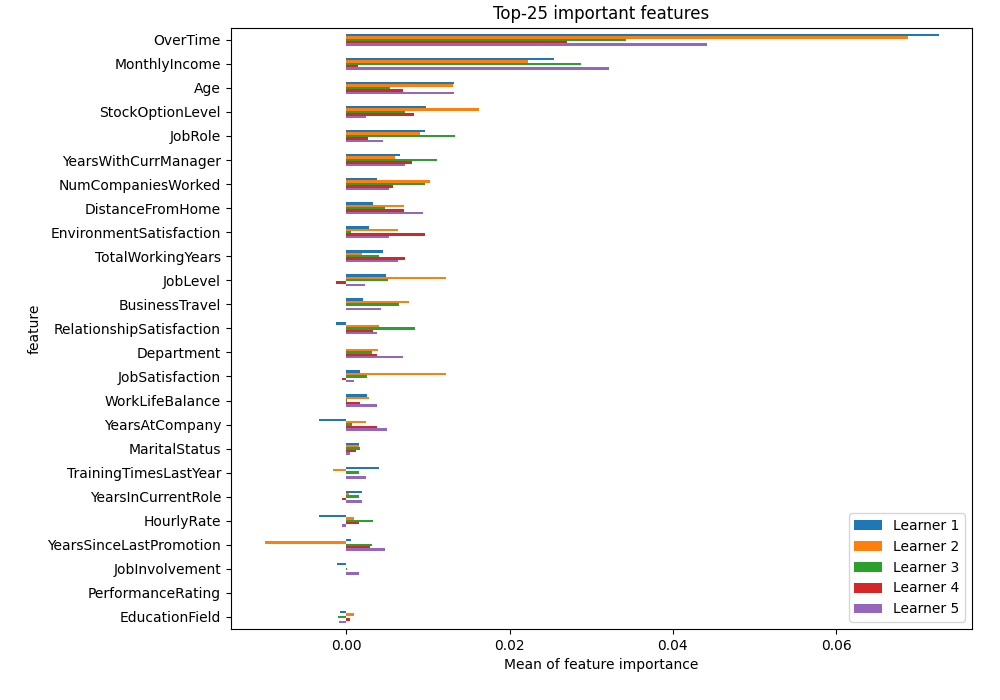
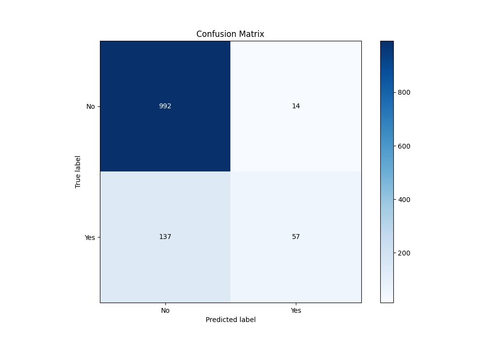
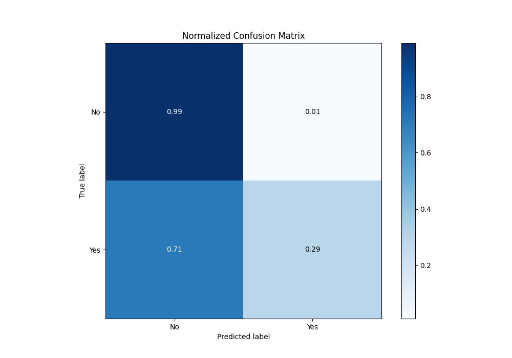
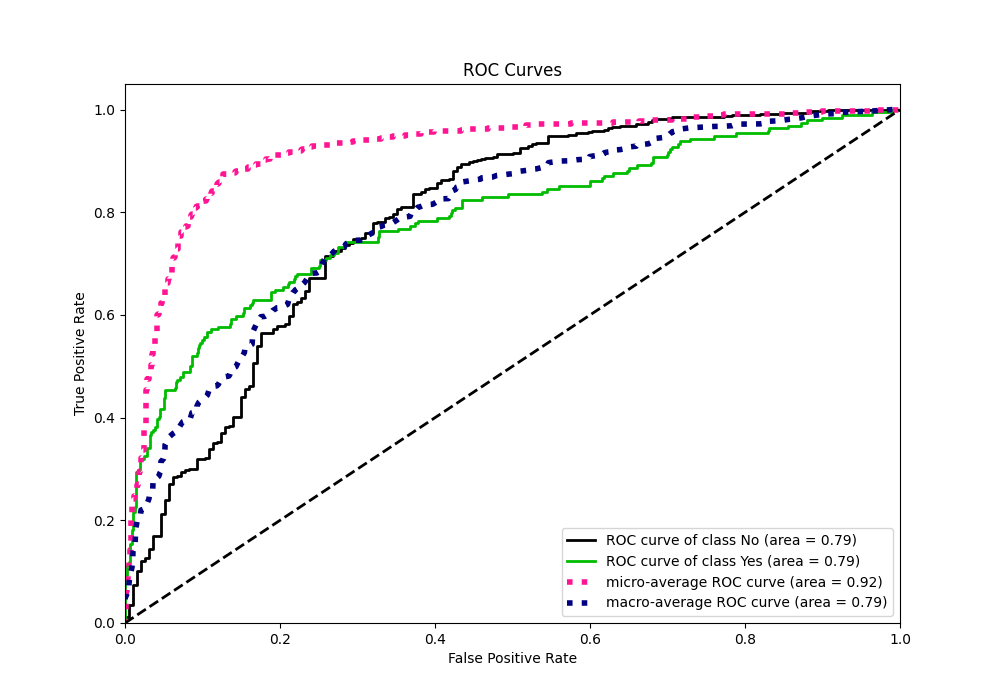
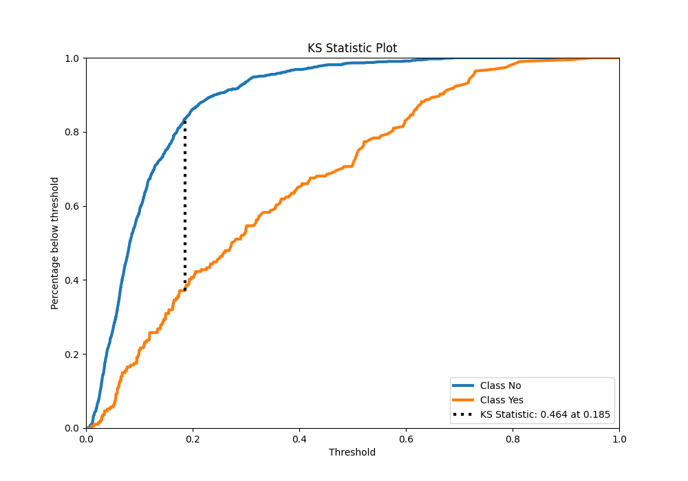
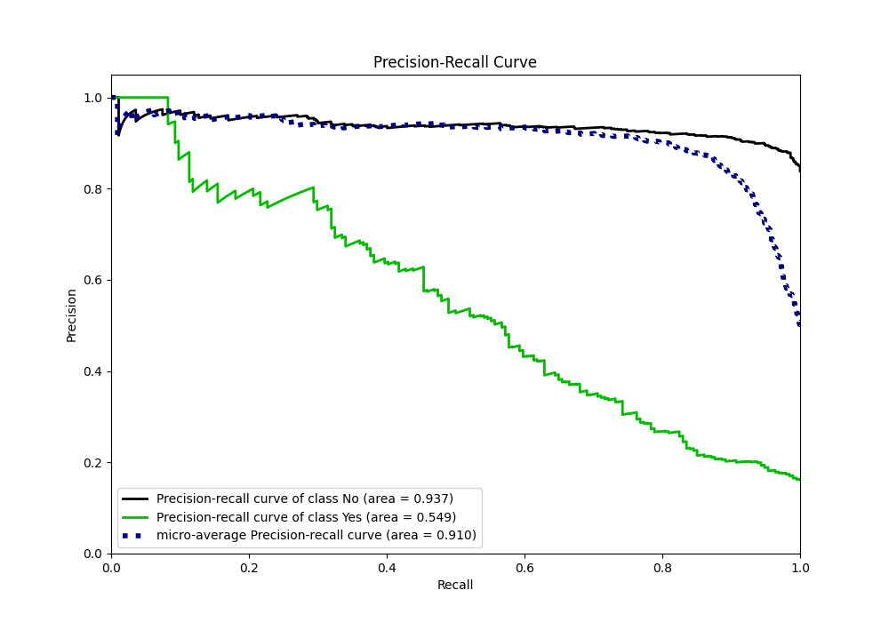
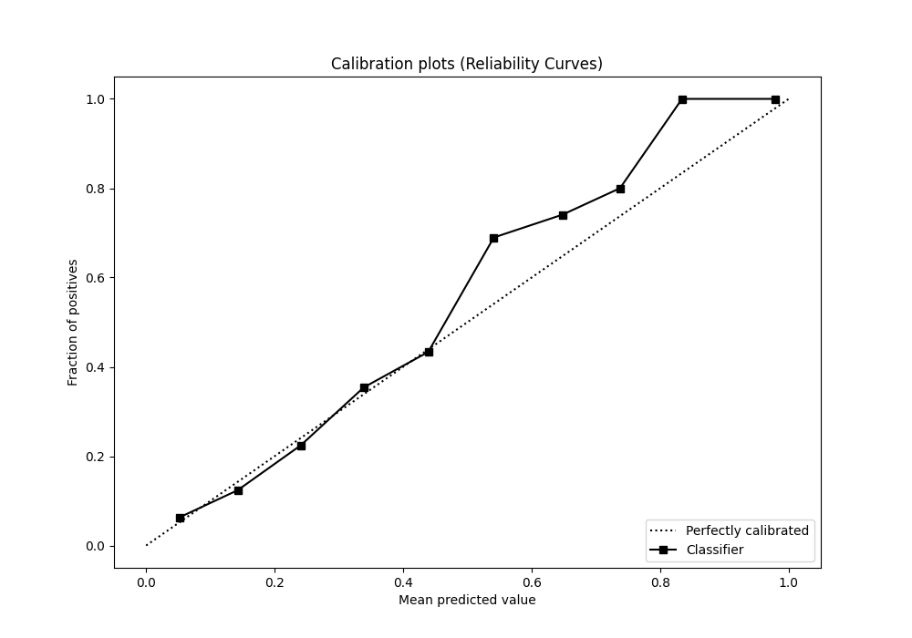
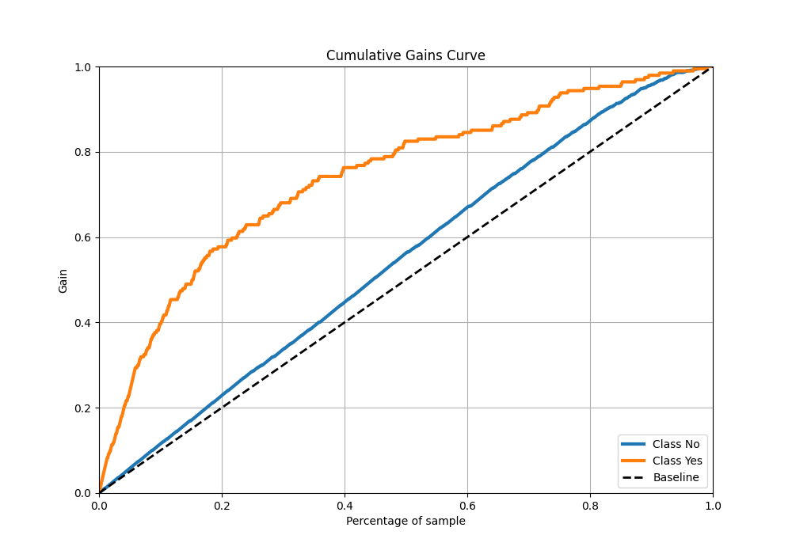
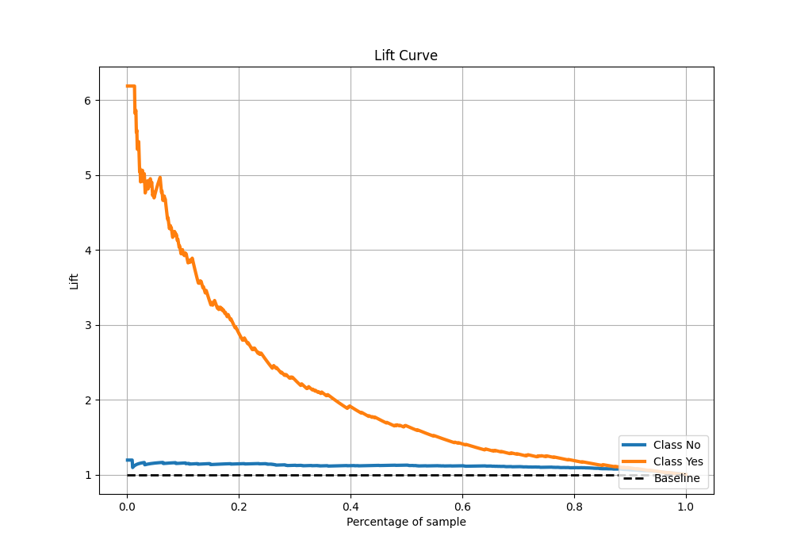

# Summary of 19_Xgboost

[<< Go back](../README.md)

## Extreme Gradient Boosting (Xgboost)
- **n_jobs**: -1
- **objective**: binary:logistic
- **eta**: 0.1
- **max_depth**: 9
- **min_child_weight**: 5
- **subsample**: 1.0
- **colsample_bytree**: 1.0
- **eval_metric**: accuracy
- **explain_level**: 2

## Validation
 - **validation_type**: kfold
 - **k_folds**: 5
 - **shuffle**: True
 - **stratify**: True
 - **random_seed**: 123

## Optimized metric
accuracy

## Training time

5.1 seconds

## Metric details
|           |    score |    threshold |
|:----------|---------:|-------------:|
| logloss   | 0.349328 | nan          |
| auc       | 0.790089 | nan          |
| f1        | 0.528967 |   0.250023   |
| accuracy  | 0.874167 |   0.499485   |
| precision | 1        |   0.721371   |
| recall    | 1        |   0.00412485 |
| mcc       | 0.453313 |   0.310903   |

## Metric details with threshold from accuracy metric
|           |    score |   threshold |
|:----------|---------:|------------:|
| logloss   | 0.349328 |  nan        |
| auc       | 0.790089 |  nan        |
| f1        | 0.430189 |    0.499485 |
| accuracy  | 0.874167 |    0.499485 |
| precision | 0.802817 |    0.499485 |
| recall    | 0.293814 |    0.499485 |
| mcc       | 0.43674  |    0.499485 |

## Confusion matrix (at threshold=0.499485)
|                |   Predicted as No |   Predicted as Yes |
|:---------------|------------------:|-------------------:|
| Labeled as No  |               992 |                 14 |
| Labeled as Yes |               137 |                 57 |

## Learning curves

## Permutation-based Importance

## Confusion Matrix

## Normalized Confusion Matrix

## ROC Curve

## Kolmogorov-Smirnov Statistic

## Precision-Recall Curve

## Calibration Curve

## Cumulative Gains Curve

## Lift Curve

[<< Go back](../README.md)
