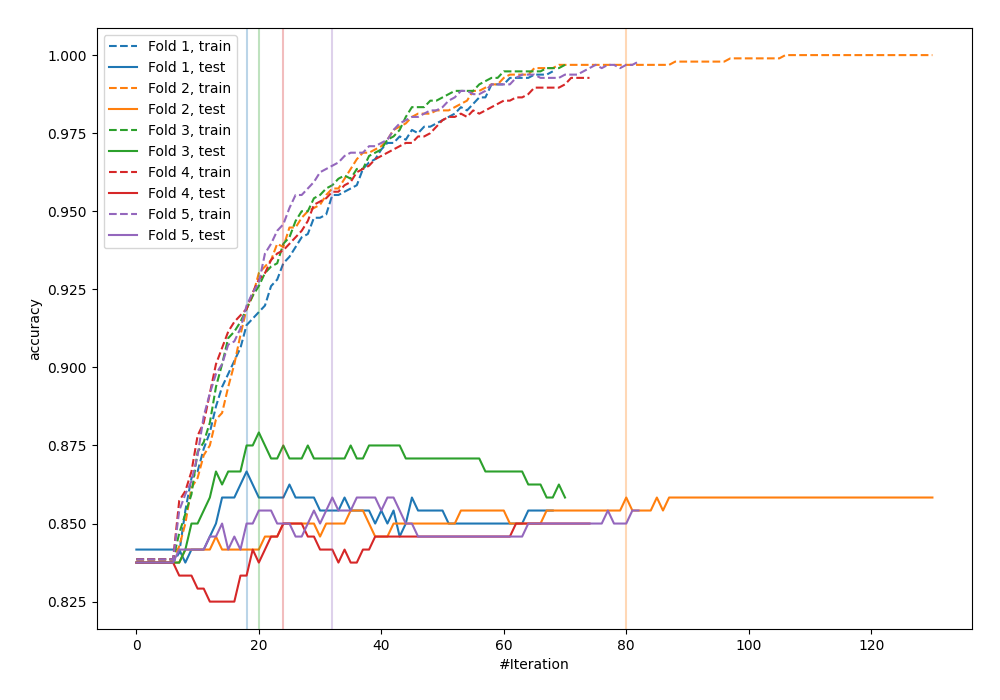
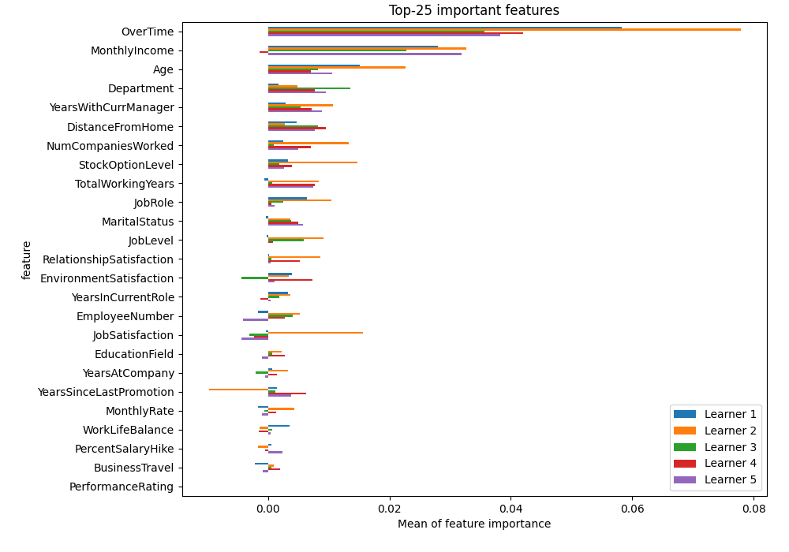
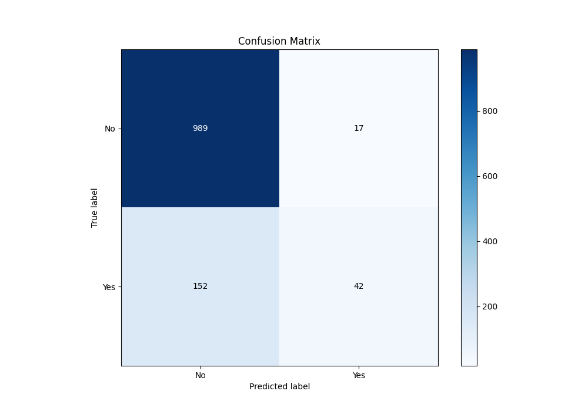
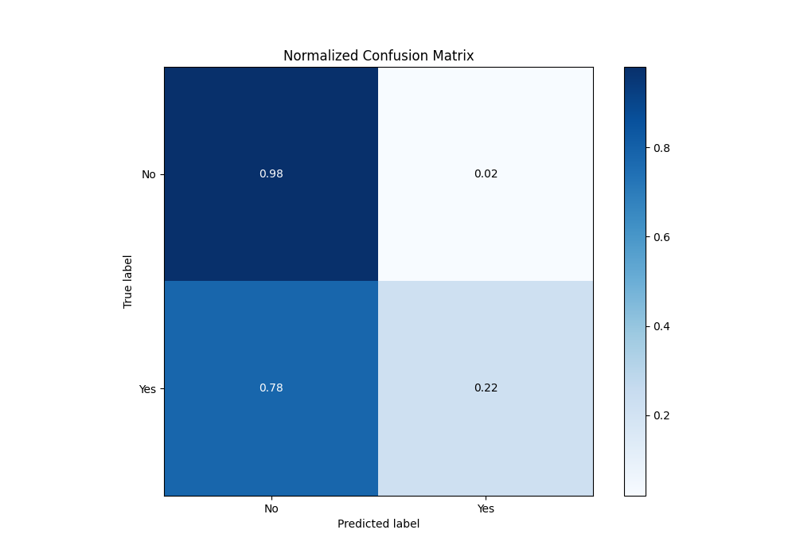
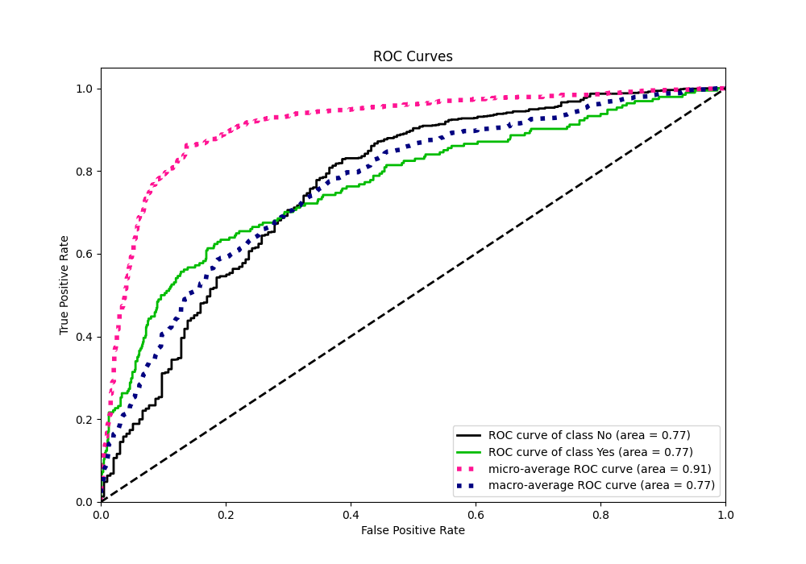
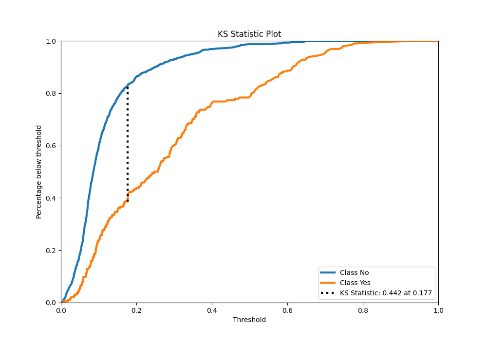
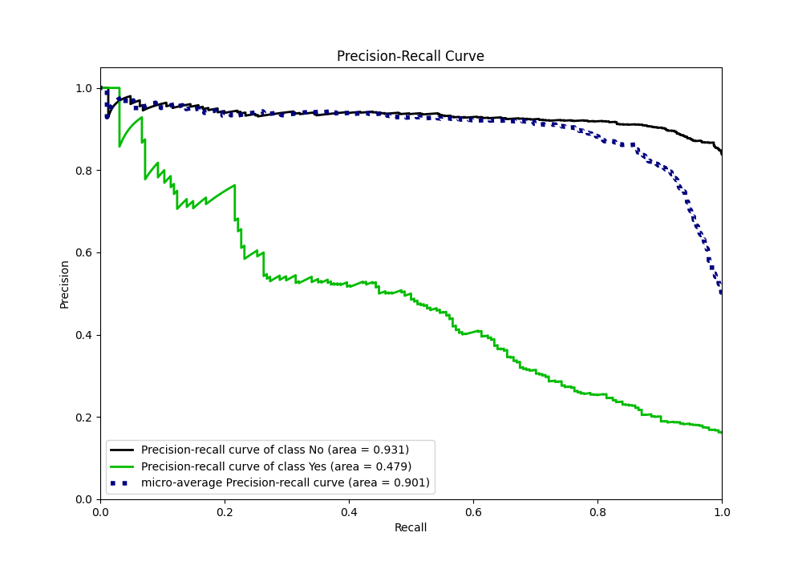
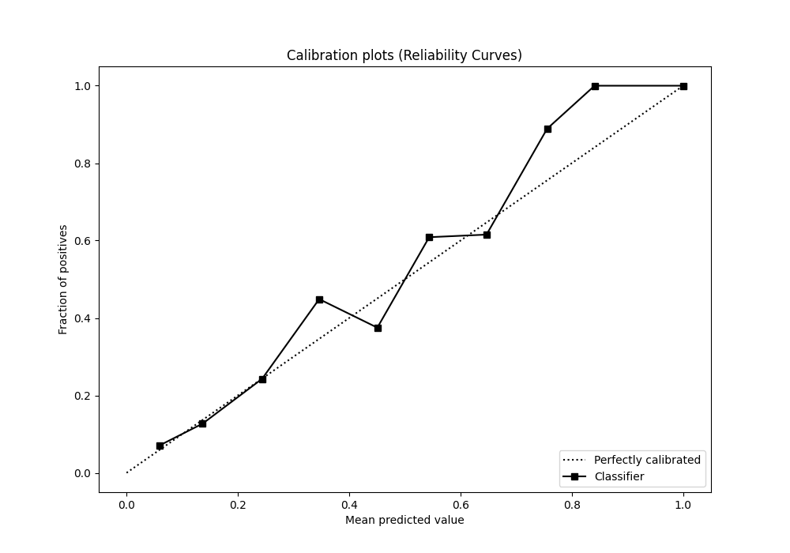
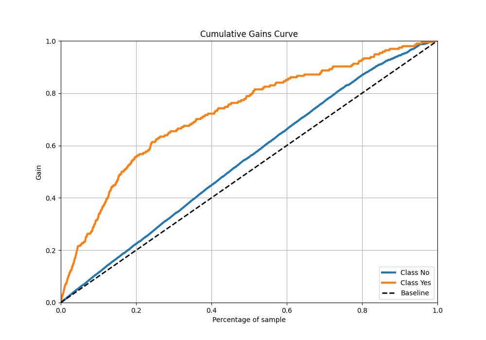
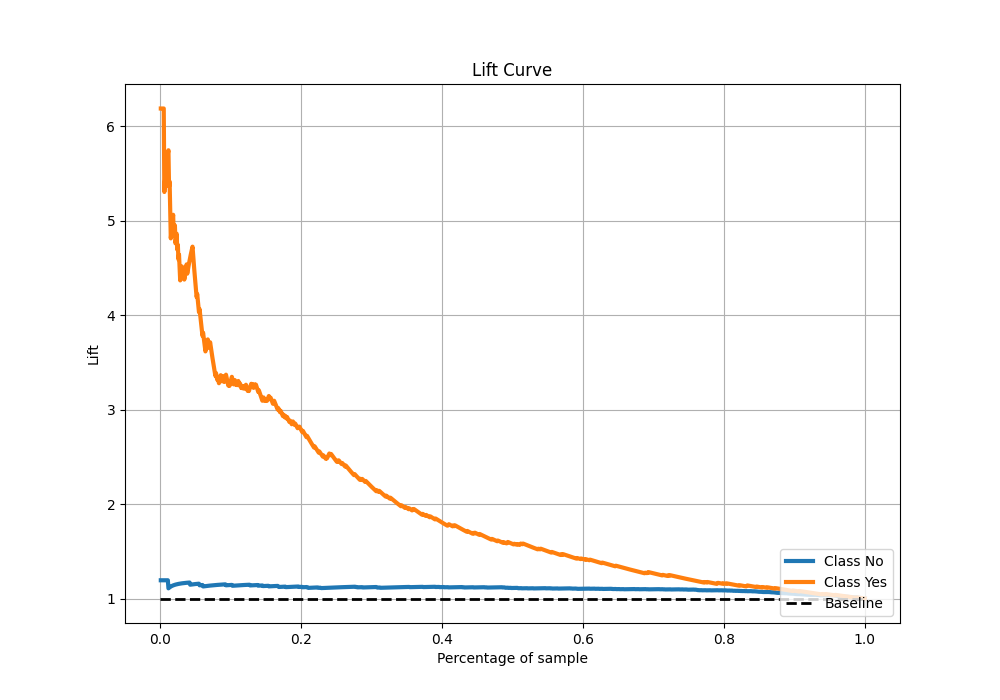

# Summary of 1_Default_Xgboost

[<< Go back](../README.md)

## Extreme Gradient Boosting (Xgboost)
- **n_jobs**: -1
- **objective**: binary:logistic
- **eta**: 0.075
- **max_depth**: 6
- **min_child_weight**: 1
- **subsample**: 1.0
- **colsample_bytree**: 1.0
- **eval_metric**: accuracy
- **explain_level**: 2

## Validation
 - **validation_type**: kfold
 - **k_folds**: 5
 - **shuffle**: True
 - **stratify**: True
 - **random_seed**: 123

## Optimized metric
accuracy

## Training time

10.2 seconds

## Metric details
|           |    score |    threshold |
|:----------|---------:|-------------:|
| logloss   | 0.368528 | nan          |
| auc       | 0.766993 | nan          |
| f1        | 0.498845 |   0.208491   |
| accuracy  | 0.859167 |   0.478415   |
| precision | 0.909091 |   0.697401   |
| recall    | 1        |   0.00392548 |
| mcc       | 0.396756 |   0.258482   |

## Metric details with threshold from accuracy metric
|           |    score |   threshold |
|:----------|---------:|------------:|
| logloss   | 0.368528 |  nan        |
| auc       | 0.766993 |  nan        |
| f1        | 0.332016 |    0.478415 |
| accuracy  | 0.859167 |    0.478415 |
| precision | 0.711864 |    0.478415 |
| recall    | 0.216495 |    0.478415 |
| mcc       | 0.339847 |    0.478415 |

## Confusion matrix (at threshold=0.478415)
|                |   Predicted as No |   Predicted as Yes |
|:---------------|------------------:|-------------------:|
| Labeled as No  |               989 |                 17 |
| Labeled as Yes |               152 |                 42 |

## Learning curves

## Permutation-based Importance

## Confusion Matrix

## Normalized Confusion Matrix

## ROC Curve

## Kolmogorov-Smirnov Statistic

## Precision-Recall Curve

## Calibration Curve

## Cumulative Gains Curve

## Lift Curve

[<< Go back](../README.md)
