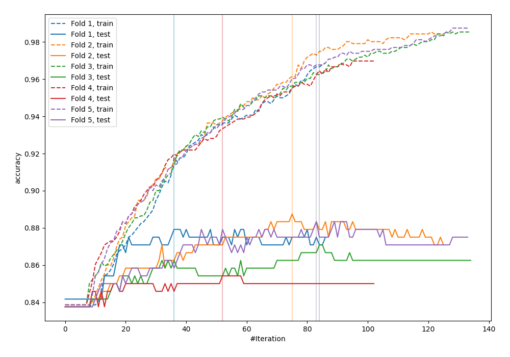
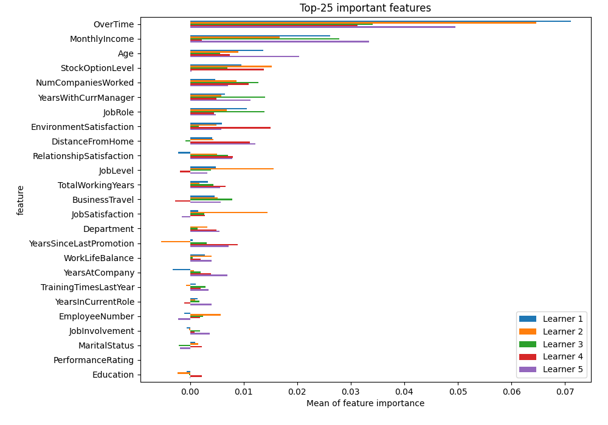
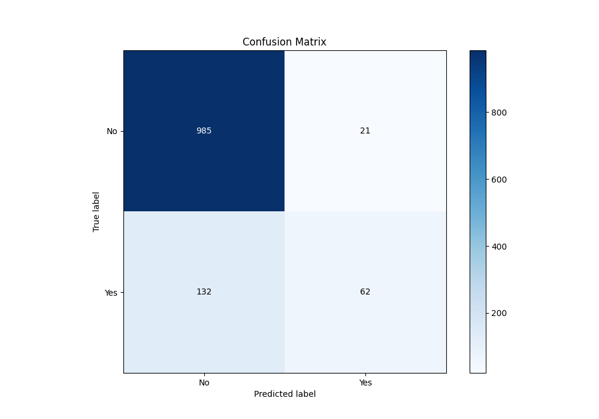
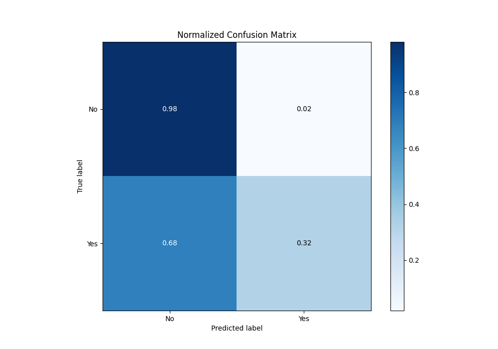
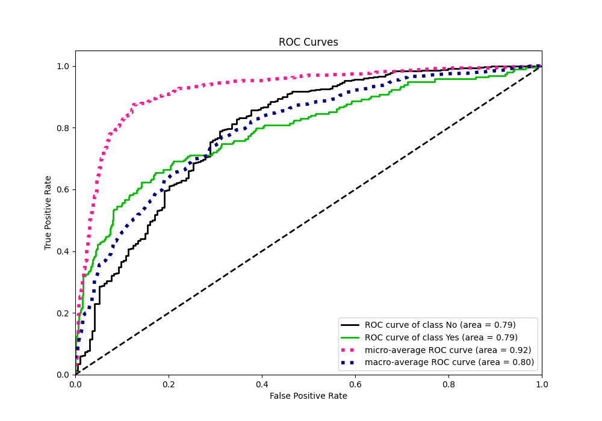
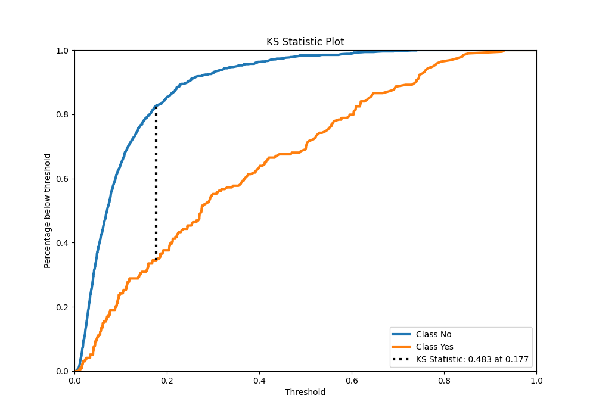
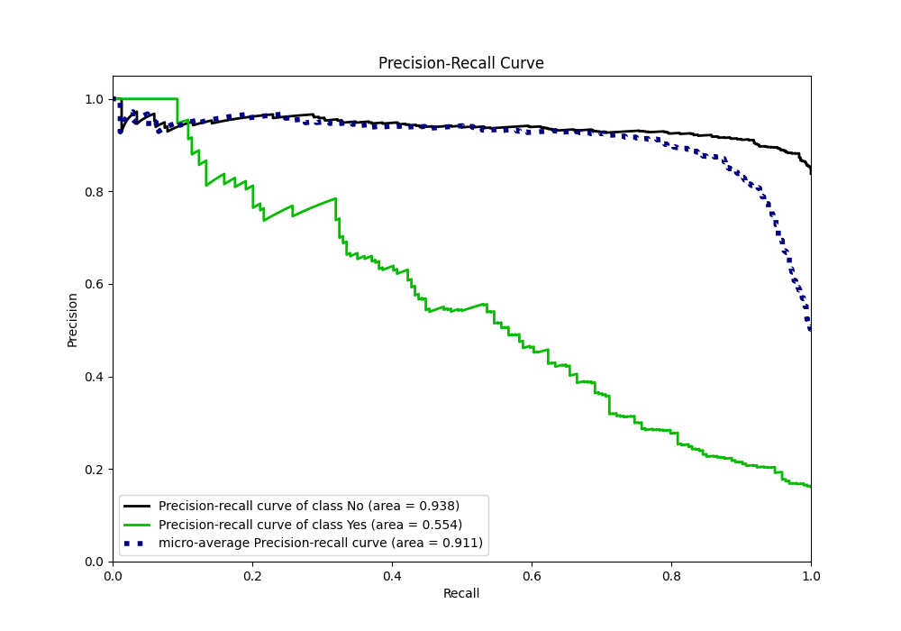
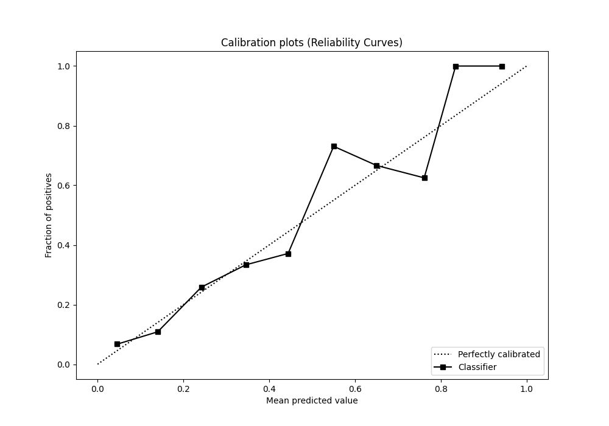
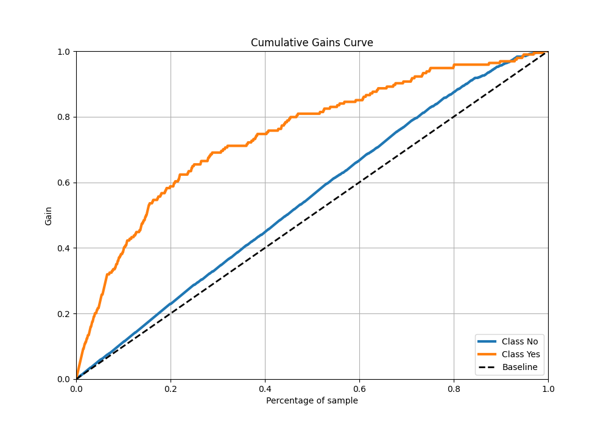
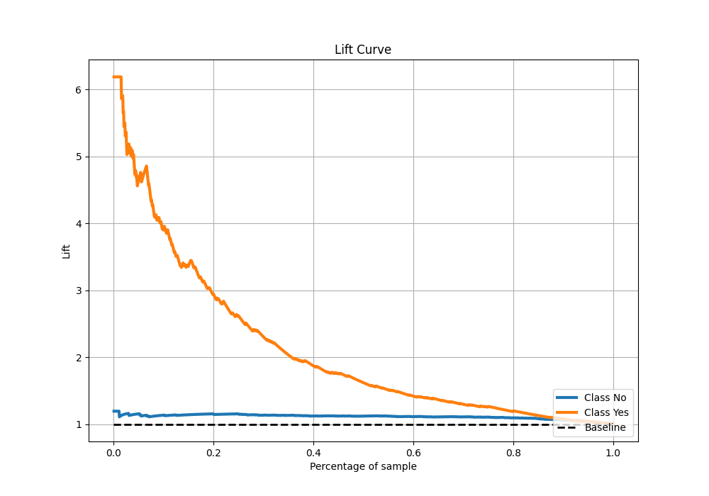

# Summary of 2_Xgboost

[<< Go back](../README.md)

## Extreme Gradient Boosting (Xgboost)
- **n_jobs**: -1
- **objective**: binary:logistic
- **eta**: 0.075
- **max_depth**: 8
- **min_child_weight**: 5
- **subsample**: 1.0
- **colsample_bytree**: 1.0
- **eval_metric**: accuracy
- **explain_level**: 2

## Validation
 - **validation_type**: kfold
 - **k_folds**: 5
 - **shuffle**: True
 - **stratify**: True
 - **random_seed**: 123

## Optimized metric
accuracy

## Training time

4.4 seconds

## Metric details
|           |    score |    threshold |
|:----------|---------:|-------------:|
| logloss   | 0.348555 | nan          |
| auc       | 0.794388 | nan          |
| f1        | 0.54026  |   0.260287   |
| accuracy  | 0.8725   |   0.477539   |
| precision | 1        |   0.770144   |
| recall    | 1        |   0.00451287 |
| mcc       | 0.452444 |   0.260287   |

## Metric details with threshold from accuracy metric
|           |    score |   threshold |
|:----------|---------:|------------:|
| logloss   | 0.348555 |  nan        |
| auc       | 0.794388 |  nan        |
| f1        | 0.447653 |    0.477539 |
| accuracy  | 0.8725   |    0.477539 |
| precision | 0.746988 |    0.477539 |
| recall    | 0.319588 |    0.477539 |
| mcc       | 0.433399 |    0.477539 |

## Confusion matrix (at threshold=0.477539)
|                |   Predicted as No |   Predicted as Yes |
|:---------------|------------------:|-------------------:|
| Labeled as No  |               985 |                 21 |
| Labeled as Yes |               132 |                 62 |

## Learning curves

## Permutation-based Importance

## Confusion Matrix

## Normalized Confusion Matrix

## ROC Curve

## Kolmogorov-Smirnov Statistic

## Precision-Recall Curve

## Calibration Curve

## Cumulative Gains Curve

## Lift Curve

[<< Go back](../README.md)
