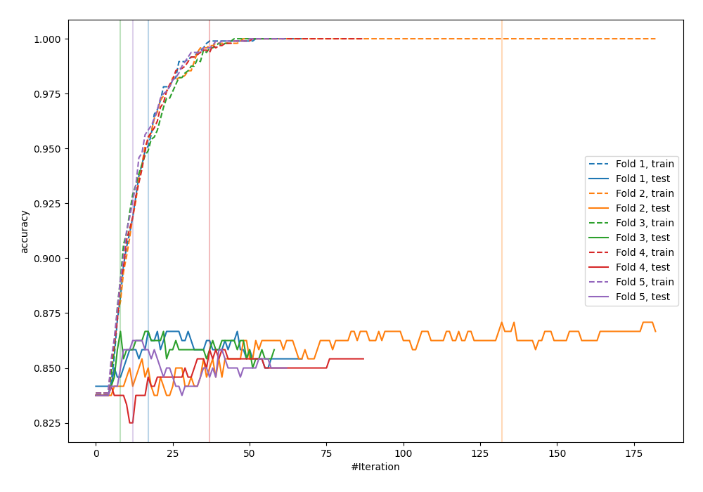
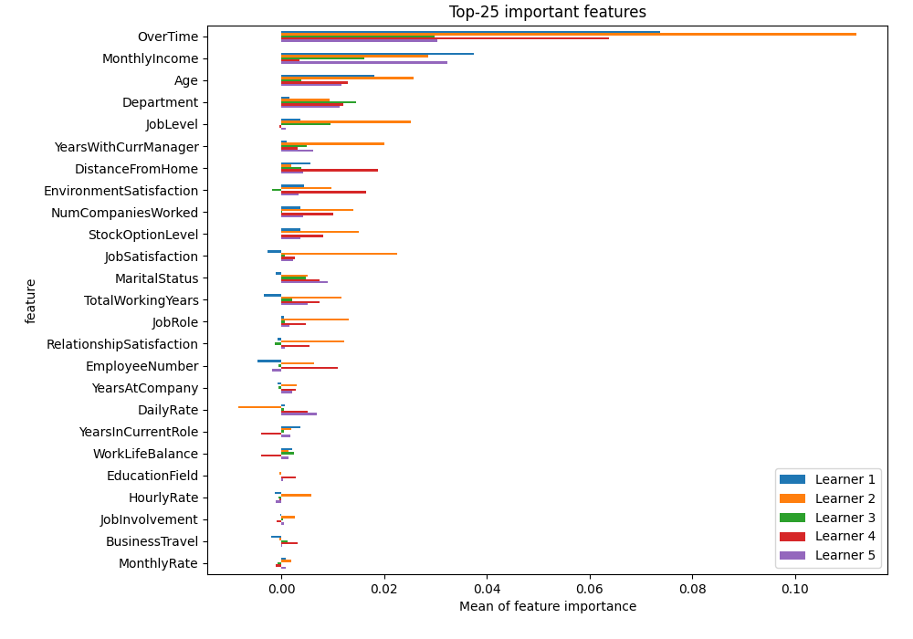
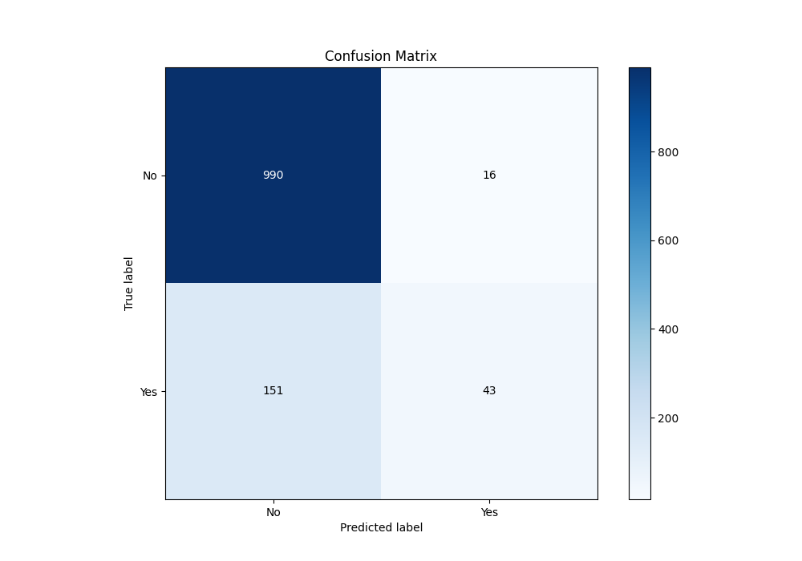
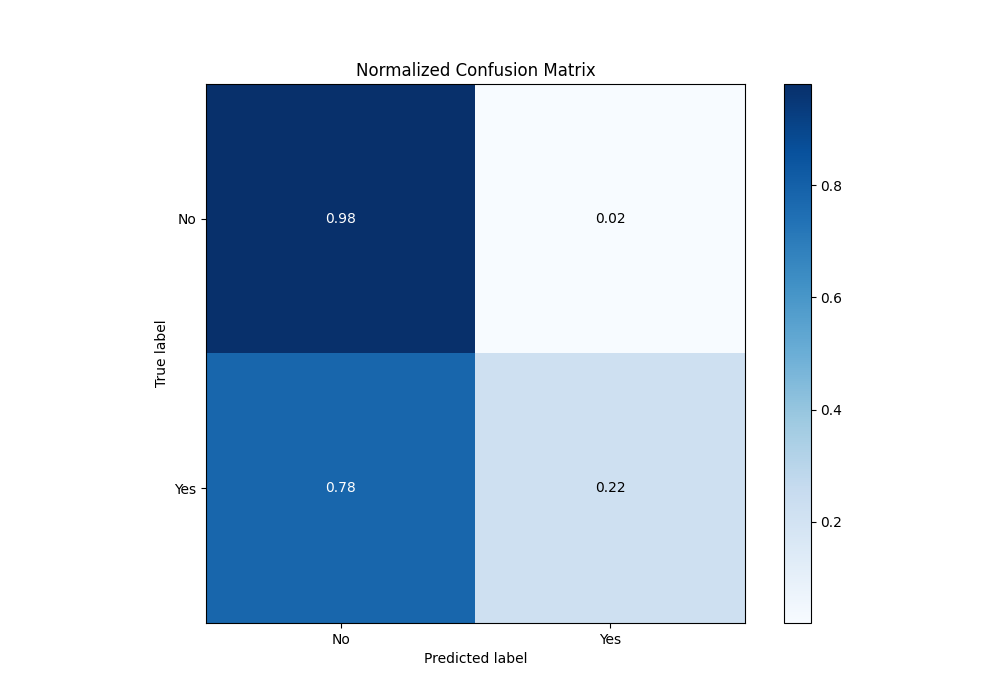
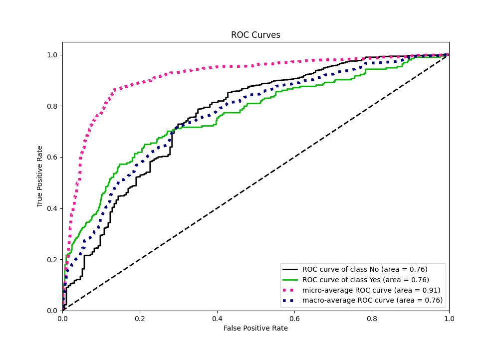
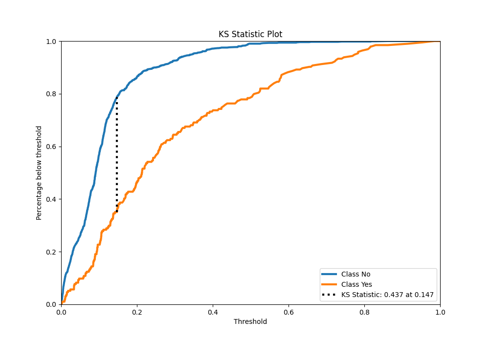
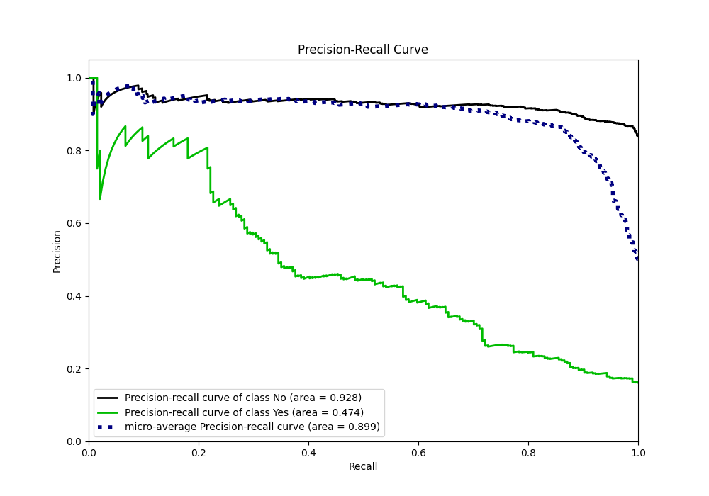
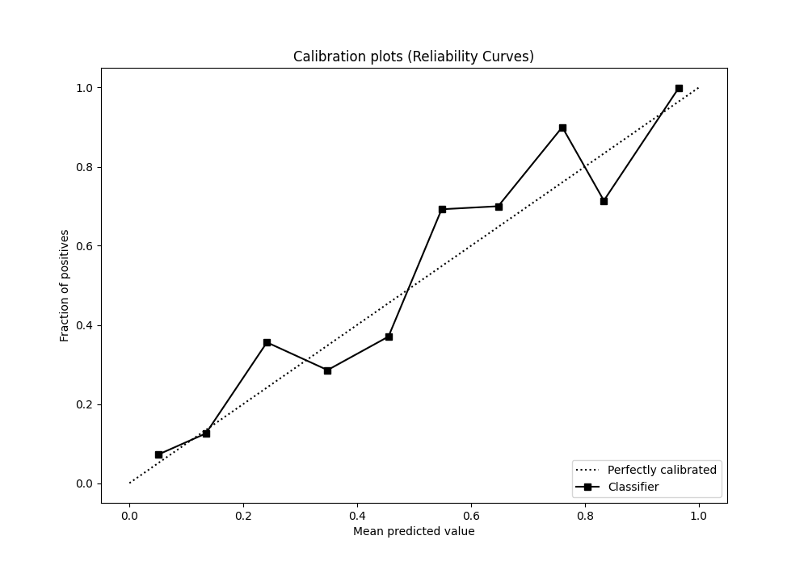
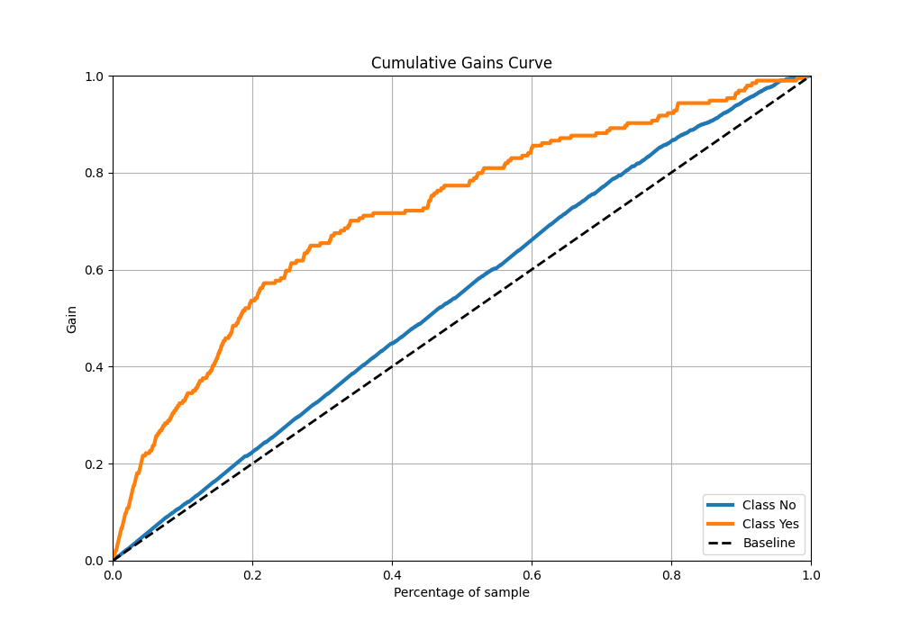
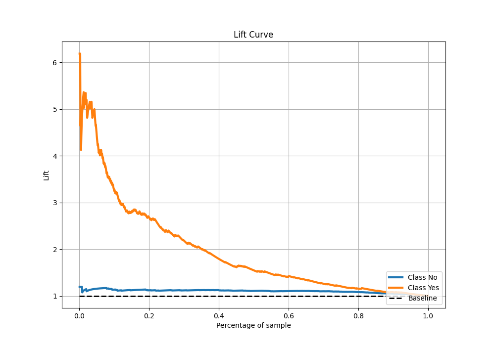

# Summary of 3_Xgboost

[<< Go back](../README.md)

## Extreme Gradient Boosting (Xgboost)
- **n_jobs**: -1
- **objective**: binary:logistic
- **eta**: 0.1
- **max_depth**: 8
- **min_child_weight**: 1
- **subsample**: 1.0
- **colsample_bytree**: 1.0
- **eval_metric**: accuracy
- **explain_level**: 2

## Validation
 - **validation_type**: kfold
 - **k_folds**: 5
 - **shuffle**: True
 - **stratify**: True
 - **random_seed**: 123

## Optimized metric
accuracy

## Training time

4.3 seconds

## Metric details
|           |    score |     threshold |
|:----------|---------:|--------------:|
| logloss   | 0.38029  | nan           |
| auc       | 0.759851 | nan           |
| f1        | 0.485777 |   0.187116    |
| accuracy  | 0.860833 |   0.488621    |
| precision | 0.828571 |   0.576638    |
| recall    | 1        |   0.000286476 |
| mcc       | 0.374721 |   0.187116    |

## Metric details with threshold from accuracy metric
|           |    score |   threshold |
|:----------|---------:|------------:|
| logloss   | 0.38029  |  nan        |
| auc       | 0.759851 |  nan        |
| f1        | 0.339921 |    0.488621 |
| accuracy  | 0.860833 |    0.488621 |
| precision | 0.728814 |    0.488621 |
| recall    | 0.221649 |    0.488621 |
| mcc       | 0.350316 |    0.488621 |

## Confusion matrix (at threshold=0.488621)
|                |   Predicted as No |   Predicted as Yes |
|:---------------|------------------:|-------------------:|
| Labeled as No  |               990 |                 16 |
| Labeled as Yes |               151 |                 43 |

## Learning curves

## Permutation-based Importance

## Confusion Matrix

## Normalized Confusion Matrix

## ROC Curve

## Kolmogorov-Smirnov Statistic

## Precision-Recall Curve

## Calibration Curve

## Cumulative Gains Curve

## Lift Curve

[<< Go back](../README.md)
