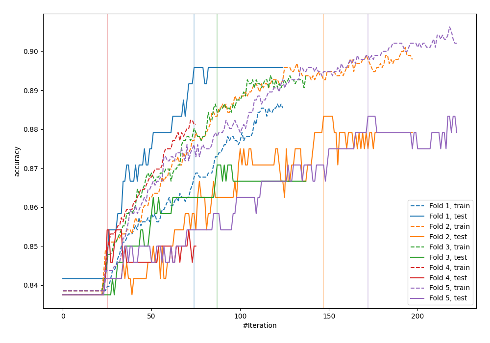
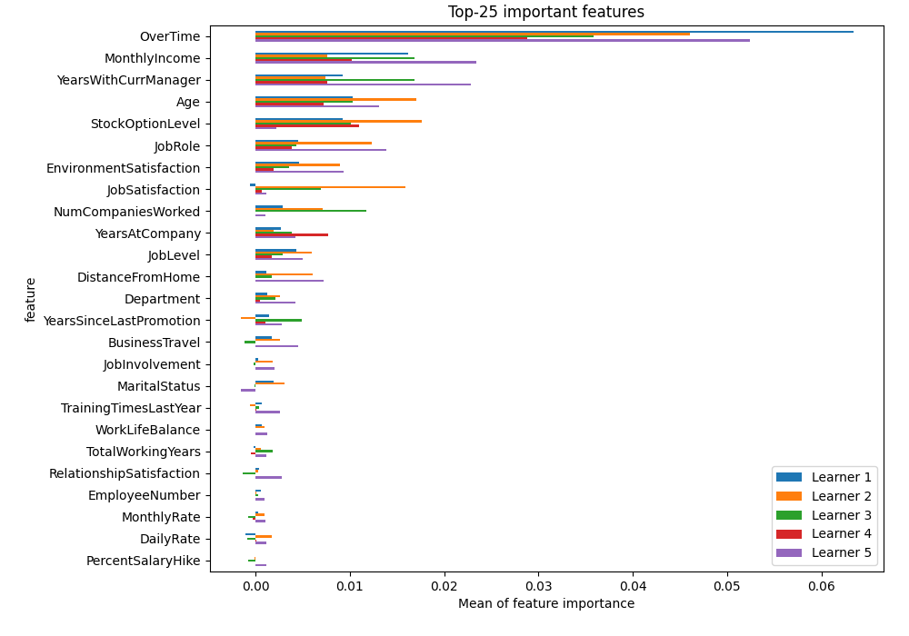
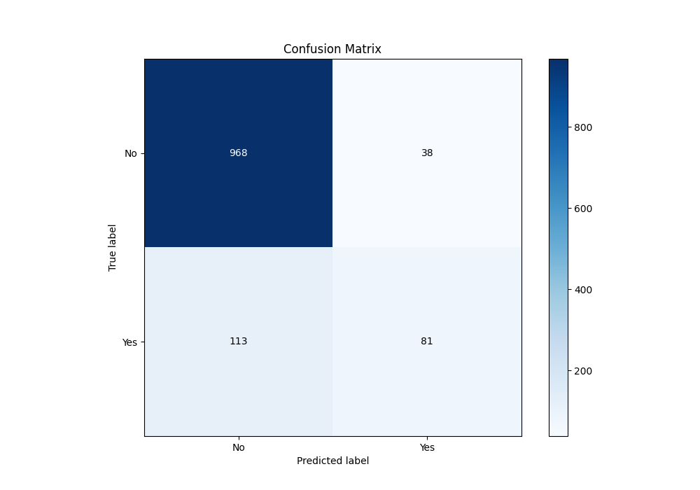
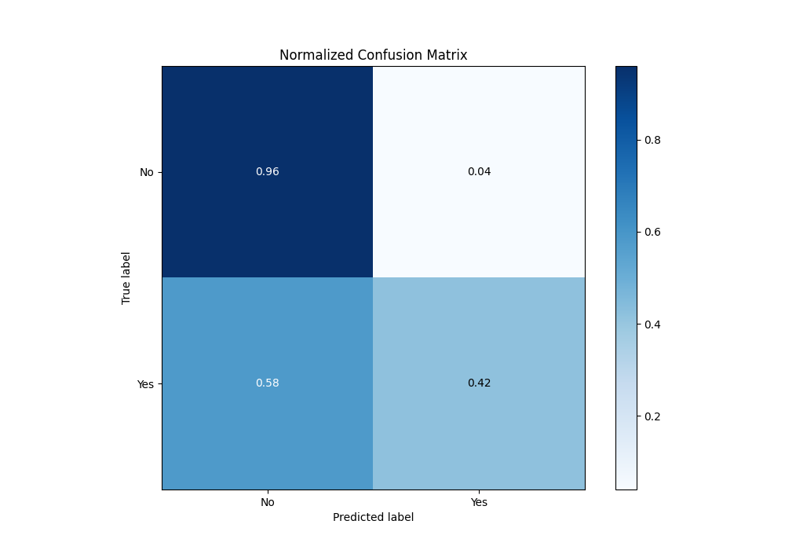
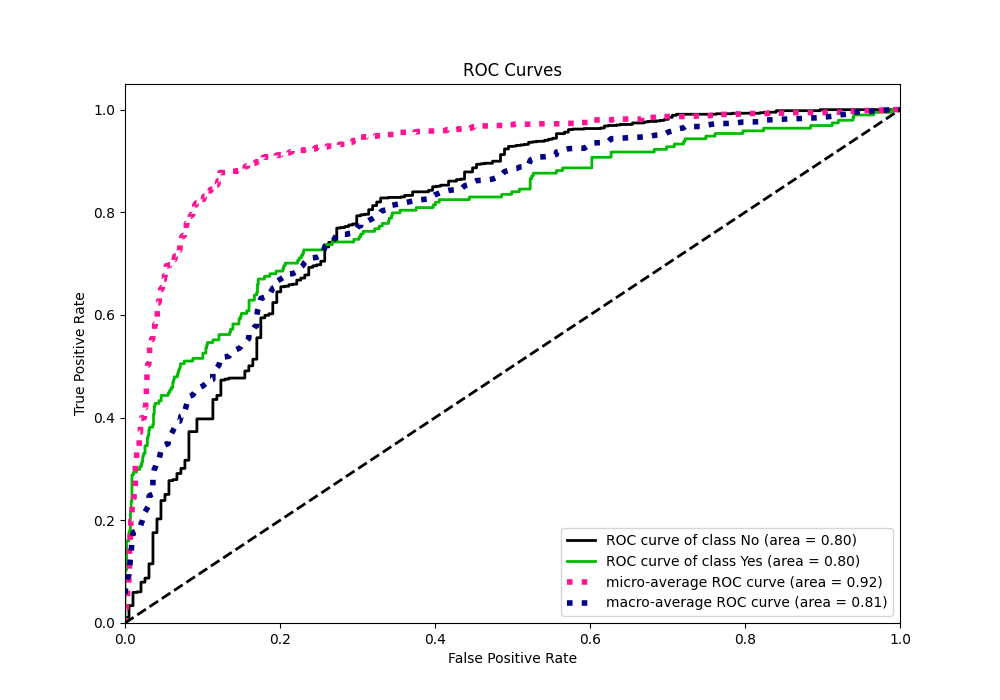
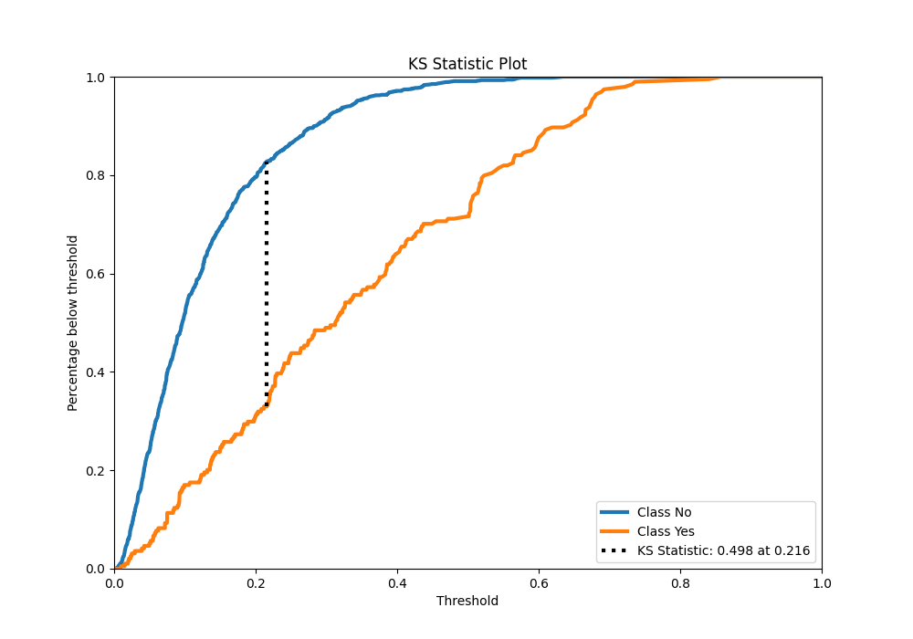
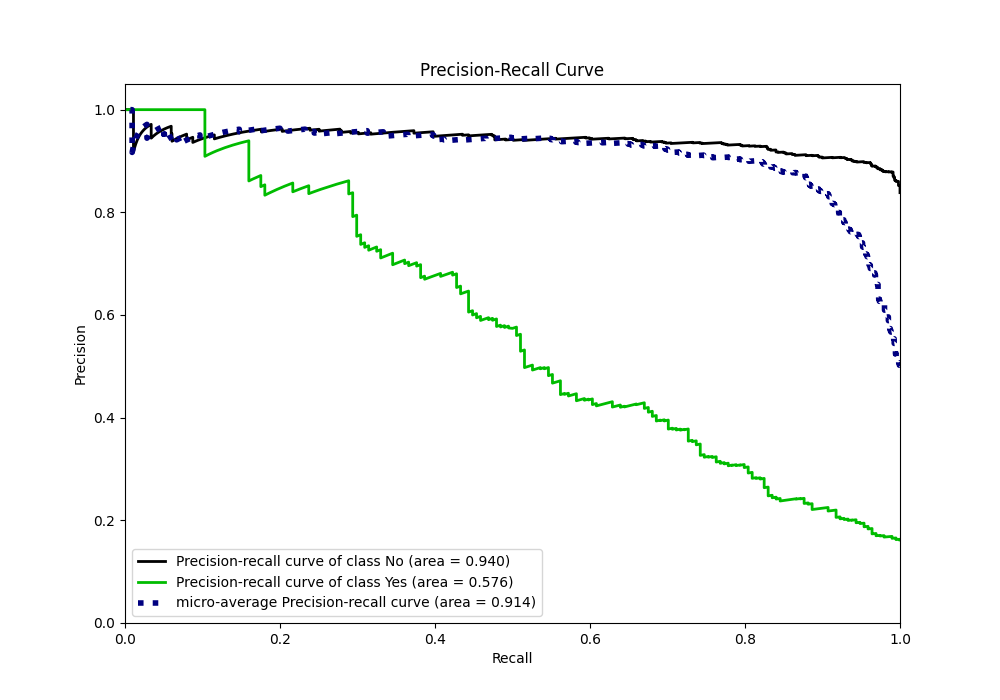
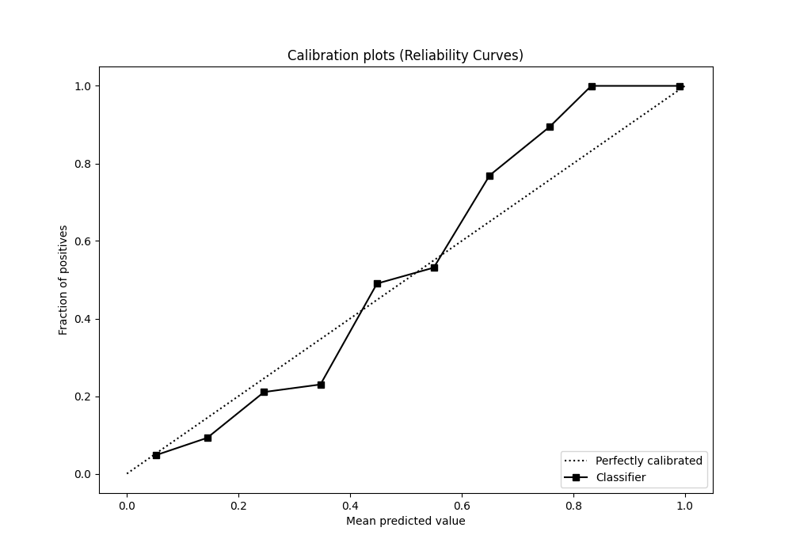
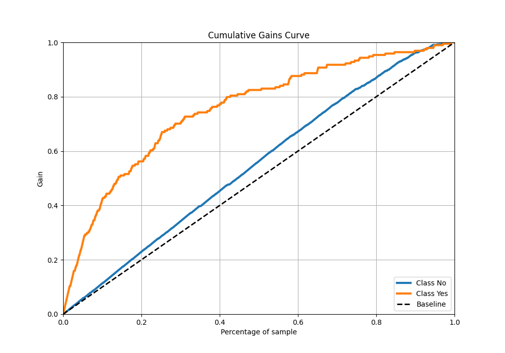
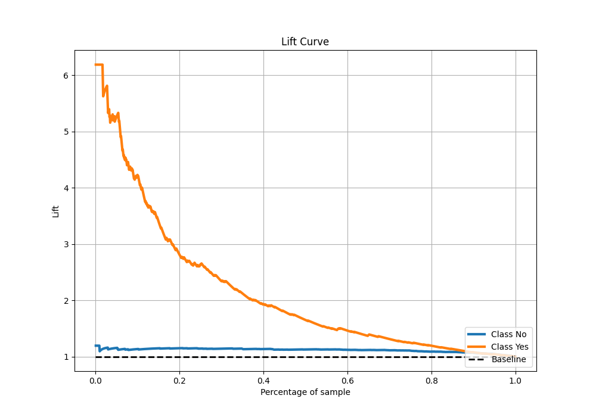

# Summary of 4_Xgboost

[<< Go back](../README.md)

## Extreme Gradient Boosting (Xgboost)
- **n_jobs**: -1
- **objective**: binary:logistic
- **eta**: 0.1
- **max_depth**: 7
- **min_child_weight**: 25
- **subsample**: 0.9
- **colsample_bytree**: 0.6
- **eval_metric**: accuracy
- **explain_level**: 2

## Validation
 - **validation_type**: kfold
 - **k_folds**: 5
 - **shuffle**: True
 - **stratify**: True
 - **random_seed**: 123

## Optimized metric
accuracy

## Training time

4.6 seconds

## Metric details
|           |    score |   threshold |
|:----------|---------:|------------:|
| logloss   | 0.34668  | nan         |
| auc       | 0.804039 | nan         |
| f1        | 0.531856 |   0.314865  |
| accuracy  | 0.874167 |   0.373502  |
| precision | 1        |   0.673804  |
| recall    | 1        |   0.0036402 |
| mcc       | 0.46775  |   0.373502  |

## Metric details with threshold from accuracy metric
|           |    score |   threshold |
|:----------|---------:|------------:|
| logloss   | 0.34668  |  nan        |
| auc       | 0.804039 |  nan        |
| f1        | 0.517572 |    0.373502 |
| accuracy  | 0.874167 |    0.373502 |
| precision | 0.680672 |    0.373502 |
| recall    | 0.417526 |    0.373502 |
| mcc       | 0.46775  |    0.373502 |

## Confusion matrix (at threshold=0.373502)
|                |   Predicted as No |   Predicted as Yes |
|:---------------|------------------:|-------------------:|
| Labeled as No  |               968 |                 38 |
| Labeled as Yes |               113 |                 81 |

## Learning curves

## Permutation-based Importance

## Confusion Matrix

## Normalized Confusion Matrix

## ROC Curve

## Kolmogorov-Smirnov Statistic

## Precision-Recall Curve

## Calibration Curve

## Cumulative Gains Curve

## Lift Curve

[<< Go back](../README.md)
