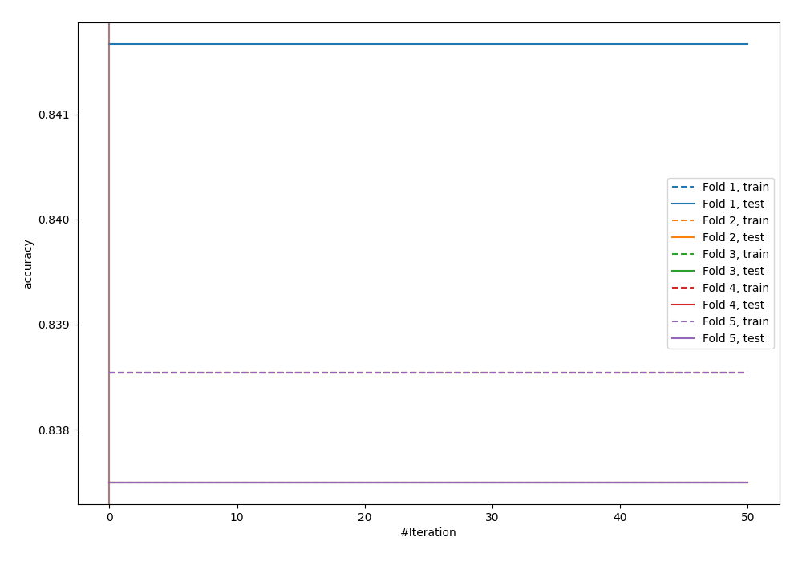
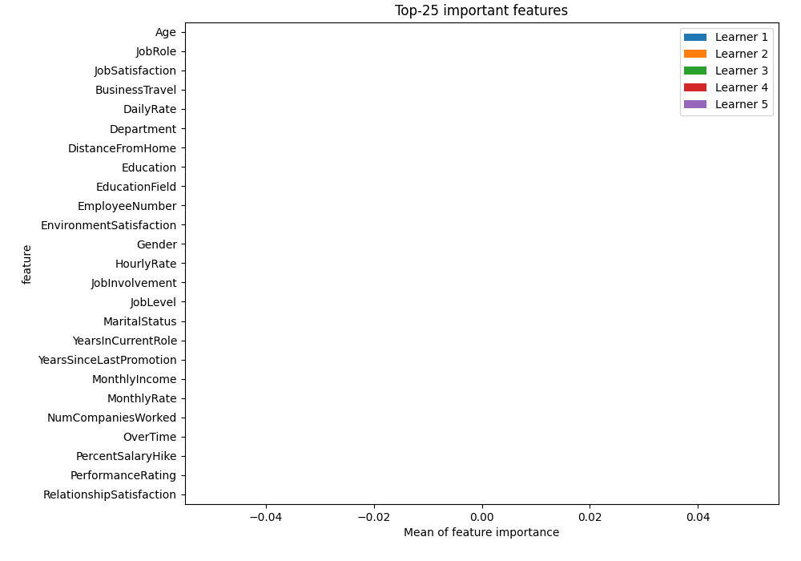
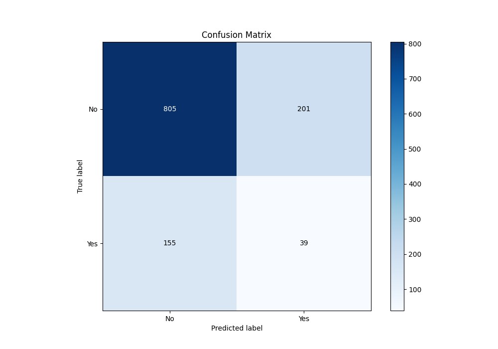
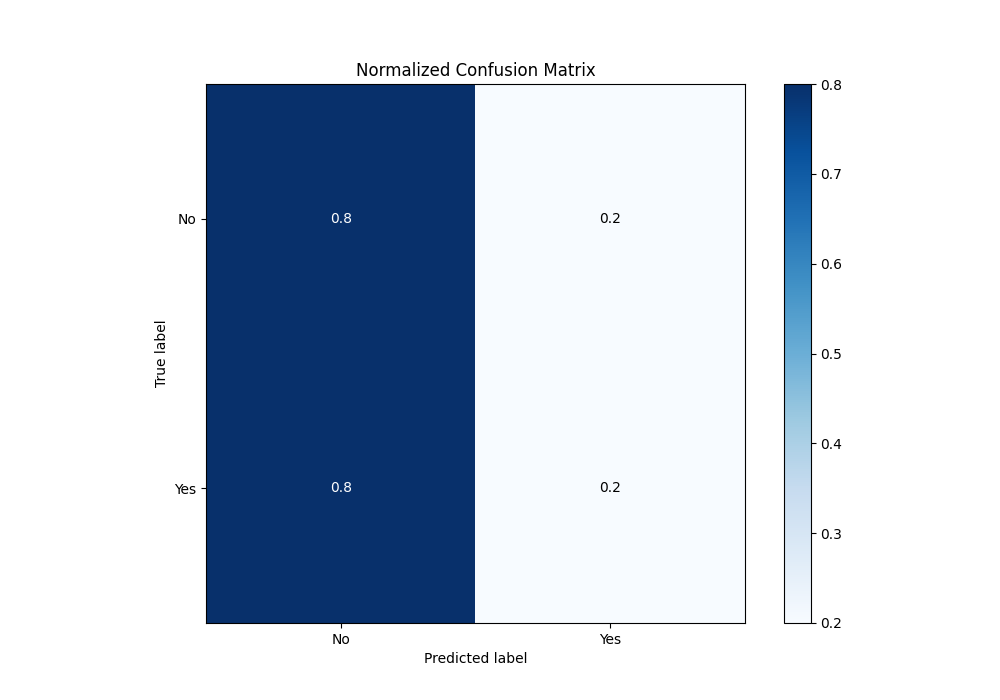
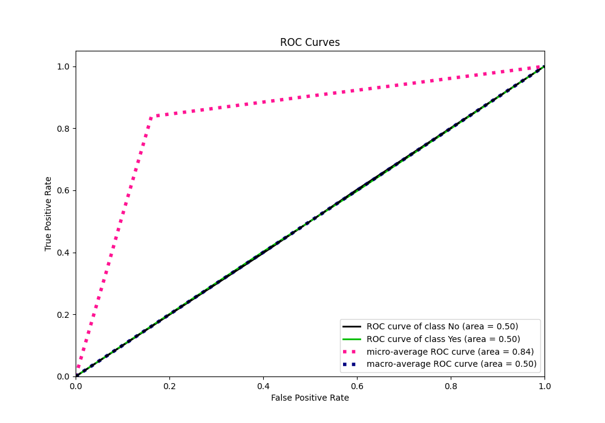
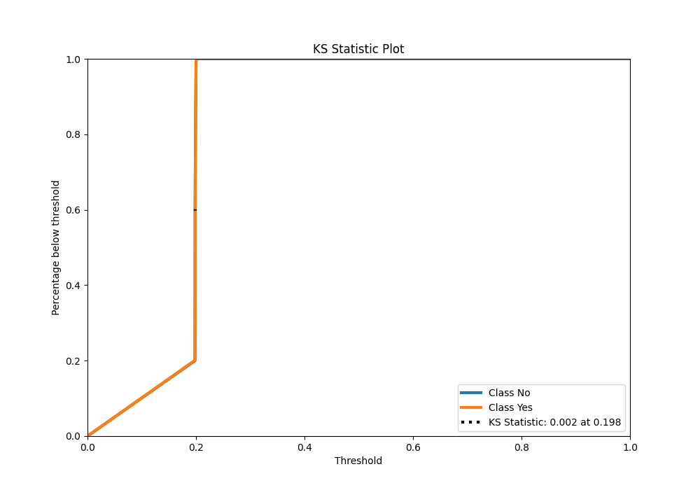
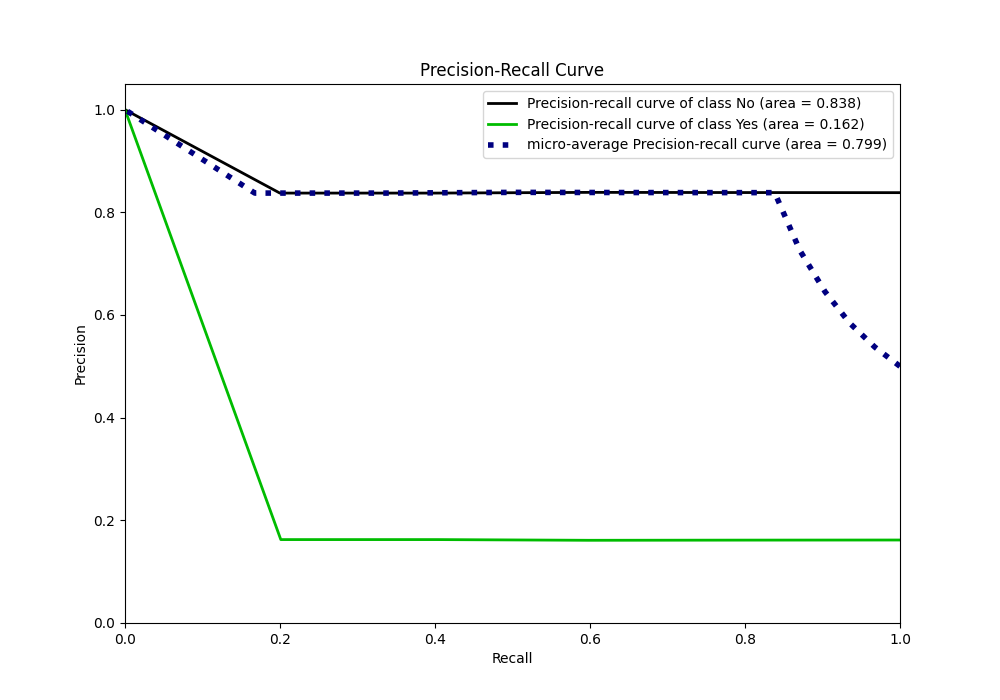
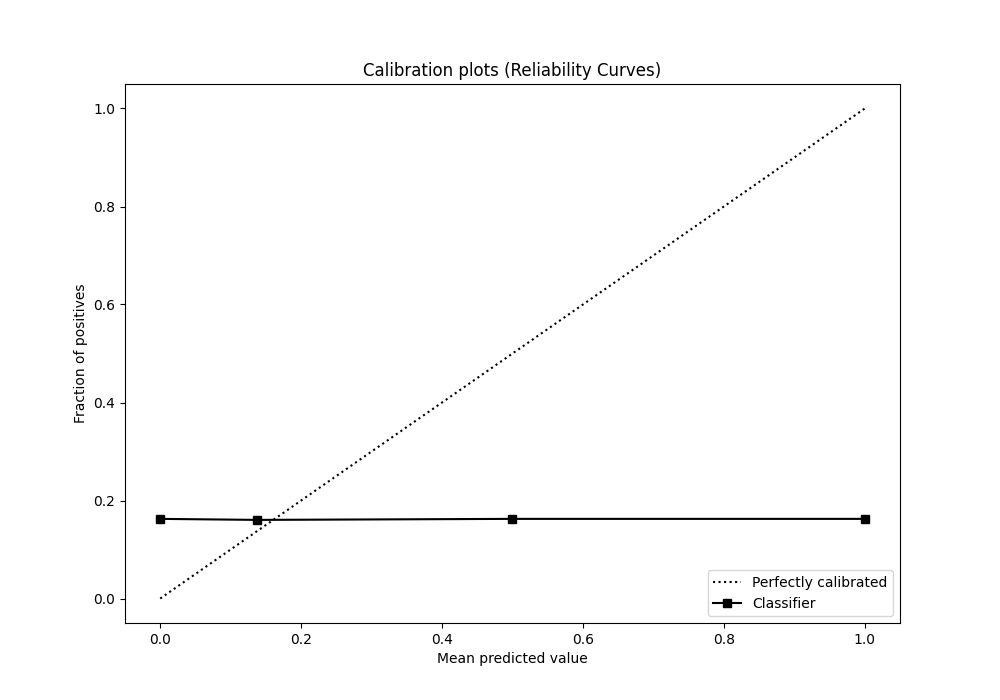
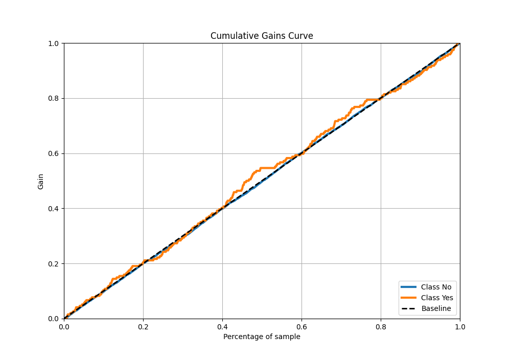
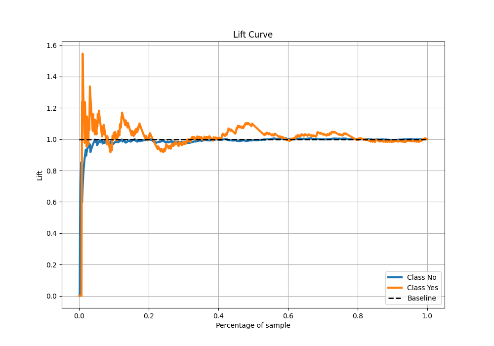

# Summary of 5_Xgboost

[<< Go back](../README.md)

## Extreme Gradient Boosting (Xgboost)
- **n_jobs**: -1
- **objective**: binary:logistic
- **eta**: 0.15
- **max_depth**: 8
- **min_child_weight**: 50
- **subsample**: 0.6
- **colsample_bytree**: 0.6
- **eval_metric**: accuracy
- **explain_level**: 2

## Validation
 - **validation_type**: kfold
 - **k_folds**: 5
 - **shuffle**: True
 - **stratify**: True
 - **random_seed**: 123

## Optimized metric
accuracy

## Training time

3.4 seconds

## Metric details
|           |      score |   threshold |
|:----------|-----------:|------------:|
| logloss   | 0.446975   |  nan        |
| auc       | 0.5        |  nan        |
| f1        | 0.278336   |    0.178237 |
| accuracy  | 0.703333   |    0.199094 |
| precision | 0.1625     |    0.198361 |
| recall    | 1          |    0.178237 |
| mcc       | 0.00184822 |    0.198361 |

## Metric details with threshold from accuracy metric
|           |     score |   threshold |
|:----------|----------:|------------:|
| logloss   | 0.446975  |  nan        |
| auc       | 0.5       |  nan        |
| f1        | 0.179724  |    0.199094 |
| accuracy  | 0.703333  |    0.199094 |
| precision | 0.1625    |    0.199094 |
| recall    | 0.201031  |    0.199094 |
| mcc       | 0.0011318 |    0.199094 |

## Confusion matrix (at threshold=0.199094)
|                |   Predicted as No |   Predicted as Yes |
|:---------------|------------------:|-------------------:|
| Labeled as No  |               805 |                201 |
| Labeled as Yes |               155 |                 39 |

## Learning curves

## Permutation-based Importance

## Confusion Matrix

## Normalized Confusion Matrix

## ROC Curve

## Kolmogorov-Smirnov Statistic

## Precision-Recall Curve

## Calibration Curve

## Cumulative Gains Curve

## Lift Curve

[<< Go back](../README.md)
