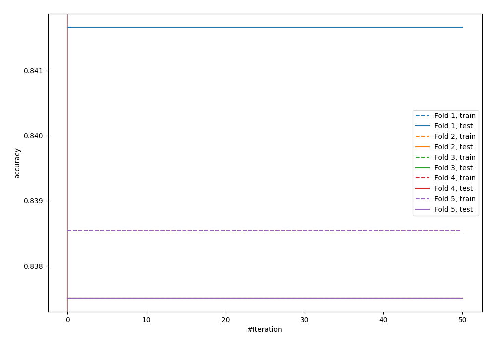
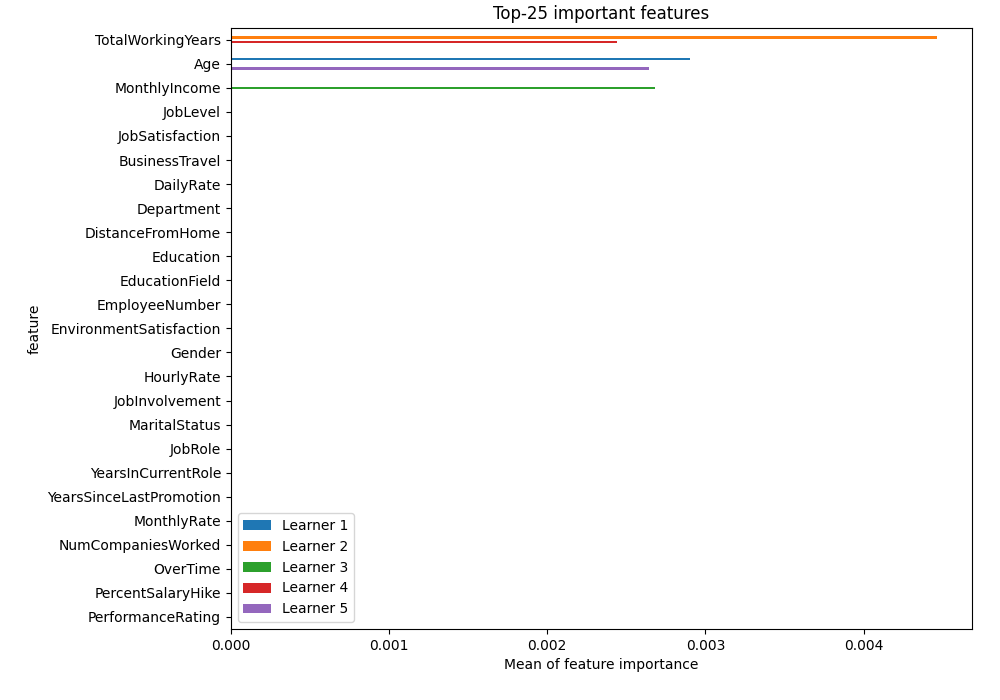
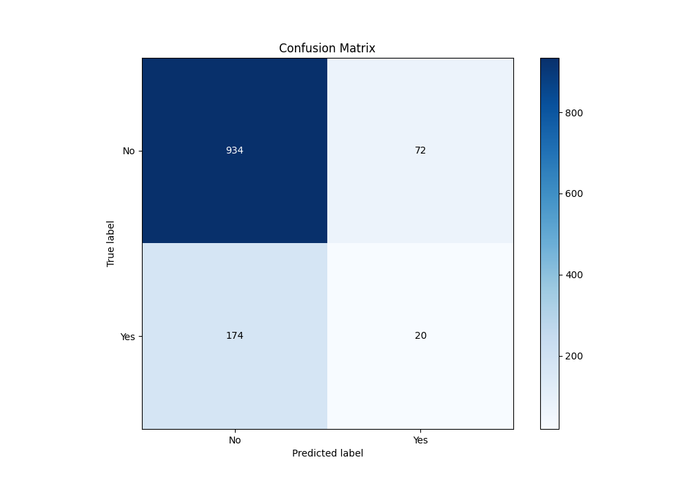
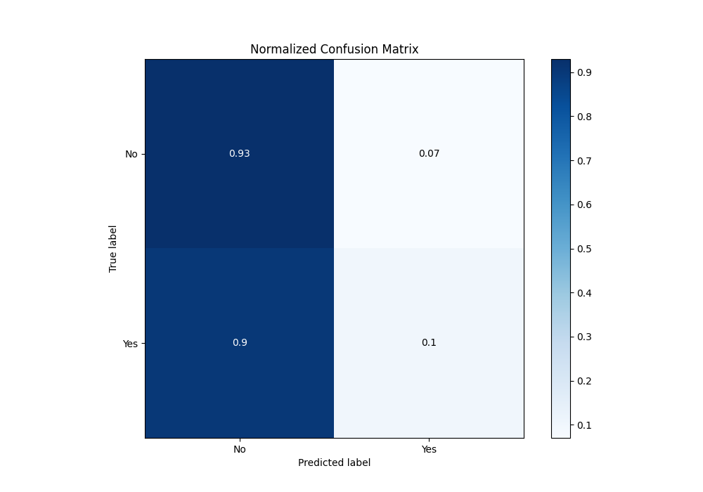
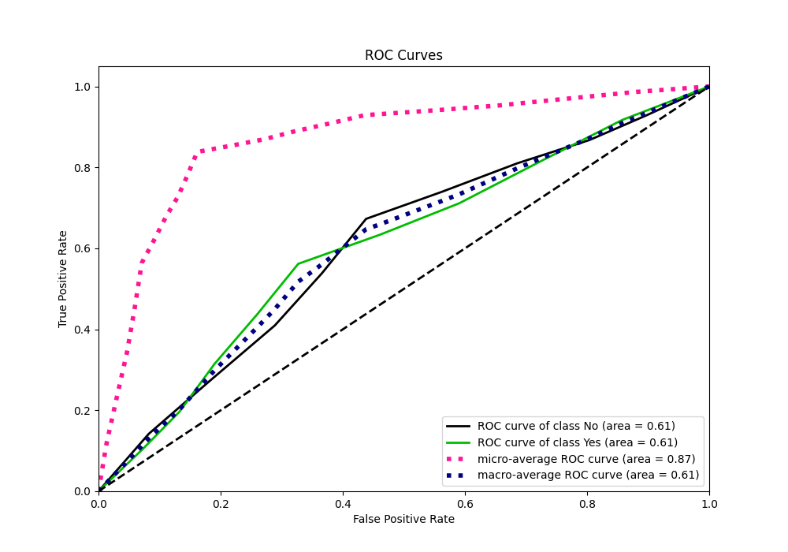
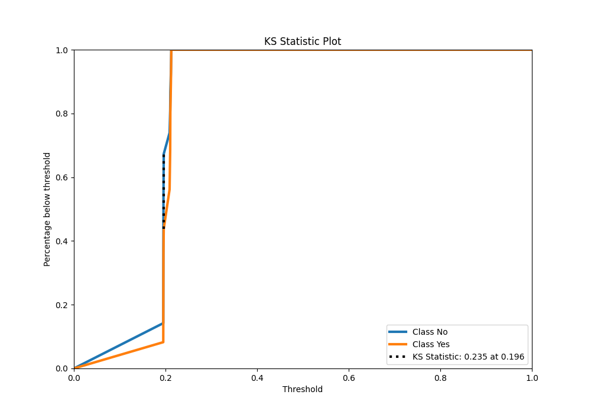
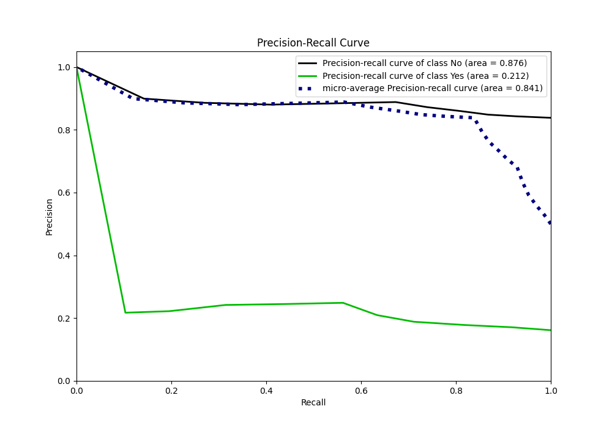
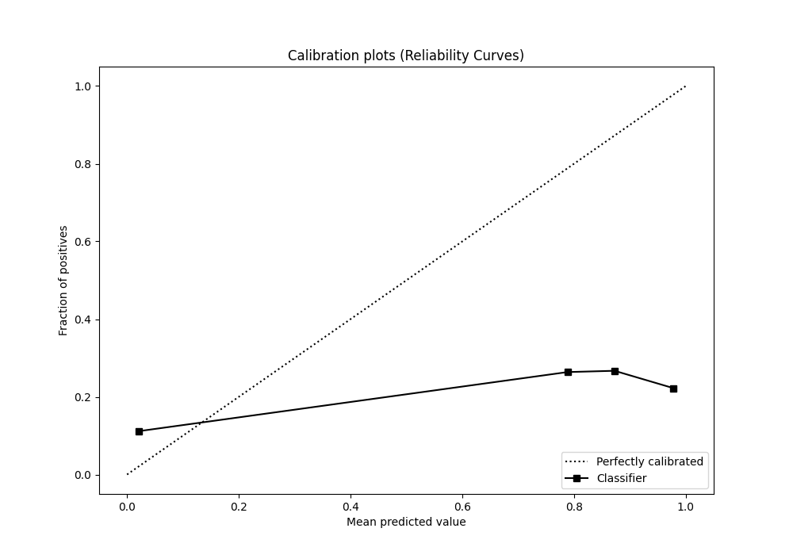
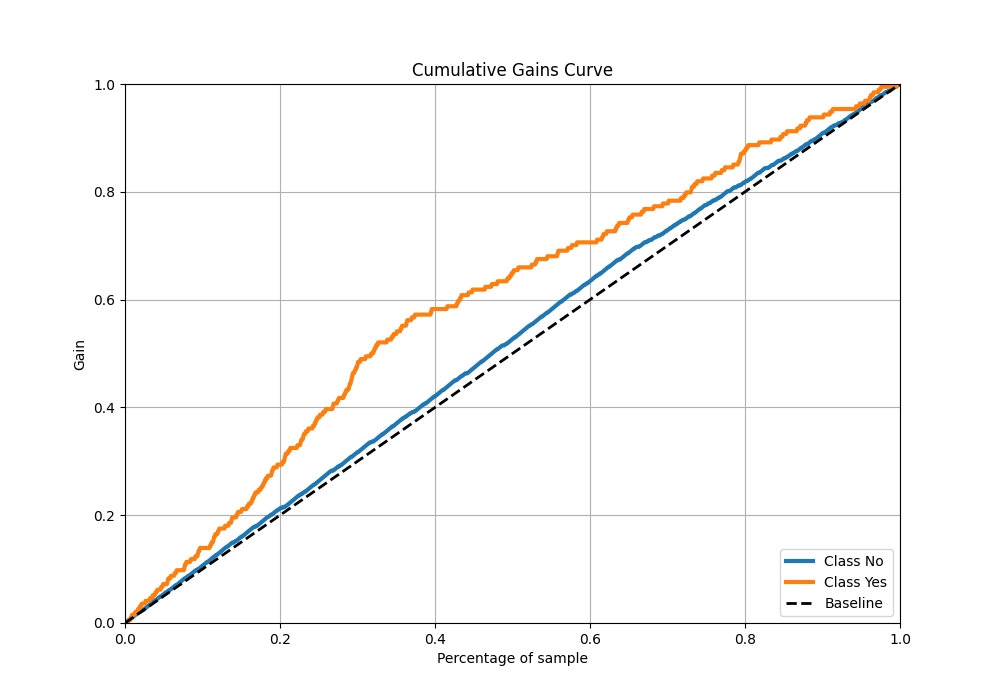
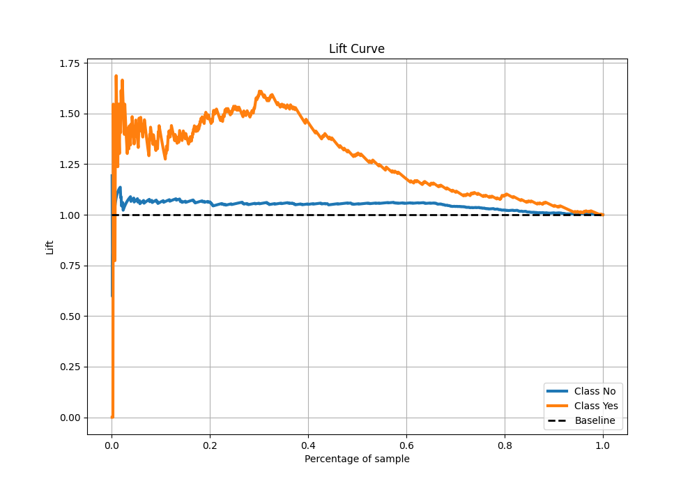

# Summary of 6_Xgboost

[<< Go back](../README.md)

## Extreme Gradient Boosting (Xgboost)
- **n_jobs**: -1
- **objective**: binary:logistic
- **eta**: 0.1
- **max_depth**: 6
- **min_child_weight**: 50
- **subsample**: 0.9
- **colsample_bytree**: 0.7
- **eval_metric**: accuracy
- **explain_level**: 2

## Validation
 - **validation_type**: kfold
 - **k_folds**: 5
 - **shuffle**: True
 - **stratify**: True
 - **random_seed**: 123

## Optimized metric
accuracy

## Training time

3.6 seconds

## Metric details
|           |    score |   threshold |
|:----------|---------:|------------:|
| logloss   | 0.444732 |  nan        |
| auc       | 0.608675 |  nan        |
| f1        | 0.344937 |    0.196204 |
| accuracy  | 0.795    |    0.211864 |
| precision | 0.248858 |    0.196204 |
| recall    | 1        |    0.175667 |
| mcc       | 0.179563 |    0.196204 |

## Metric details with threshold from accuracy metric
|           |     score |   threshold |
|:----------|----------:|------------:|
| logloss   | 0.444732  |  nan        |
| auc       | 0.608675  |  nan        |
| f1        | 0.13986   |    0.211864 |
| accuracy  | 0.795     |    0.211864 |
| precision | 0.217391  |    0.211864 |
| recall    | 0.103093  |    0.211864 |
| mcc       | 0.0436167 |    0.211864 |

## Confusion matrix (at threshold=0.211864)
|                |   Predicted as No |   Predicted as Yes |
|:---------------|------------------:|-------------------:|
| Labeled as No  |               934 |                 72 |
| Labeled as Yes |               174 |                 20 |

## Learning curves

## Permutation-based Importance

## Confusion Matrix

## Normalized Confusion Matrix

## ROC Curve

## Kolmogorov-Smirnov Statistic

## Precision-Recall Curve

## Calibration Curve

## Cumulative Gains Curve

## Lift Curve

[<< Go back](../README.md)
