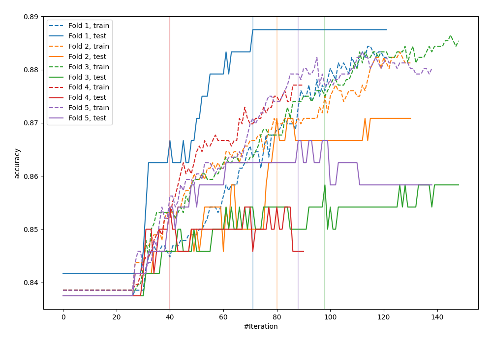
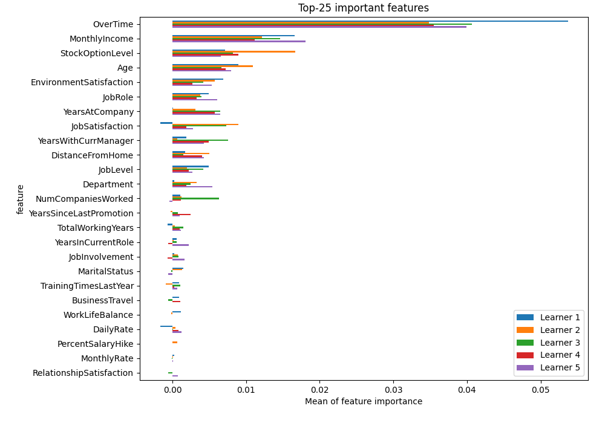
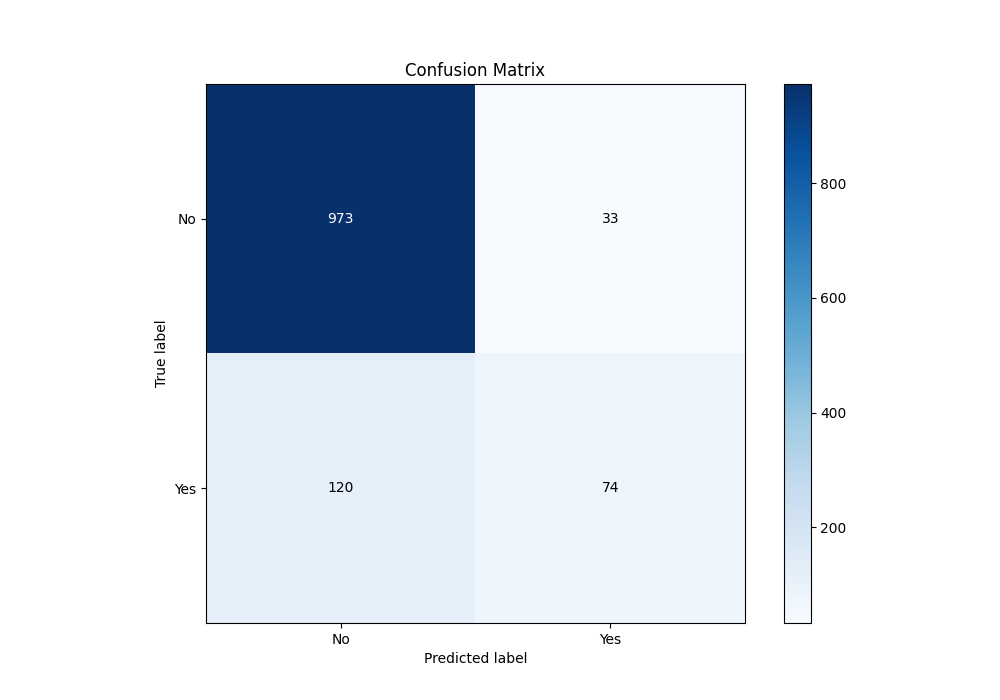
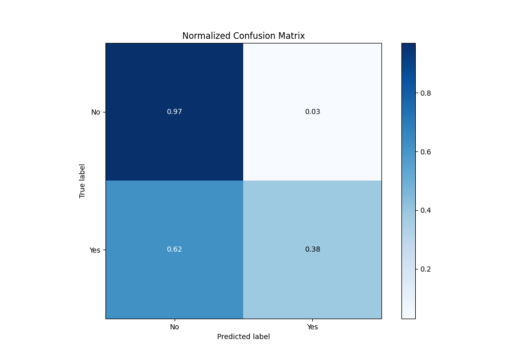
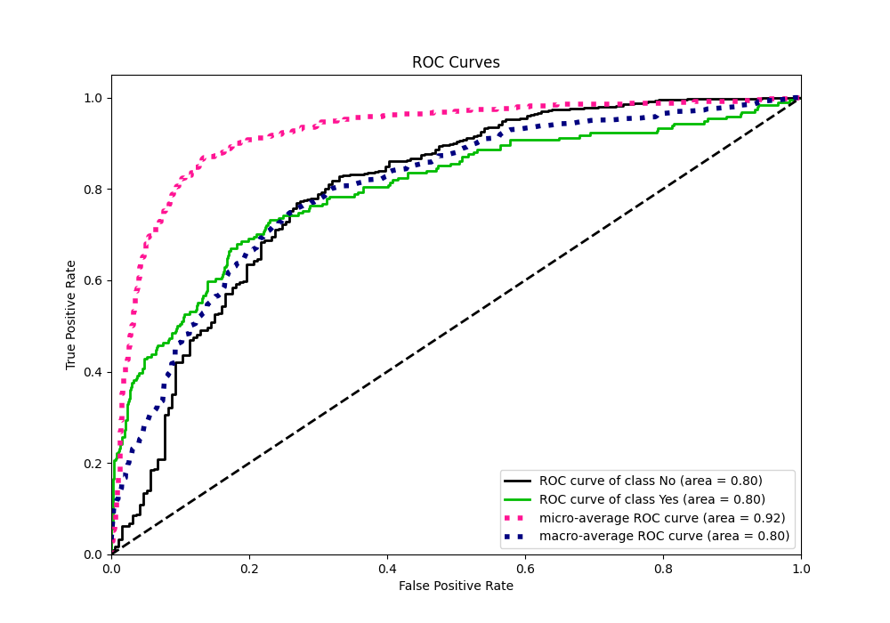
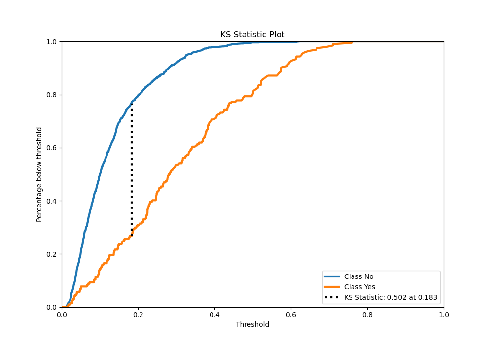
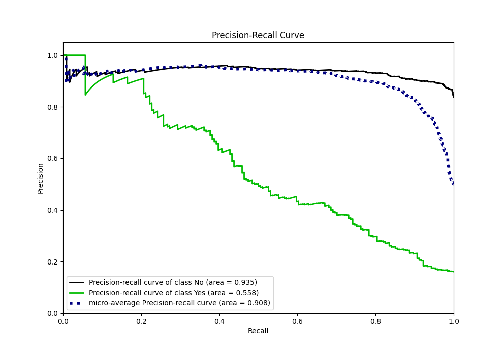
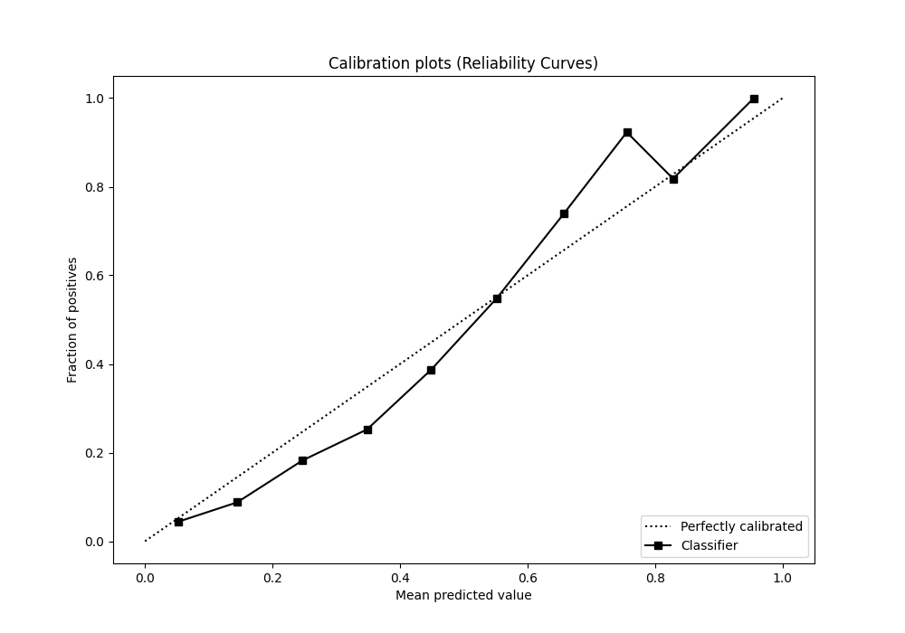
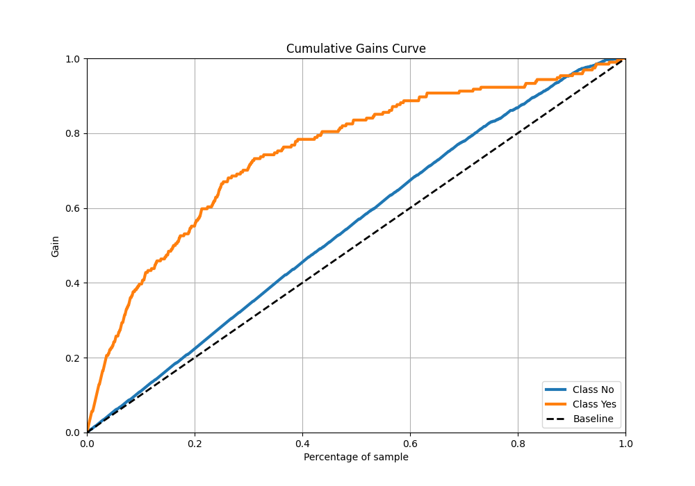
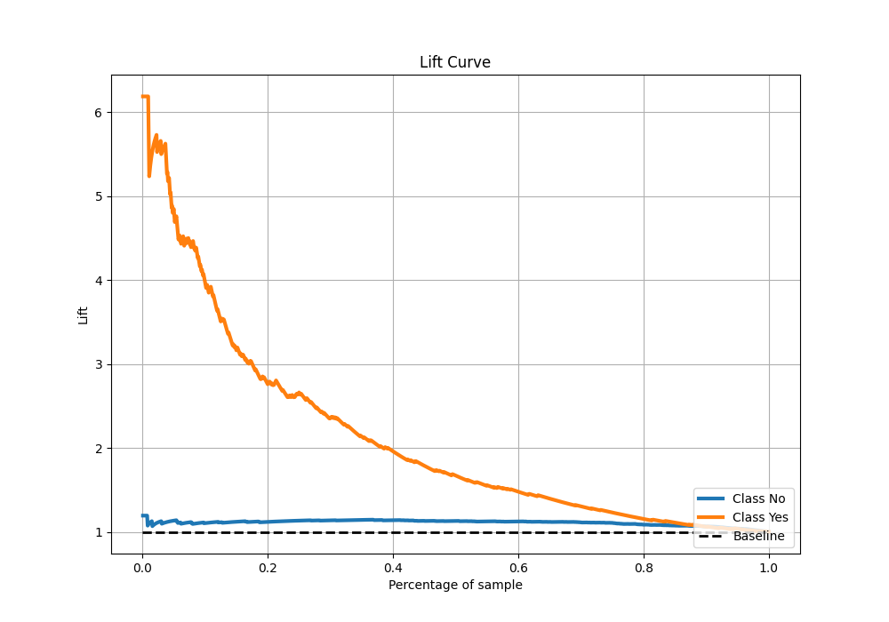

# Summary of 7_Xgboost

[<< Go back](../README.md)

## Extreme Gradient Boosting (Xgboost)
- **n_jobs**: -1
- **objective**: binary:logistic
- **eta**: 0.1
- **max_depth**: 4
- **min_child_weight**: 25
- **subsample**: 0.7
- **colsample_bytree**: 0.7
- **eval_metric**: accuracy
- **explain_level**: 2

## Validation
 - **validation_type**: kfold
 - **k_folds**: 5
 - **shuffle**: True
 - **stratify**: True
 - **random_seed**: 123

## Optimized metric
accuracy

## Training time

4.4 seconds

## Metric details
|           |    score |   threshold |
|:----------|---------:|------------:|
| logloss   | 0.353893 | nan         |
| auc       | 0.79943  | nan         |
| f1        | 0.51927  |   0.221448  |
| accuracy  | 0.8725   |   0.367472  |
| precision | 1        |   0.625552  |
| recall    | 1        |   0.0108514 |
| mcc       | 0.450376 |   0.367472  |

## Metric details with threshold from accuracy metric
|           |    score |   threshold |
|:----------|---------:|------------:|
| logloss   | 0.353893 |  nan        |
| auc       | 0.79943  |  nan        |
| f1        | 0.491694 |    0.367472 |
| accuracy  | 0.8725   |    0.367472 |
| precision | 0.691589 |    0.367472 |
| recall    | 0.381443 |    0.367472 |
| mcc       | 0.450376 |    0.367472 |

## Confusion matrix (at threshold=0.367472)
|                |   Predicted as No |   Predicted as Yes |
|:---------------|------------------:|-------------------:|
| Labeled as No  |               973 |                 33 |
| Labeled as Yes |               120 |                 74 |

## Learning curves

## Permutation-based Importance

## Confusion Matrix

## Normalized Confusion Matrix

## ROC Curve

## Kolmogorov-Smirnov Statistic

## Precision-Recall Curve

## Calibration Curve

## Cumulative Gains Curve

## Lift Curve

[<< Go back](../README.md)
