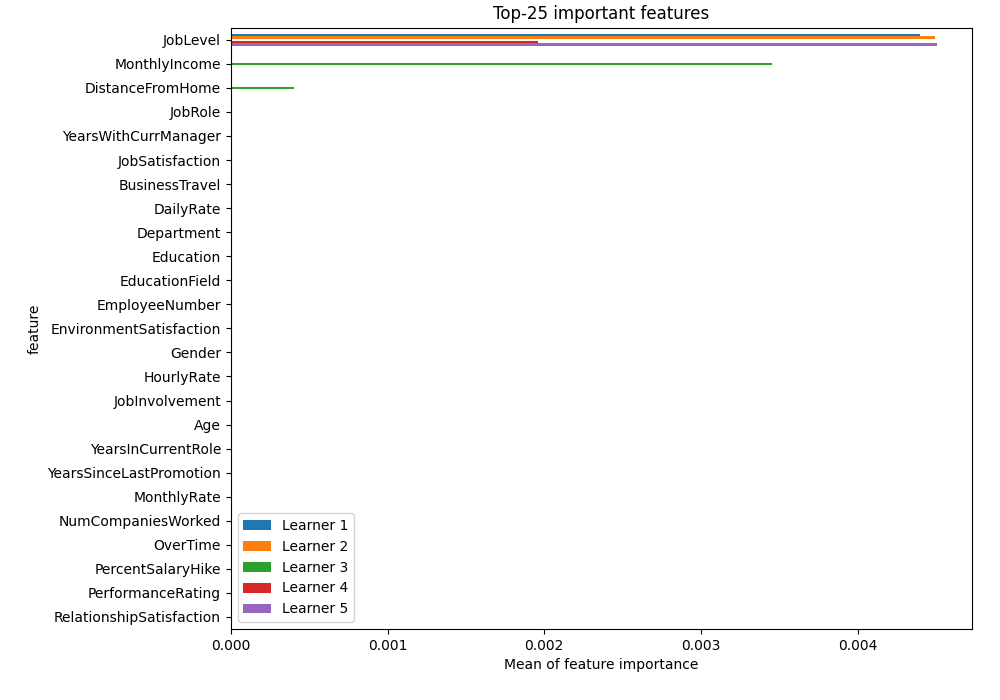
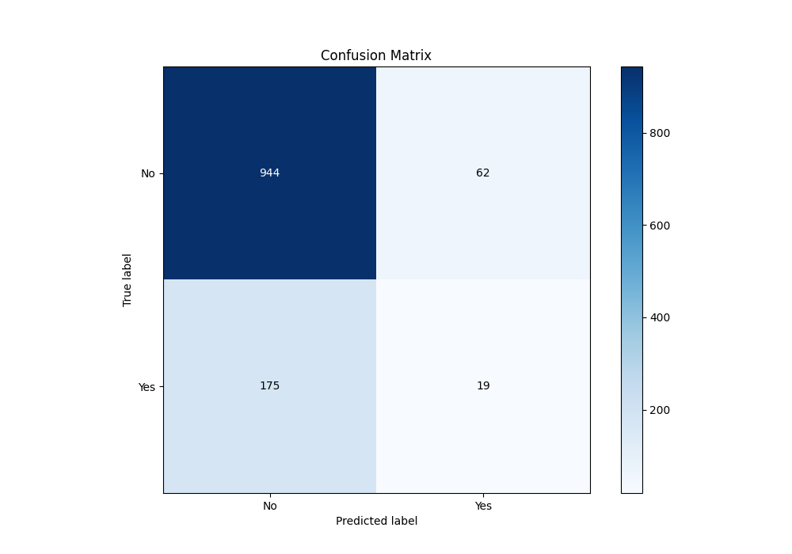
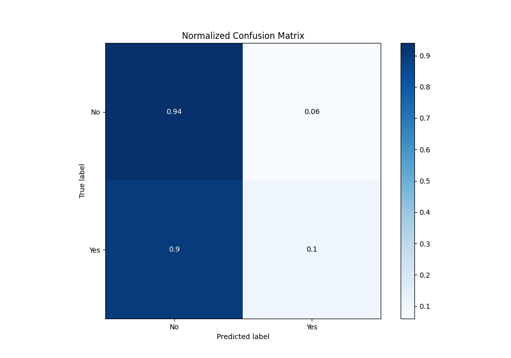
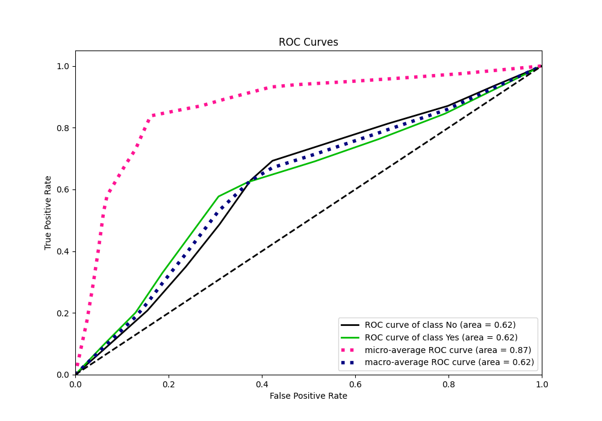
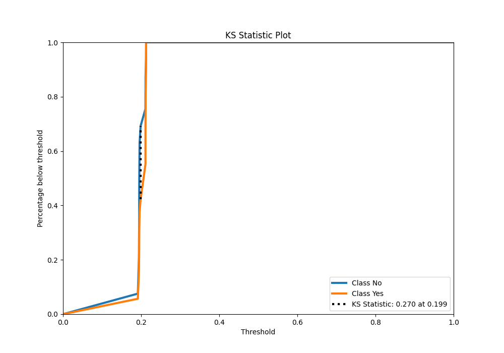
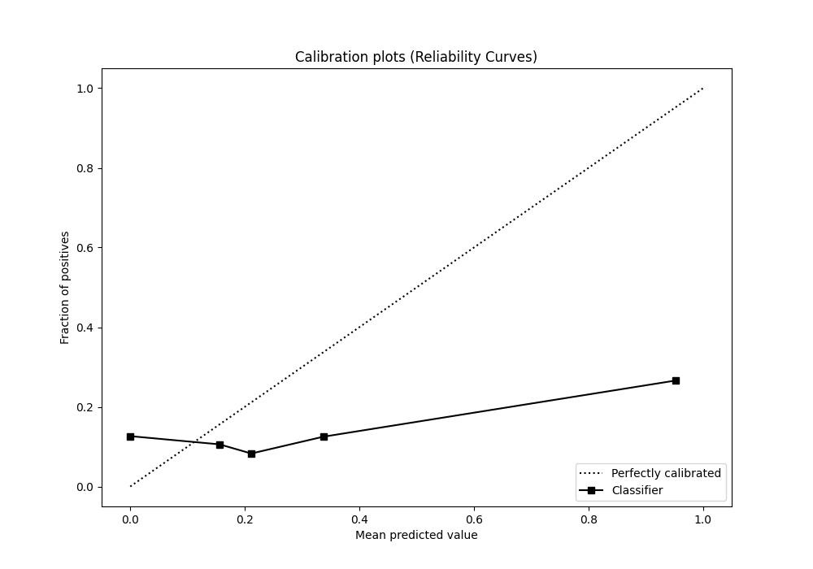
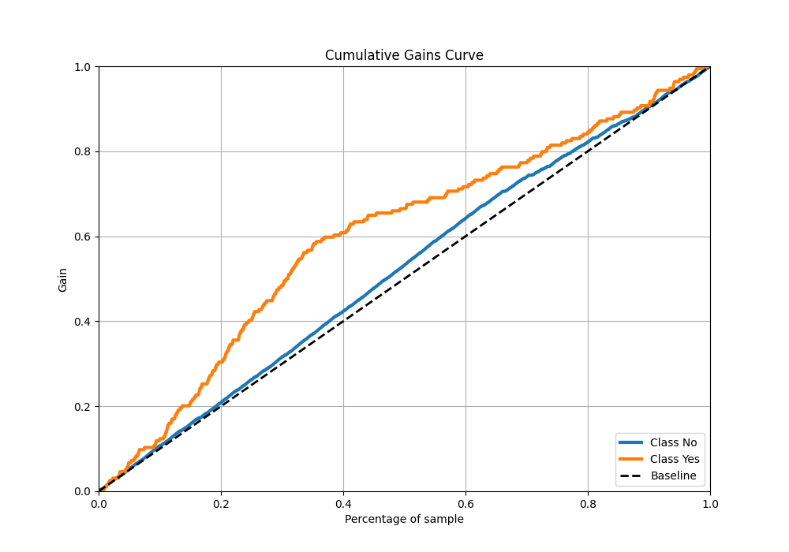
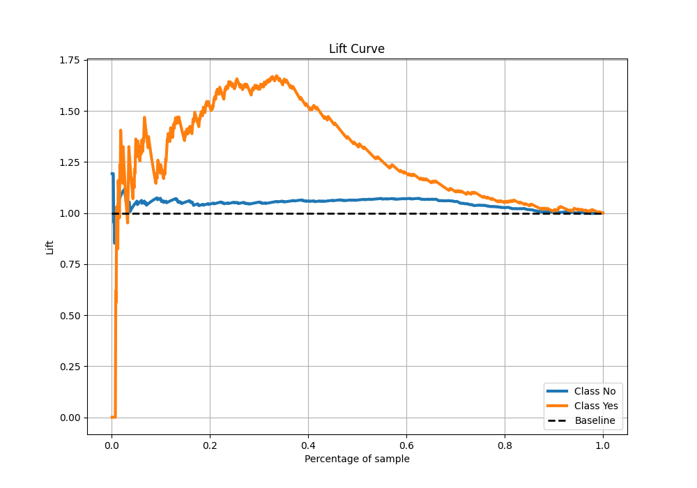

# Summary of 9_Xgboost

[<< Go back](../README.md)

## Extreme Gradient Boosting (Xgboost)
- **n_jobs**: -1
- **objective**: binary:logistic
- **eta**: 0.1
- **max_depth**: 7
- **min_child_weight**: 50
- **subsample**: 1.0
- **colsample_bytree**: 1.0
- **eval_metric**: accuracy
- **explain_level**: 2

## Validation
 - **validation_type**: kfold
 - **k_folds**: 5
 - **shuffle**: True
 - **stratify**: True
 - **random_seed**: 123

## Optimized metric
accuracy

## Training time

3.9 seconds

## Metric details
|           |    score |   threshold |
|:----------|---------:|------------:|
| logloss   | 0.443979 |  nan        |
| auc       | 0.620312 |  nan        |
| f1        | 0.364228 |    0.19876  |
| accuracy  | 0.8025   |    0.212592 |
| precision | 0.266033 |    0.19876  |
| recall    | 1        |    0.17244  |
| mcc       | 0.208408 |    0.19876  |

## Metric details with threshold from accuracy metric
|           |     score |   threshold |
|:----------|----------:|------------:|
| logloss   | 0.443979  |  nan        |
| auc       | 0.620312  |  nan        |
| f1        | 0.138182  |    0.212592 |
| accuracy  | 0.8025    |    0.212592 |
| precision | 0.234568  |    0.212592 |
| recall    | 0.0979381 |    0.212592 |
| mcc       | 0.0532775 |    0.212592 |

## Confusion matrix (at threshold=0.212592)
|                |   Predicted as No |   Predicted as Yes |
|:---------------|------------------:|-------------------:|
| Labeled as No  |               944 |                 62 |
| Labeled as Yes |               175 |                 19 |

## Learning curves

## Permutation-based Importance

## Confusion Matrix

## Normalized Confusion Matrix

## ROC Curve

## Kolmogorov-Smirnov Statistic

## Precision-Recall Curve

## Calibration Curve

## Cumulative Gains Curve

## Lift Curve

[<< Go back](../README.md)
