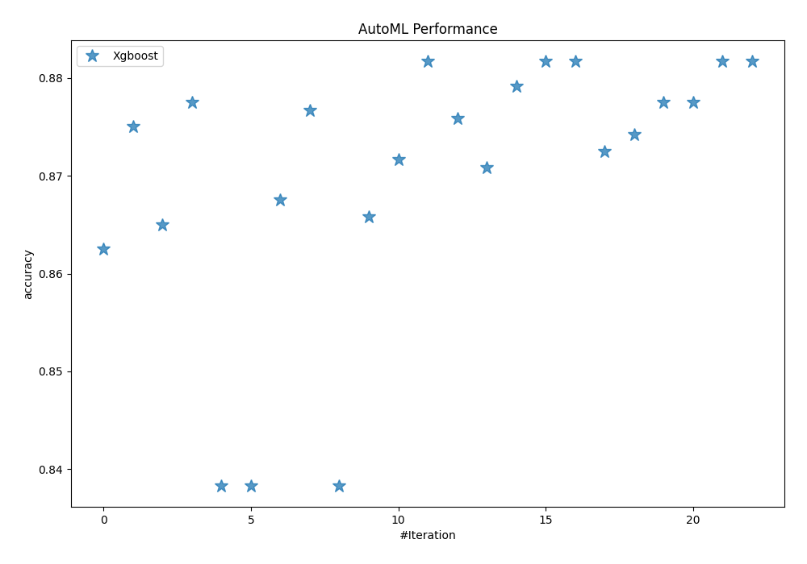

# AutoML Leaderboard

| Best model   | name                                             | model_type   | metric_type   |   metric_value |   train_time |
|:-------------|:-------------------------------------------------|:-------------|:--------------|---------------:|-------------:|
|              | [1_Default_Xgboost](1_Default_Xgboost/README.md) | Xgboost      | accuracy      |       0.8625   |        11.18 |
|              | [2_Xgboost](2_Xgboost/README.md)                 | Xgboost      | accuracy      |       0.875    |         5.33 |
|              | [3_Xgboost](3_Xgboost/README.md)                 | Xgboost      | accuracy      |       0.865    |         5.17 |
|              | [4_Xgboost](4_Xgboost/README.md)                 | Xgboost      | accuracy      |       0.8775   |         5.46 |
|              | [5_Xgboost](5_Xgboost/README.md)                 | Xgboost      | accuracy      |       0.838333 |         4.28 |
|              | [6_Xgboost](6_Xgboost/README.md)                 | Xgboost      | accuracy      |       0.838333 |         4.5  |
|              | [7_Xgboost](7_Xgboost/README.md)                 | Xgboost      | accuracy      |       0.8675   |         5.36 |
|              | [8_Xgboost](8_Xgboost/README.md)                 | Xgboost      | accuracy      |       0.876667 |         5.66 |
|              | [9_Xgboost](9_Xgboost/README.md)                 | Xgboost      | accuracy      |       0.838333 |         4.8  |
|              | [10_Xgboost](10_Xgboost/README.md)               | Xgboost      | accuracy      |       0.865833 |         6.04 |
|              | [11_Xgboost](11_Xgboost/README.md)               | Xgboost      | accuracy      |       0.871667 |         6.07 |
| **the best** | [12_Xgboost](12_Xgboost/README.md)               | Xgboost      | accuracy      |       0.881667 |         6.15 |
|              | [13_Xgboost](13_Xgboost/README.md)               | Xgboost      | accuracy      |       0.875833 |         5.83 |
|              | [14_Xgboost](14_Xgboost/README.md)               | Xgboost      | accuracy      |       0.870833 |         6    |
|              | [15_Xgboost](15_Xgboost/README.md)               | Xgboost      | accuracy      |       0.879167 |         6.21 |
|              | [16_Xgboost](16_Xgboost/README.md)               | Xgboost      | accuracy      |       0.881667 |         6.06 |
|              | [17_Xgboost](17_Xgboost/README.md)               | Xgboost      | accuracy      |       0.881667 |         6.07 |
|              | [18_Xgboost](18_Xgboost/README.md)               | Xgboost      | accuracy      |       0.8725   |         5.95 |
|              | [19_Xgboost](19_Xgboost/README.md)               | Xgboost      | accuracy      |       0.874167 |         5.99 |
|              | [20_Xgboost](20_Xgboost/README.md)               | Xgboost      | accuracy      |       0.8775   |         6.62 |
|              | [21_Xgboost](21_Xgboost/README.md)               | Xgboost      | accuracy      |       0.8775   |         6.62 |
|              | [22_Xgboost](22_Xgboost/README.md)               | Xgboost      | accuracy      |       0.881667 |         6.67 |
|              | [23_Xgboost](23_Xgboost/README.md)               | Xgboost      | accuracy      |       0.881667 |         6.59 |

### AutoML Performance

### AutoML Performance Boxplot
